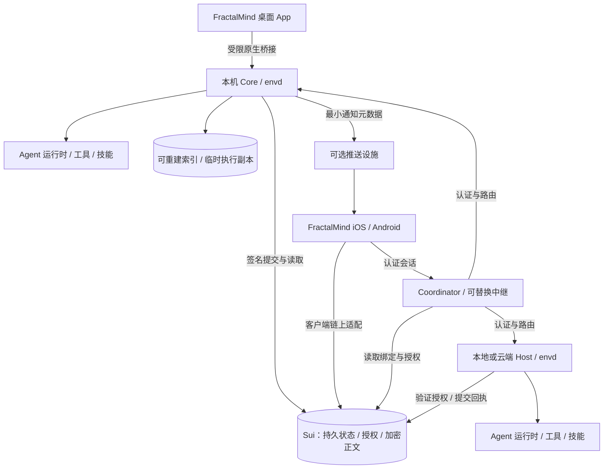

# FractalMind App 工程规划与资产盘点

状态：工程提案；产品原型已合并，生产集成尚未完成。
同步基线：PR #19 合并后的 `main`（`c590689`），产品原型 15 / PRD v0.9。
历史资产盘点源于 PR #17；下文记录已确认的产品调整和待实施差距，不宣称重新验收所有组件。
原型与运行说明见 [FractalMind App prototype](product/fractalmind-app-prototype/README.md)，
交互/领域检查证据见 [QA 记录](product/fractalmind-app-prototype/QA-REPORT.md)。

产品范围与验收以 [FractalMind App PRD](product/fractalmind-app-prd.md) 为准。
本文保留产品方向的推导、现有资产和工程候选，供实施时参考；技术选型、
工期和支持版本仍需 P0 验证。下文阶段对应 PRD 的 P0–P4，首版特指 P2
五平台 MVP Beta；个人组织、Host 管理、身份和恢复在 P1–P2，人员委派与团队治理进入 P3。

已确认的首版用户：个人开发者，桌面执行 Agent，手机查看进度并审批。

## 0. 使命、愿景与统一入口

依据项目现有定义：[What is FractalMind?](site/docs/guide/what-is-fractalmind.md)、
[Fractal Model](site/docs/architecture/fractal-model.md)、
[Architecture Overview](site/docs/architecture/overview.md)。

**使命**：通过自相似的 Agent、团队、组织和组织联邦，组合并发展智能能力。
**愿景**：让 ASI 成为无需许可、去中心化、任何人都可以参与的公共基础设施。
这是产品发展的方向；组织规模与智能能力之间的关系仍需验证，不能宣称
现有 App 已经实现 ASI。

**App 定位**：FractalMind 开放智能网络的统一入口，让每个人创建自己的
链上个人组织，组织人与 Agent 协作，并自主选择如何参与更大的组织与网络。

用户成长路径：

个人开发者是首版采用者。个人组织、团队与组织联邦沿用相同的 OKR、
任务、身份、权限、状态与证据结构，以便逐级组合。

| 使命要求 | 用户体验 | 架构要求 | 如何验证 |
| --- | --- | --- | --- |
| 任何人可以参与 | 安装后创建/恢复 Human 和个人组织；公开浏览网络 | 无业务后端、自持身份、可替换链上接入；人员成员关系按真实规则开放 | 无 FractalMind 云账号完成注册、授权和目标闭环；费用和签名明确 |
| 智能按组织结构组合 | 同一任务可交给 Agent、团队或组织；逐层查看结果与证据 | 统一工作单元接口和任务生命周期，保留层级边界 | 一个团队任务可拆分、交接、验收并汇总 |
| 用户自主控制 | 可选择模型、设备、服务节点；导出工作区、密钥备份和产物 | 模型/运行时适配，标准文件与 API，可替换中继；私钥由用户设备安全持有 | 导出后可通过 CLI 或另一兼容客户端继续工作 |
| 开放治理 | 看见目标、成员、提案、授权与结果；参与组织决策 | Sui authority 与执行端验证；公开组织治理状态，私密持久内容加密上链 | 授权、撤销、审批与执行记录可对应核查 |
| 智能与经验持续积累 | 任务结束验收成果、沉淀记忆，选择是否分享为技能或模板 | 保留现有 heartbeat → memory → candidate OKR → governance → execution → outcome → evolution 闭环 | 后续任务能引用已有证据/记忆，分享需明确授权 |

产品承诺与原则：

- App 提供默认、易用的入口；核心组件继续支持 CLI/API、其他客户端和独立安装。
- 默认服务可替换、自托管。社区发布技能/连接器的协议开放，精选目录只是默认推荐来源。
- 个人使用也创建 Organization；公开元数据、私密密文和解密权分别说明。
  个人组织名称不代表自动保密；发布成果、授权和链上写入使用清晰的确认步骤。
- UI 可以简化链上细节，但组织身份、授权、撤销和治理的作用必须可见。
- 不把聊天次数、连接器数量或安装量当作智能发展程度的证明。

与既有设计的衔接：现有文档强调模型无关、使用用户环境运行 Agent、文件
契约、无 GUI 依赖。本规划把 App 作为组合和发行入口，继续复用运行时及
标准文件适配。所有持久产品状态以 Sui 为权威，SQLite/本机文件仅为可重建缓存、
暂存及执行工作副本。文件变更需要显式提交才能成为已确认产品状态；扩展协议
和加密持久化方案需单独 ADR/合约实施，不能由 HTML 模拟或目录迁移替代。

## 1. 产品目标

用户在每台设备安装一个 FractalMind App，即可创建工作区、运行任务、管理
Agent、启用工具和连接服务。macOS、Windows、Ubuntu 提供执行能力；iOS、
Android 提供配对、对话、任务查看、审批和结果浏览。

首个价值流程：安装 → 填写新身份资料 → 运行费准备 → 链上确认个人组织与设备授权 →
保存单恢复码 → 项目/模型配置 → 本地或云端 Host 接入 → 确认 OKR 与约束 → Agent 自主执行 →
验证关键结果与成功标准 → 沉淀记忆。有效赞助方可承担费用，到账不自动签名。
第二个流程：新设备发起配对 → 已有管理设备核对授权 → 独立同步加密数据 → 手机查看、对话和审批。
第三个流程：已授权 Host 发现已有 Agent → 仅观察导入 → 明确交接并授权纳入 OKR → 继续执行。
全设备丢失时只输入一份恢复码，核对找到的身份后恢复；Human ID 与组织关系保持稳定。

“一个 App”的交付承诺：

- 内置 FractalMind 核心服务和默认工具，由 App 管理配置、启动、停止和升级；
  默认兼容 Agent 运行时按其分发条件内置或由 App 引导安装。
- 扩展工具需要的 Node、Python 等依赖，在 App 内按需安装并展示进度。
- 模型账号/API key、操作系统权限和外部渠道授权，提供引导和检查。
- 新用户无需先安装 Go/Rust 开发工具或编辑 YAML；默认本地流程不要求搭建服务器。
- 手机独立安装后有欢迎、已有身份和恢复入口；真实任务指向已授权的桌面、小主机或自有云端 Host。
  多主机管理属于首版；跨组织算力与自动调度在后续阶段。
- 用户已拥有的 Codex、Claude、OpenClaw 等运行环境作为可选连接器，按其授权和分发条件接入。

## 2. 现有资产与差距

以下是源码、配置和工作流检查结果；工作流存在不等于五平台发行已验证。

| 资产 | 当前可复用部分 | 统一 App 的整合方式 | 需要补齐 |
| --- | --- | --- | --- |
| `apps/agent-console` | React/TS、协调器客户端、节点列表、控制命令、WebRTC 查看器；Tauri/Capacitor 配置 | 作为 FractalMind App 起点 | 导航、任务/会话模型、本地服务管理、配对、发布签名、iOS 工程 |
| `runtime/fractalmind-envd` | 节点发现、协调器、心跳、重连、进程监督、运行时适配、Sui 授权 | 多主机控制面和节点服务 | 链上权威解析/对账、Host 准入、真实 Agent 实例发现/交接、事件同步、安装生命周期、完整 Windows 支持 |
| `skills/coordination/agent-manager-skill/agent-manager` | 已有 Agent 操作和协议适配 | 兼容运行时适配器 | 当前 tmux/Python 依赖的托管安装；原生跨平台执行适配 |
| `runtime/fractalbot` | Telegram、飞书、Slack、Discord、iMessage 等渠道和运行时路由 | “连接”中的可选服务 | App 配置界面、健康状态、密钥引用、统一任务映射 |
| `runtime/fractalmind-envd/desktop` | WebRTC、屏幕采集、输入控制、健康检查 | 设备页中的远程桌面模块 | Windows 采集/输入、Ubuntu Wayland、系统权限和组件打包 |
| `skills/` 与 `roms/` | 技能、注册表、Agent 发行模板 | 工具/技能目录与创建 Agent 模板 | 版本锁、运行依赖、权限说明、卸载与升级 |
| `protocols/fractalmind-protocol` | Sui SDK、Organization/Agent 及命令授权 | 组织和远程授权基础 | Human/DeviceGrant、恢复目录/密钥备份、HostInvite/HostMembership、admin 权力映射及 Gas 引导；原型不代表已有合约 |
| `protocols/fractal-demail` | 邮件客户端、桥接和 gas station 适配 | 高级消息连接器 | App 数据模型、发送/收件 UX；fractalbot 的通用 Demail Agent 入站路由仍待实现 |
| `apps/explorer` | React、组织/链上可视化 | 后续“组织/网络”模块，按需加载 | React 18/19 等依赖统一、抽离组件和数据访问；避免同时引入两套应用状态 |
| `apps/typemind-android` | Android IME 与输入 API | 可选 Android 原生扩展，后续验证同一安装包内集成 | Kotlin/Manifest 合并与系统启用引导；当前 shell/root 广播不是普通 App 的无配置接口 |
| `apps/openclaw-gateway-app` | macOS 包装和权限说明 | 可选 OpenClaw 连接器的权限引导 | 统一签名和进程归属验证；当前仍要求外部 OpenClaw/Node 安装 |
| `runtime/claude-code-go` | 实验中的 CLI、server 和会话兼容面 | 实验连接器，逐功能标明支持范围 | 稳定性与兼容性验证，不作为默认执行引擎依赖 |
| 私有 memory/gateway 仓库 | 此次未检查其内部实现 | 按版本化服务协议预留连接器 | 分别核实可用 API、部署、认证、许可和数据边界 |
| `workspace/oh-my-code`、`governance/`、team/OKR/heartbeat 技能 | 文件工作区、运行闭环、团队协调、候选 OKR | 目标、团队、记忆、提案和验收的统一产品体验 | 文件适配、冲突处理、治理 UI；继续遵守 Agent OS 文件契约 |

两个明确的发行前缺口：Agent Console 当前将连接 token 存入 localStorage，
Tauri CSP 为 `null`，macOS 使用临时签名且 hardened runtime 关闭；这些都需在
正式发行前处理。现有节点命令 UI 也尚不是产品需要的任务与审批界面。

## 3. 技术方案

### 3.1 推荐沿用 React + Tauri 桌面 + Capacitor 移动

统一 UI、领域模型、API 客户端和设计系统；原生能力经 `PlatformAdapter` 访问。
桌面和移动分别构建原生安装包，对外使用相同产品名称。

| 方案 | 适合本项目的理由 | 代价与决策 |
| --- | --- | --- |
| React + Tauri + Capacitor | 直接复用现有 UI、TS SDK 和已有打包路径 | 保留两套原生壳；首版推荐，维护边界集中在平台适配层 |
| React + 全平台 Tauri 2 | 可统一原生壳；官方支持桌面与移动 | 需实机验证推送、安全存储、扫码、WebRTC 和后台恢复；PoC 全通过后可选，尚不承诺迁移 |
| Flutter | 官方覆盖五个目标平台，统一 UI 工具链 | 现有 React 页面和 TS 客户端需重写或重新桥接；本阶段投入收益较低 |

框架覆盖平台并不代表运行时能力相同。Tauri 的移动 Shell 插件不提供桌面式
子进程执行；本方案把完整 Agent 执行留在桌面/远程节点。移动本地能力使用
Swift/Kotlin 插件，例如扫码、系统安全存储、推送和文件选择。

### 3.2 控制面与执行面

FractalMind Core 是逻辑层，优先扩展 envd 的入口和包。默认运行一个本机核心
进程，按需监督独立服务；Go 核心、Rust 原生桥接和 TS UI 分别承担清晰职责。
不把所有第三方服务编进同一二进制。是否需要额外可执行入口由 PoC 的依赖
和跨平台构建结果决定。

- Sui 保存已确认的任务事实；Core 执行、对账并维护可重建索引与密钥引用；UI 通过客户端适配读取。
- 后台执行由 Core/OS 用户服务负责，关闭窗口继续运行；明确“退出并停止任务”操作。
- 系统睡眠时本地执行暂停，恢复后重新对账；电脑离线时手机显示离线和最后更新时间。
- 手机的消息/审批是对权威状态的请求；执行确认后再展示成功。
- 中继用于公网可达；不得获得模型 key、完整节点控制凭据和任务明文。
- APNs/FCM 推送通过通知网关发送；推送只负责唤醒提示，打开 App 后重新拉取状态。
- 支持 LAN 直连和自托管中继；外网默认中继的运营成本、隐私和可用性需单独估算。
- Sui 接入复用仓库已迁移的 gRPC/GraphQL/SDK 适配；桌面可经 Core，手机由可用的客户端适配访问。
  具体 WebView 传输兼容性由 P0 验证；不引入保存用户/组织/恢复记录的业务服务端。
- CoordinatorBinding 是链上认可的连接入口；连接、组织资格、命令授权分别校验。
  空组织先确认绑定，再创建 Host 邀请；端点失联可重连，不重复消费邀请码。

### 3.3 统一领域和 API

先约定：HumanIdentity、DeviceGrant、RecoveryRecord、EncryptedKeyBackup、Organization、
Workspace、Team、Membership、HostInvite、HostMembership、CoordinatorBinding、AgentInstance、
AgentImport、OKR、KeyResult、ExecutionConstraints、Conversation、Task、Run、Approval、Proposal、
Capability、Evidence、Memory、Tool、Connector、Artifact。新增名称为设计模型，需明确合约映射。
个人使用同一 Organization 模型，不引入 Space；Workspace 只是项目目录与执行范围。
Human 是稳定主体，设备密钥/钱包地址不是 Human ID；Host、Agent 身份与进程实例分别验证。

OKR 语义与验收以 PRD 第 8.1 节及 `okr-manager` 技能为准。新增指标采样、
验证记录、约束版本、预算预留、heartbeat 决策和升级请求契约；Task 必须
关联 KR。调度器在每个动作前检查约束及执行权限，验证器记录证据和规则版本。
进度由指标加权计算；验证完成独立记录。成功标准的自由文本需要先转为
经用户确认的可验证规则，不能直接用模型的“完成”声明驱动 ACHIEVED。

Agent、团队和组织对外共用工作单元约定：身份、目标、任务收发、状态/心跳、
产物/证据和授权范围。基础 Task 生命周期遵循现有模型：Created → Assigned →
Submitted → Verified → Completed；执行成功只代表 Run 成功，仍需成果验收。
新增失败、取消和等待等状态须说明与现有协议的映射，不能混同聊天消息与执行。

本机/节点适配接口建议使用 `/api/v1`，定义 OpenAPI 与事件 schema，并保留现有 envd
端点供旧客户端使用。事件包含 `event_id`、`device_id`、`run_id`、序号和时间。

- API 覆盖 capabilities、OKR/候选/约束确认、KR 测量与验证、任务创建/取消、
  heartbeat/升级事件、审批、产物索引与下载。保持既有权限权威与文件契约。
- 能力协商返回 OS、运行时版本和可用操作；UI 据此展示能力与安装入口。
- 保留 `SYSTEM.md`、`SOUL.md`、`AGENTS.md`、`USER.md`、`HEARTBEAT.md`、
  `OKR.md`、`okrs/Candidate.md` 和 `memory/` 等既有工作区契约；UI 通过
  受控文件适配访问，`OKR.md` ACTIVE 目标数量继续遵守现有最多 3 条的约束。
- OKR、任务/Run、审批、对话、记忆、证据和产品配置的持久记录/敏感密文存入 Sui。
  SQLite 仅保存索引、查询游标和临时执行暂存；清除缓存后可重建已确认状态。
  保留文件契约作为编辑/交换与执行适配，不把文件唯一副本当作产品持久化承诺。
  外部修改需版本核对、用户确认及链上提交；正文/密文分块、写频、大小和成本为 P0 门槛。
- 密钥放系统安全存储，数据库只保存引用；提供用户可控的备份和恢复路径。
- WebSocket/SSE 断线后按游标补拉；执行设备提交带来源/序号/版本的回执，Sui 确认后才更新权威状态。
  跨设备/窗口旧版本提交要拒绝或重核，切换身份/组织时丢弃旧异步结果。
- 手机离线可编辑消息草稿；危险操作和审批不自动积压执行，重连后要求状态有效。
- 创建任务、审批和重试均有幂等 ID；审批绑定具体操作、参数摘要、有效期和版本。
- 崩溃后已发起的外部副作用标为待对账，不能简单重放；持久化幂等记录并核对执行状态。
- 代码工作目录与未提交日志是临时工作副本；承诺保留的快照/产物/日志按 PRD §8 上链。
  手机按组织范围授权读取；撤销阻止新增受保护操作，但不能收回已取得的明文或旧密钥。

### 3.4 执行与授权

运行时适配器提供 capabilities、start、assign、events、cancel、resume、health；
审批能力由各适配器如实声明。无法提供操作前审批的 CLI 不能伪装支持该能力。

默认优先实现跨平台的受管进程适配。Unix PTY 和 Windows ConPTY 分别适配；
支持结构化事件的运行时优先走其协议，交互 CLI 走终端适配。原有 tmux
agent-manager 保留兼容接入，不能以当前 tmux 发现方式承诺原生 Windows 支持。

首版选择一个可分发/可引导安装的兼容运行时做默认体验，整合有限的文件读取、
受控修改和命令执行工具；再接一个已安装的开发 Agent。CLI 路由的聊天、
运行状态和审批能力需分别验收，不能把终端输出等同于可靠任务事件。

授权包括组织角色、Human 设备授权、Host 资格、执行 capability 和数据访问，分别验证。
本机首次执行也需明确的组织及 Host 授权；OS 文件权限额外限制可执行范围，不能绕过链上边界。
保留 NodeCommand 验签、策略、目标绑定、nonce 和执行结果对账，不能用 App token 取代授权。

- Human 设备配对：新设备发起挑战，已有管理设备核对后授权。默认当前组织 7 天只读，
  执行/审批单独选择，不自动授予身份管理权。授权确认和数据密钥同步分别完成。
- Host 接入：App 生成秘密邀请，管理员签名预授权；envd 生成绑定设备/组织/网络的证明，
  合约原子消费邀请并授予资格和限定能力；Coordinator 认证、路由、聚合心跳。
  Coordinator 无权批准入组或恢复 Human，Host 邀请不能作为用户登录凭证。
- 本机解锁：系统安全存储、密码/生物识别/Passkey 的具体方案由平台 PoC 决定；
  本机已解锁不代表有组织管理权或数据解密权。原型仅演示这些状态。
- 单恢复码：本机从高熵材料定位链上恢复记录，核对 Human/组织后生成绑定新设备的证明；
  原子撤销旧设备、授予新设备并消费记录。随后单独解密密钥备份，再生成新码。
  稳定 Human ID 由记录关联，不将新设备地址或轮换后恢复地址作为 Human ID。
- 恢复权必须在 Organization.admin/OrgAdminCap 和既有 remote authority 路径实际生效。
  设计签名派生、链上定位、版本/网络标记、密钥封装及恢复交易费用；跨全新设备和
  并发恢复必须可测试。原型摘要索引不是生产恢复协议；不上传恢复明文秘密。

本机 IPC 优先使用有访问限制的 socket/管道；如需 loopback HTTP，仍要随机
凭据、Origin 校验和明确的可调用范围。生产 UI 不直接持有任意 shell 能力。

### 3.5 首次资金、Agent 导入与运行准备

首次创建使用“资料 → 运行费 → 核对/提交 → 确认 → 恢复码”状态机（PRD J10）。
自付需先安全备份初始资金凭据，或选择真实可用的已有赞助方；不默认建设官方代付服务。
估算与预算分开，到账不自动签名；待确认锁定资料并查询原交易，失败实际费用以链结果为准。
后续链上写操作复用预算/支付检查；模型和云主机费用另计。丢失旧设备后仍要解决恢复 Gas，
不能依赖不可用旧钱包。原型仅模拟首次创建费用，生产需覆盖所有已交付的写入路径。

Agent 发现从已授权 Host 获取带时间的观测，核验组织、主机、实例连续性和工作区。
先幂等导入为仅观察，保持旧进程与任务；支持约束的适配器在安全检查点完成交接，
确认旧执行停止、目标/预算/工具/期限后才纳入 OKR，授权后等待明确继续。
能力、工作区、部署、在线和授权决定是否可激活目标；否则允许候选保存。
边界版本变化、过期观测、再次扫描丢失或离线时停止使用旧执行资格并重新核验。
原型 5 分钟观测期限是评审值；现有 tmux 发现需扩展可信身份/适配器，不能承诺接管任意 Agent。

## 4. 产品界面

未登录入口是“创建我的身份 / 我已有身份 / 使用恢复码找回”；组织内容在身份、权限与
数据访问就绪后展示。登录后全局入口是当前组织切换器 / 我的组织 / 开放网络。
个人使用创建链上组织；每页显示组织、执行位置和授权范围，不再建立“我的空间”授权域。

| 模块 | 主要内容和首版操作 |
| --- | --- |
| 工作台 | 默认首页；地图导航、当前位置/检查点、偏航/阻塞/失联/预算、Agent 对话、纠偏方案与明确确认 |
| OKR | 列表及定义/指标/依赖/边界/证据详情；运行入口跳工作台，Task/Run 是 KR 下的执行细节 |
| 主机与算力 | 多 Coordinator、本地/云端主机、Host 邀请、实例/命令回执、维护与改派；远程桌面按已支持能力开放 |
| 团队与 Agents | 默认 Agent、已有实例发现与仅观察导入、支持约束时明确纳入 OKR；团队交付在 P3 |
| 记忆与成果 | 来源与验证证据、链上记录/加密内容、编辑/归档/按组织导出 |
| 治理与审批 | 操作审批、当前权限、撤销和决定记录；人员委派和组织提案按 P3 协议开放 |
| 我的身份 | 稳定 Human、已授权设备、锁定、配对/数据同步、单恢复码、恢复及撤销 |
| 组织设置 | 模型/工具/连接、语言与主题、费用、通知、诊断和导出；可安装技能/渠道目录后续扩展 |

手机底部为工作台、OKR、主机、组织、设置；顶部“全部功能”访问 Agents、记忆、审批、身份和费用。
主机功能集中于“主机与算力”，不加重复入口。语言提供简中/英文，浅色/深色/跟随系统；
主题与语言切换保留输入和执行状态。地图同时用文字与形状表达方向/边界，异常可直接联系 Agent。
对话保留目标/约定快照，用户采用方案前暂停受影响执行，旧方案不能覆盖新版本；交互细则见 PRD §8.2。

个人目标和操作审批首版就进入交付流程；团队/组织治理不能只留成设置页。
团队阶段须验收任务交接、Lead 责任、证据验证；网络阶段须验收公开规则、
组织自治、跨组织协作和自愿贡献。

技能面板复用现有 `npx skills add` 安装语义和注册表，但由桌面 Core 执行，
提供预览、版本锁和结果。内置技能直接分发，不要求用户自己运行 npx。
移动端启用技能时明确目标桌面/节点；可执行依赖安装在那里。

## 5. 五个平台的支持契约

以下为目标，具体最低版本在 PoC 后锁定。首轮实测优先：macOS Apple Silicon，
Windows 11 x64，Ubuntu 22.04/24.04 x64，iOS 和 Android 真机；macOS Intel、
Windows ARM 与 Linux ARM 在相应运行时和安装包通过后再列为正式支持。

| 平台 | 任务/对话/审批 | 本地 Agent | 远程桌面作为被控端 | 安装与后台 |
| --- | --- | --- | --- | --- |
| macOS | 完整 | 完整 | P4 专项验收；采集/辅助功能需系统授权 | 签名、公证 DMG；GUI 相关服务使用用户 LaunchAgent |
| Windows | 完整 | 必须完成原生进程、ConPTY、取消和重启验证 | 后续；需独立采集/输入实现 | 签名 EXE/MSI；Core 与 GUI 会话权限分离，验证 Job Object 清理 |
| Ubuntu | 完整 | 完整 | 分别验收 X11 与 Wayland；现有 xdotool/X11 不能代表 Wayland | DEB 优先；用户 systemd 服务；系统 WebView 依赖随包声明 |
| iOS | 完整远程协作 | 首版在已授权桌面执行 | P4 查看端，需实机验收 WebRTC | TestFlight → App Store；APNs，恢复时同步 |
| Android | 完整远程协作 | 首版在已授权桌面执行 | P4 查看端，需实机验收 WebRTC | 测试 APK → 签名 AAB；FCM；IME 后续可选 |

iOS 下载/执行代码与后台运行受平台规则限制；Android 前台服务也有启动和
运行限制。因此手机协作以推送、前台同步和可恢复请求实现，不依赖永久
后台 WebSocket 或桌面式守护进程。

## 6. 安装、组件和发行

- 一个产品版本同时记录 Core、API schema、UI、平台壳和可选组件版本。
- 基础包包含 UI、Core、默认运行时和默认工具；大组件按需安装，锁版本、
  校验签名/摘要，失败可恢复；不在后台静默执行任意注册表安装脚本。
- 需要 Git 等外部工具的操作在启动前检测，提供 App 内安装路径或连接已有安装。
- OS 权限只在启用对应能力时引导；不将远程桌面、全盘访问、WireGuard 作为首次运行的前提。
- 最早阶段就验证签名产物：macOS Developer ID/公证与稳定 helper 身份；
  Windows Authenticode；移动端开发者账号、签名和推送资质。
- 桌面更新要求签名和版本兼容；Ubuntu DEB 可走包管理渠道，移动端随商店发行。
- 活跃任务期间先下载，等安全检查点再升级；链上 schema/客户端版本兼容与缓存重建分开验证，
  密钥备份单独保护，回滚不得回放旧授权或覆盖链上新版本。
- 重启、崩溃和升级按链上任务/回执与目标端实际状态对账，不重复执行已确认副作用。
- 卸载时停止后台服务，提供删除或保留工作区数据选项；日志不得包含凭据。

建议工程结构：先在 `apps/agent-console` 迭代，产品名称改为 FractalMind；
品牌包名/App ID 迁移经过已发布安装包核查后决定。待第一阶段稳定再移动到
`apps/fractalmind`，同步工作流路径和数据迁移。共享 UI/客户端可抽取到
`packages/app-ui`、`packages/app-client`，明确与现有协议 SDK 的职责。
不将目录改名和深层运行时重构放在同一 PR。

## 7. 分阶段实施

估算前提：2–3 名能覆盖前端、Go 和原生发行的工程师，具备五个平台的测试
设备及开发者账号。原计划 1–2 / 3–4 / 3–4 / 4–5 周已不覆盖新增的身份恢复、
全量链上持久化和多主机交接，撤回这些时间估算；完成 P0 合约/成本/平台验证后重新估算。
各阶段按退出门槛推进，商店审核和生产协议安全评审另计。

### P0：协议、恢复、成本与五平台验证

交付：原型 15 与 PRD v0.9 需求映射、平台能力表、链上数据/权限 schema、
恢复与支付 PoC、运行时适配和原生壳 ADR。原型已合并，以下生产验证仍待交付。

- 五个平台分别启动同一 UI、访问测试 Core，并完成安全存储/扫码验证。
- macOS、Windows、Ubuntu 完成受管进程启动、事件采集、取消、重启清理。
- 验证普通用户安装，尽早试签名 DMG/Windows installer/iOS TestFlight。
- 原生壳对比只做同一条关键流程：配对、通知、前后台切换；WebRTC 作为后续能力做技术预研，
  全平台 Tauri 未通过门槛时沿用现有 Tauri + Capacitor。
- 确认默认模型/运行时及其分发条件；验证组织/Host/设备授权、OS 权限叠加，
  以及配对后首次 capability 注册/授权的真实步骤。
- 核查现有协议的组织、成员、任务、提案 API，标记哪些能直接接入、哪些尚待实现。
- 设计 Human/DeviceGrant、HostInvite/HostMembership/CoordinatorBinding 与现有 admin 权力的映射。
- 在全新客户端仅凭恢复码找到原 Human 并完成权限与加密数据恢复；覆盖并发消费、撤销、费用和错误网络。
- 验证正文/密文、密钥备份、分块/分页、Gas 与大小成本，以及清缓存从链重建；不可行时回到产品决策。
- 为文件适配/可重建索引、真实 Agent 发现/连续性/交接、跨平台受管执行记录 ADR。

退出标准：五平台 UI、三桌面执行、链上持久化/成本、多设备与恢复 PoC 均有证据；
未解决的合约权力映射或无缓存恢复问题会阻塞生产集成。不能仅凭框架表或 HTML 回归通过。

### P1：桌面 Alpha

交付：三个桌面平台的安装包、默认本地 Core、一个模型运行时、任务与审批。

- 首次运行完成未登录入口、运行费准备、Human/个人组织确认、单恢复码备份和空组织配置。
- 本机/云端 Host 接入、连接绑定、多主机清单与 Agent Console 命令/回执整合；执行端核验授权。
- 实现 J8/J9 桌面配对、独立数据同步及恢复；Host Agent 先仅观察导入，支持约束时按 J11 交接。
- 配置项目/模型，确认 OKR；运行准备通过后推进、显示工作台导航和对话，验收成果并形成记忆。
- 组织切换隔离权限与数据，导出限定当前组织；实现简中/英文和明暗/系统主题。
- 任务、结果、审批及产品正文/密文链上持久化；关闭窗口后台继续，重启对账。
- 默认工具无需外部开发环境，缺失可选依赖时提供安装或禁用说明。
- token 迁移至安全存储、启用 CSP、收窄原生桥接。
- 交付首版所需的数据导出、升级恢复、卸载与脱敏诊断；后续发行阶段继续完善。

退出标准：满足 PRD P1 的 FR/J 桌面门槛；三平台干净环境完成首次成果、全新设备恢复、
多主机/既有 Agent 闭环；进程崩溃、取消、清缓存和重启能对账，不重复副作用。

### P2：五平台 MVP Beta

交付：Android 与 iOS 测试版、设备配对、加密同步、中继和推送。
同时交付真实公开组织的查找与详情，以及来源、网络、空态和错误状态。

- 完成扫码、逐设备密钥、Sui capability 授权、撤销和重连对账；签名命令
  走目标端验证，不扩大兼容 bearer 控制命令的暴露面。
- 手机发起任务、继续对话、查看产物、处理具体操作审批。
- 验证 LAN、Wi-Fi → 蜂窝、桌面离线、手机杀进程和推送重复到达。
- 重复/过期/撤销后的审批不执行；联网后以链上确认与目标执行回执区分授权和实际结果。
- 手机走通未登录、同 Human 接入、恢复码、运行费及数据同步；验证“全部功能”和锁定/只读边界。

退出标准：两类手机分别在外网完成“发起任务 → 审批 → 查看结果”，桌面离线
可辨识，通知无需后台长连接，撤销生效；并满足 PRD 定义的全部五平台 MVP
要求，包括公开组织浏览、导出、恢复、升级、语言和可访问性。

### P3：团队、人员治理与发行

交付：一个可运行 Agent 团队、人员委派/提案、技能目录、fractalbot 首个渠道、
更多开发 Agent 适配、发行和诊断体系；不推迟 P1–P2 的身份、组织和已有实例导入。

- 至少一个现有开发 Agent 与一个消息渠道映射到同一任务模型。
- 至少两个 Agent 在 Lead 协调下完成一次目标拆分、交接、验收与结果汇总。
- 按已实现协议增加人员加入/角色委派、基本提案入口；
  尚未实现的治理动作明确标注，不将注册或投票宣传成组织智能已验证。
- 技能安装、禁用、升级和依赖失败可恢复，模型与渠道凭据统一管理。
- 完成更新签名、组件兼容检查、迁移/卸载和支持说明。
- 五平台发布候选版本，建立真实安装/启动/配对/任务回归流程。

退出标准：五平台候选版本通过核心流程；商店提交材料、运营中继/推送方案
及发布责任人到位；单 Agent → 团队的交付闭环通过。远程桌面、Explorer、
复杂链上治理按各自验收结果开放。

### P4：扩展能力，滚动规划

逐步加入跨组织提案/任务协作、预算与委托治理、Memory 服务、Demail、
完整跨平台远程桌面、Android IME、跨组织算力和自动资源调度。每个连接器需满足
统一身份、任务、权限、健康和诊断约定；不以展示一个旧网页作为整合完成标准。

## 8. 验收与观测

产品首要指标：每周经过验收、具有可追溯证据的目标成果数，以及完成这些
成果所需的人类介入时间。团队与网络能力上线后再观察：多 Agent 交付成功率、
成员持续参与、跨组织协作成果数、技能/经验被复用的比例。单独报告失败与
资源成本；规模增加本身不等同于智能能力增长。

指标定义、分母、目标和试用方法见 PRD 第 10 节；工程验收引用 PRD 的
FR/NFR 编号，避免使用不同口径的“首次成功”或“配对完成”。

每次 PR：共享客户端/API 契约测试、核心构建和任务恢复测试。受影响的原生壳
做相应平台构建。发布前：真实安装、关键权限、更新迁移和五平台核心流程
验收。Web 浏览器测试不能替代 WKWebView/Android WebView 和系统权限测试。

先收集本机脱敏诊断；上传诊断和产品指标由用户选择。模型成本优先展示
可验证的 token/计费来源，未知成本明确标记，不凭估计宣称精确费用。

## 9. 最先拆出的工程切片

| 顺序 | 工程切片 | 依赖与交付证据 | PRD |
| --- | --- | --- | --- |
| 1 | 链上状态、身份与恢复 ADR/PoC | Human 与 admin 权力映射、恢复定位/消费、密钥封装、资金恢复；全新客户端恢复同一身份和数据 | FR-32–38，J8–J10 |
| 2 | Host 准入与实时权限 | 邀请原子兑换、连接绑定、目标验签、撤销/重放；明确 Coordinator/envd 边界 | FR-25–30、33–34，J7 |
| 3 | 五平台壳与三桌面执行 PoC | 安全存储/配对/推送、签名、Unix/Windows 生命周期；受支持能力矩阵 | FR-01、03、09、11–15，NFR-01 |
| 4 | Desktop Bootstrap 与运行费 | 依赖 1–3；首次创建、备份、空组织、Core 打包和后台生命周期 | FR-01–03、35–38，J1/J10 |
| 5 | OKR/Run/Approval 与导航对话 | 链上持久化和并发控制、证据、预算、偏航/阻塞干预、恢复对账 | FR-04–09、31–32、40 |
| 6 | Host Agent 发现/导入/交接 | 依赖 2/3/5；可靠实例标识、先观察、安全停止与重新授权 | FR-29、39–40，J11 |
| 7 | Mobile Identity/Sync | 依赖 1/2/5；逐设备授权、数据同步、恢复与费用、外网/推送 | FR-11–15、35–38，J2/J8/J9 |
| 8 | Connector/Skill/团队治理 | 核心闭环完成后扩展运行时、渠道、技能与人员提案 | FR-21–24 |

1–3 可并行验证，后续切片按表中依赖交付；完成 P0 后重新估算排期。项目发布门槛
逐项引用 PRD §11，HTML 已有入口不能抵消缺少的合约、费用、真实适配器或五平台验证。

### 9.1 原型到需求与实施的追踪

| 原型入口/证据 | PRD 约定 | plan 实施位置 | 当前状态 |
| --- | --- | --- | --- |
| 工作台地图、Agent 对话；OKR 列表/详情 | §8.1–8.2、FR-04–07/31 | §3.3、§4、切片 5 | 交互模拟；真实事件/证据/边界待接入 |
| 多主机、Host 邀请、首个 Coordinator | J7、FR-25–30/33–34 | §3.2/3.4、切片 2 | 模拟准入；生产合约与权限解析待实现 |
| 欢迎页、我的身份、单恢复码 | J1/J8/J9、FR-35–37 | §3.4、切片 1/4/7 | 本浏览器模拟目录；无真实密钥派生或解密 |
| 首次费用与费用页 | J10、FR-38 | §3.5、切片 1/4 | 仅首次费用模拟；后续费用与真实代付待接入 |
| 团队与 Agents → 从 Host 发现 | J11、FR-39 | §3.5、切片 6 | 固定观测；可靠身份/交接适配待实现 |
| 锁定/只读、候选、导出、多窗口、主题与手机菜单 | FR-14/17/20/36/40 | §3.3、§4、§8 | 原型保护已覆盖；原生与链上并发待验收 |

七组原型回归和浏览器走查范围记录在 QA 文档。本次只同步 plan/PRD，不新增或部署
生产能力；原型仍是 `docs/product/fractalmind-app-prototype` 下的单 HTML 评审材料。

## 10. 外部技术依据

以下为既有技术候选的参考链接；本次仅同步仓库内产品决策，未重新确认外部版本/平台政策。
实施时按 P0/发行验证更新兼容矩阵。

- [Tauri 平台与架构](https://v2.tauri.app/start/)：支持桌面/移动，采用 Web UI 与原生桥接。
- [Tauri sidecar](https://v2.tauri.app/develop/sidecar/)：可分发外部二进制，需针对平台/架构产物。
- [Tauri Shell 平台能力](https://v2.tauri.app/plugin/shell/)：移动端不具备桌面式子进程能力。
- [Capacitor 文档](https://capacitorjs.com/docs)：Web 应用到 iOS/Android 的原生运行时及插件路径。
- [Flutter 平台矩阵](https://docs.flutter.dev/reference/supported-platforms)：框架覆盖候选平台，不等于本项目功能已验证。
- [Apple App Review Guidelines §2.5](https://developer.apple.com/app-store/review/guidelines/#software-requirements)：移动代码执行和后台服务的约束，需在设计与发行时核查。
- [Android 后台任务](https://developer.android.com/develop/background-work/background-tasks)：前台服务与后台运行限制，推送和恢复机制需独立设计。
