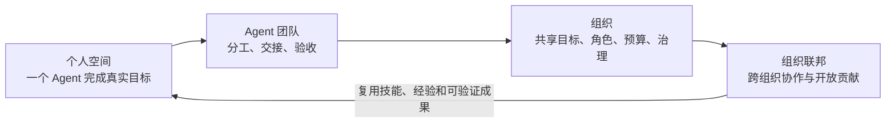
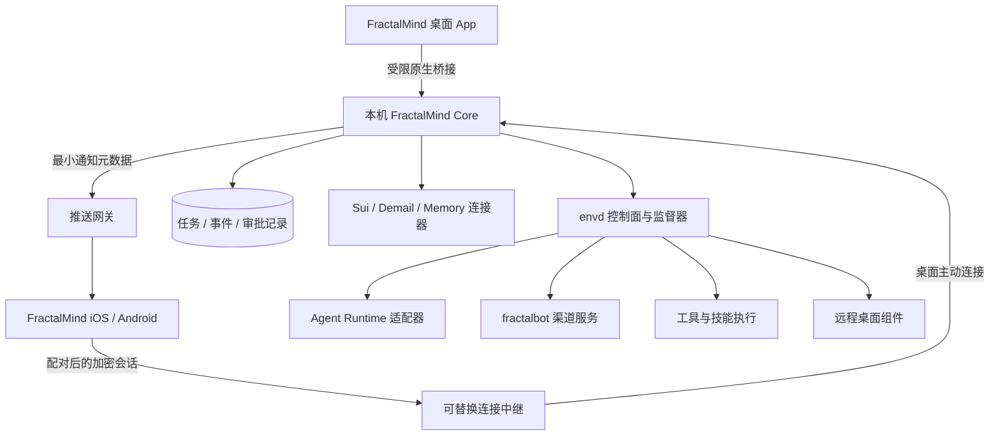

# FractalMind App 工程规划与资产盘点

状态：提案，尚未实施。基于 PR #17 合并后的 `main`（`b7382af`）。

产品范围与验收以 [FractalMind App PRD](product/fractalmind-app-prd.md) 为准。
本文保留产品方向的推导、现有资产和工程候选，供实施时参考；技术选型、
工期和支持版本仍需 P0 验证。下文阶段对应 PRD 的 P0–P4，首版特指 P2
五平台 MVP Beta，团队和组织操作进入 P3。

已确认的首版用户：个人开发者，桌面执行 Agent，手机查看进度并审批。

## 0. 使命、愿景与统一入口

依据项目现有定义：[What is FractalMind?](site/docs/guide/what-is-fractalmind.md)、
[Fractal Model](site/docs/architecture/fractal-model.md)、
[Architecture Overview](site/docs/architecture/overview.md)。

**使命**：通过自相似的 Agent、团队、组织和组织联邦，组合并发展智能能力。
**愿景**：让 ASI 成为无需许可、去中心化、任何人都可以参与的公共基础设施。
这是产品发展的方向；组织规模与智能能力之间的关系仍需验证，不能宣称
现有 App 已经实现 ASI。

**App 定位**：FractalMind 开放智能网络的统一入口，让每个人创建自己的
智能工作空间，组织人与 Agent 协作，并自主选择如何参与更大的组织与网络。

用户成长路径：

个人开发者是首版采用者。所有人的个人、团队和组织空间都沿用相同的目标、
任务、身份、权限、状态与证据结构，以便逐级组合。

| 使命要求 | 用户体验 | 架构要求 | 如何验证 |
| --- | --- | --- | --- |
| 任何人可以参与 | 安装即进入个人空间；公开浏览网络；自主创建或申请加入组织 | 本地启动、自托管连接、开放协议；组织成员关系由其公开规则决定 | 无 FractalMind 云账号也能完成本地任务 |
| 智能按组织结构组合 | 同一任务可交给 Agent、团队或组织；逐层查看结果与证据 | 统一工作单元接口和任务生命周期，保留层级边界 | 一个团队任务可拆分、交接、验收并汇总 |
| 用户自主控制 | 可选择模型、设备、服务节点；导出工作区、密钥备份和产物 | 模型/运行时适配，标准文件与 API，可替换中继；私钥控制权由用户选择 | 导出后可通过 CLI 或另一兼容客户端继续工作 |
| 开放治理 | 看见目标、成员、提案、授权与结果；参与组织决策 | Sui authority 与执行端验证；公开组织治理状态，私密运行数据链下保存 | 授权、撤销、审批与执行记录可对应核查 |
| 智能与经验持续积累 | 任务结束验收成果、沉淀记忆，选择是否分享为技能或模板 | 保留现有 heartbeat → memory → candidate OKR → governance → execution → outcome → evolution 闭环 | 后续任务能引用已有证据/记忆，分享需明确授权 |

产品承诺与原则：

- App 提供默认、易用的入口；核心组件继续支持 CLI/API、其他客户端和独立安装。
- 默认服务可替换、自托管。社区发布技能/连接器的协议开放，精选目录只是默认推荐来源。
- 个人空间默认私密。参与公共网络、发布成果和链上动作使用清晰的单独步骤。
- UI 可以简化链上细节，但组织身份、授权、撤销和治理的作用必须可见。
- 不把聊天次数、连接器数量或安装量当作智能发展程度的证明。

与既有设计的衔接：现有文档强调模型无关、使用用户环境运行 Agent、文件
契约、无 GUI 依赖。本规划把 App 作为组合和发行入口，继续复用运行时及
标准文件。SQLite 只用于 App 执行账本和查询索引；如需改变协议或自研默认
Agent 执行引擎，应先提交单独 ADR，不能由 UI 整合隐式改变核心定位。

## 1. 产品目标

用户在每台设备安装一个 FractalMind App，即可创建工作区、运行任务、管理
Agent、启用工具和连接服务。macOS、Windows、Ubuntu 提供执行能力；iOS、
Android 提供配对、对话、任务查看、审批和结果浏览。

首个价值流程：安装 → 创建个人空间 → 选择项目 → 配置模型/运行时 →
确定目标 → 发起任务 → 验收成果 → 沉淀记忆。
第二个流程：手机扫码配对 → 查看桌面任务 → 审批一次操作 → 桌面继续执行。
组织入口从首版出现在空间切换与公开网络浏览中；创建链上组织和参与治理
随其真实能力逐步开放，清楚展示测试网络和功能状态。

“一个 App”的交付承诺：

- 内置 FractalMind 核心服务和默认工具，由 App 管理配置、启动、停止和升级；
  默认兼容 Agent 运行时按其分发条件内置或由 App 引导安装。
- 扩展工具需要的 Node、Python 等依赖，在 App 内按需安装并展示进度。
- 模型账号/API key、操作系统权限和外部渠道授权，提供引导和检查。
- 新用户无需先安装 Go/Rust 开发工具或编辑 YAML；默认本地流程不要求搭建服务器。
- 手机独立安装后可进入演示和配对流程；执行真实项目任务需要已配对桌面，后续可接远程节点。
- 用户已拥有的 Codex、Claude、OpenClaw 等运行环境作为可选连接器，按其授权和分发条件接入。

## 2. 现有资产与差距

以下是源码、配置和工作流检查结果；工作流存在不等于五平台发行已验证。

| 资产 | 当前可复用部分 | 统一 App 的整合方式 | 需要补齐 |
| --- | --- | --- | --- |
| `apps/agent-console` | React/TS、协调器客户端、节点列表、控制命令、WebRTC 查看器；Tauri/Capacitor 配置 | 作为 FractalMind App 起点 | 导航、任务/会话模型、本地服务管理、配对、发布签名、iOS 工程 |
| `runtime/fractalmind-envd` | 节点发现、协调器、心跳、重连、进程监督、运行时适配、Sui 授权 | App 核心控制面和节点服务 | 本地模式、任务持久化、事件同步、安装生命周期、完整 Windows 支持 |
| `skills/coordination/agent-manager-skill/agent-manager` | 已有 Agent 操作和协议适配 | 兼容运行时适配器 | 当前 tmux/Python 依赖的托管安装；原生跨平台执行适配 |
| `runtime/fractalbot` | Telegram、飞书、Slack、Discord、iMessage 等渠道和运行时路由 | “连接”中的可选服务 | App 配置界面、健康状态、密钥引用、统一任务映射 |
| `runtime/fractalmind-envd/desktop` | WebRTC、屏幕采集、输入控制、健康检查 | 设备页中的远程桌面模块 | Windows 采集/输入、Ubuntu Wayland、系统权限和组件打包 |
| `skills/` 与 `roms/` | 技能、注册表、Agent 发行模板 | 工具/技能目录与创建 Agent 模板 | 版本锁、运行依赖、权限说明、卸载与升级 |
| `protocols/fractalmind-protocol` | Sui SDK、身份、策略和命令授权 | 组织身份、治理和远程操作授权基础 | App UX、密钥托管边界、注册和赞助手续 |
| `protocols/fractal-demail` | 邮件客户端、桥接和 gas station 适配 | 高级消息连接器 | App 数据模型、发送/收件 UX；fractalbot 的通用 Demail Agent 入站路由仍待实现 |
| `apps/explorer` | React、组织/链上可视化 | 后续“组织/网络”模块，按需加载 | React 18/19 等依赖统一、抽离组件和数据访问；避免同时引入两套应用状态 |
| `apps/typemind-android` | Android IME 与输入 API | 可选 Android 原生扩展，后续验证同一安装包内集成 | Kotlin/Manifest 合并与系统启用引导；当前 shell/root 广播不是普通 App 的无配置接口 |
| `apps/openclaw-gateway-app` | macOS 包装和权限说明 | 可选 OpenClaw 连接器的权限引导 | 统一签名和进程归属验证；当前仍要求外部 OpenClaw/Node 安装 |
| `runtime/claude-code-go` | 实验中的 CLI、server 和会话兼容面 | 实验连接器，逐功能标明支持范围 | 稳定性与兼容性验证，不作为默认执行引擎依赖 |
| 私有 memory/gateway 仓库 | 此次未检查其内部实现 | 按版本化服务协议预留连接器 | 分别核实可用 API、部署、认证、许可和数据边界 |
| `workspace/oh-my-code`、`governance/`、team/OKR/heartbeat 技能 | 文件工作区、运行闭环、团队协调、候选 OKR | 目标、团队、记忆、提案和验收的统一产品体验 | 文件适配、冲突处理、治理 UI；继续遵守 Agent OS 文件契约 |

两个明确的发行前缺口：Agent Console 当前将连接 token 存入 localStorage，
Tauri CSP 为 `null`，macOS 使用临时签名且 hardened runtime 关闭；这些都需在
正式发行前处理。现有节点命令 UI 也尚不是产品需要的任务与审批界面。

## 3. 技术方案

### 3.1 推荐沿用 React + Tauri 桌面 + Capacitor 移动

统一 UI、领域模型、API 客户端和设计系统；原生能力经 `PlatformAdapter` 访问。
桌面和移动分别构建原生安装包，对外使用相同产品名称。

| 方案 | 适合本项目的理由 | 代价与决策 |
| --- | --- | --- |
| React + Tauri + Capacitor | 直接复用现有 UI、TS SDK 和已有打包路径 | 保留两套原生壳；首版推荐，维护边界集中在平台适配层 |
| React + 全平台 Tauri 2 | 可统一原生壳；官方支持桌面与移动 | 需实机验证推送、安全存储、扫码、WebRTC 和后台恢复；PoC 全通过后可选，尚不承诺迁移 |
| Flutter | 官方覆盖五个目标平台，统一 UI 工具链 | 现有 React 页面和 TS 客户端需重写或重新桥接；本阶段投入收益较低 |

框架覆盖平台并不代表运行时能力相同。Tauri 的移动 Shell 插件不提供桌面式
子进程执行；本方案把完整 Agent 执行留在桌面/远程节点。移动本地能力使用
Swift/Kotlin 插件，例如扫码、系统安全存储、推送和文件选择。

### 3.2 控制面与执行面

FractalMind Core 是逻辑层，优先扩展 envd 的入口和包。默认运行一个本机核心
进程，按需监督独立服务；Go 核心、Rust 原生桥接和 TS UI 分别承担清晰职责。
不把所有第三方服务编进同一二进制。是否需要额外可执行入口由 PoC 的依赖
和跨平台构建结果决定。

- 本机 Core 持有任务事实与密钥引用；UI 是其客户端。
- 后台执行由 Core/OS 用户服务负责，关闭窗口继续运行；明确“退出并停止任务”操作。
- 系统睡眠时本地执行暂停，恢复后重新对账；电脑离线时手机显示离线和最后更新时间。
- 手机的消息/审批是对权威状态的请求；执行确认后再展示成功。
- 中继用于公网可达；不得获得模型 key、完整节点控制凭据和任务明文。
- APNs/FCM 推送通过通知网关发送；推送只负责唤醒提示，打开 App 后重新拉取状态。
- 支持 LAN 直连和自托管中继；外网默认中继的运营成本、隐私和可用性需单独估算。
- Sui gRPC 留在 Core/服务端或现有适配层，App 消费版本化业务 API；链上结果展示复用 GraphQL/SDK 的适用部分。

### 3.3 统一领域和 API

先约定：Space、Workspace、Organization、Team、Membership、Goal/OKR、Device、
Agent、Conversation、Task、Run、Approval、Proposal、Capability、Evidence、Memory、
Tool、Connector、Artifact。`Space` 是导航与授权范围，个人工作区不能自动等同于
已注册链上组织；两者可以经显式注册流程关联。一次 Task 可包含多个 Run。

Agent、团队和组织对外共用工作单元约定：身份、目标、任务收发、状态/心跳、
产物/证据和授权范围。基础 Task 生命周期遵循现有模型：Created → Assigned →
Submitted → Verified → Completed；执行成功只代表 Run 成功，仍需成果验收。
新增失败、取消和等待等状态须说明与现有协议的映射，不能混同聊天消息与执行。

新业务接口建议使用 `/api/v1`，定义 OpenAPI 与事件 schema，并保留现有 envd
端点供旧客户端使用。事件包含 `event_id`、`device_id`、`run_id`、序号和时间。

- API 覆盖 capabilities、任务创建/取消、事件订阅、审批、产物索引与下载。
- 能力协商返回 OS、运行时版本和可用操作；UI 据此展示能力与安装入口。
- 保留 `SYSTEM.md`、`SOUL.md`、`AGENTS.md`、`USER.md`、`HEARTBEAT.md`、
  `OKR.md`、`okrs/Candidate.md` 和 `memory/` 等既有工作区契约；UI 通过
  受控文件适配访问，`OKR.md` ACTIVE 目标数量继续遵守现有最多 3 条的约束。
- SQLite 保存 App 执行账本、事件、审批和组件版本，以及文件/链上状态的查询
  索引；文件目标/记忆和 Sui 授权仍由其原有来源决定，不建立相互竞争的事实库。
  外部文件变更检测、来源版本与冲突处理进入适配器契约。
- 密钥放系统安全存储，数据库只保存引用；提供用户可控的备份和恢复路径。
- WebSocket/SSE 断线后按游标补拉；每个设备是自己 Run 的权威写入端。
- 手机离线可编辑消息草稿；危险操作和审批不自动积压执行，重连后要求状态有效。
- 创建任务、审批和重试均有幂等 ID；审批绑定具体操作、参数摘要、有效期和版本。
- 崩溃后已发起的外部副作用标为待对账，不能简单重放；持久化幂等记录并核对执行状态。
- 代码修改、日志和产物留在工作区/桌面；手机只按需读取，权限撤销立即阻止新增读取。

### 3.4 执行与授权

运行时适配器提供 capabilities、start、assign、events、cancel、resume、health；
审批能力由各适配器如实声明。无法提供操作前审批的 CLI 不能伪装支持该能力。

默认优先实现跨平台的受管进程适配。Unix PTY 和 Windows ConPTY 分别适配；
支持结构化事件的运行时优先走其协议，交互 CLI 走终端适配。原有 tmux
agent-manager 保留兼容接入，不能以当前 tmux 发现方式承诺原生 Windows 支持。

首版选择一个可分发/可引导安装的兼容运行时做默认体验，整合有限的文件读取、
受控修改和命令执行工具；再接一个已安装的开发 Agent。CLI 路由的聊天、
运行状态和审批能力需分别验收，不能把终端输出等同于可靠任务事件。

授权设计有两类明确边界：

1. 新增本地工作区模式：由本机权限管理，默认不要求钱包。
   这是需要实现和验证的独立授权域，不是关闭现有节点授权校验。
2. 手机远程操作、接入 Sui 节点/联邦网络：沿用 NodeCommand 验签、策略、目标绑定、
   nonce 和持久化执行结果；不能用普通 App token 绕过原有授权。

扫码使用一次性短期配对挑战；用户核对两端验证信息，建立独立设备密钥。
配对解决设备识别和加密传输；远程权限另行映射到目标验证的 capability。
App 引导身份注册、赞助交易和授权，分别展示配对成功与授权就绪。首版在
明确标识的测试网上验证；远程授权不可用时，阻止相应操作。App 不能以
扫码配对替代协议授予权限。可逐设备撤销和限制权限。
敏感操作用 App 内审批，生物识别可作为解锁手段。
本机 IPC 优先使用有访问限制的 socket/管道；如需 loopback HTTP，仍要随机
凭据、Origin 校验和明确的可调用范围。生产 UI 不直接持有任意 shell 能力。

## 4. 产品界面

全局入口是“我的空间 / 我的组织 / 开放网络”；空间内沿用相同工作界面。
“我的空间”可在不加入组织时完整使用；“我的组织”显示成员关系和参与的
团队；“开放网络”显示组织、公开目标、可复用技能和公开贡献入口。
内容发现与私有工作区严格分开，每个页面显示当前空间与授权范围。

| 模块 | 用户主要操作 | 首版范围 |
| --- | --- | --- |
| 工作台 | 确定目标、查看待办、继续对话与审批 | 默认首页；首个目标、运行状态、成果验收和错误恢复 |
| 目标与任务 | 查看优先级、队列、运行、审批与历史 | Goal → Task → Run → Evidence；取消、重试、产物 |
| 团队与 Agents | 创建 Agent、选择模型/模板、组建团队 | 一个默认 Agent、已有 Agent 接入、基本生命周期；后续 Lead/成员分工 |
| 记忆与成果 | 查看任务证据、决策、复用经验 | 个人任务完成记录和本地记忆；公开分享在后续显式启用 |
| 治理 | 查看成员、提案、委托、预算和撤销 | 首版提供权限与审批；组织治理随链上能力分阶段开放 |
| 工具与连接 | 启用技能、配置模型和渠道 | 内置工具与精选技能；明确权限、依赖、安装位置 |
| 设备 | 配对手机/电脑、查看健康、打开远程桌面 | 配对、撤销、在线状态；远程桌面作为后续增强 |
| 设置 | 凭据、通知、存储、升级、诊断 | App/组件版本、脱敏诊断、备份/重置和卸载策略 |

桌面使用空间切换、侧栏和任务详情面板；手机使用工作台、任务、空间、设置
底部导航，审批和继续对话放在首屏可达位置。设备与连接的配置进入空间设置。
组织创建/加入、治理、Demail 和 Explorer 能力分阶段加入同一导航体系，
成熟功能采用共享组件和数据模型迁移。

个人目标和操作审批首版就进入交付流程；团队/组织治理不能只留成设置页。
团队阶段须验收任务交接、Lead 责任、证据验证；网络阶段须验收公开规则、
组织自治、跨组织协作和自愿贡献。

技能面板复用现有 `npx skills add` 安装语义和注册表，但由桌面 Core 执行，
提供预览、版本锁和结果。内置技能直接分发，不要求用户自己运行 npx。
移动端启用技能时明确目标桌面/节点；可执行依赖安装在那里。

## 5. 五个平台的支持契约

以下为目标，具体最低版本在 PoC 后锁定。首轮实测优先：macOS Apple Silicon，
Windows 11 x64，Ubuntu 22.04/24.04 x64，iOS 和 Android 真机；macOS Intel、
Windows ARM 与 Linux ARM 在相应运行时和安装包通过后再列为正式支持。

| 平台 | 任务/对话/审批 | 本地 Agent | 远程桌面作为被控端 | 安装与后台 |
| --- | --- | --- | --- | --- |
| macOS | 完整 | 完整 | P4 专项验收；采集/辅助功能需系统授权 | 签名、公证 DMG；GUI 相关服务使用用户 LaunchAgent |
| Windows | 完整 | 必须完成原生进程、ConPTY、取消和重启验证 | 后续；需独立采集/输入实现 | 签名 EXE/MSI；Core 与 GUI 会话权限分离，验证 Job Object 清理 |
| Ubuntu | 完整 | 完整 | 分别验收 X11 与 Wayland；现有 xdotool/X11 不能代表 Wayland | DEB 优先；用户 systemd 服务；系统 WebView 依赖随包声明 |
| iOS | 完整远程协作 | 首版在已授权桌面执行 | P4 查看端，需实机验收 WebRTC | TestFlight → App Store；APNs，恢复时同步 |
| Android | 完整远程协作 | 首版在已授权桌面执行 | P4 查看端，需实机验收 WebRTC | 测试 APK → 签名 AAB；FCM；IME 后续可选 |

iOS 下载/执行代码与后台运行受平台规则限制；Android 前台服务也有启动和
运行限制。因此手机协作以推送、前台同步和可恢复请求实现，不依赖永久
后台 WebSocket 或桌面式守护进程。

## 6. 安装、组件和发行

- 一个产品版本同时记录 Core、API schema、UI、平台壳和可选组件版本。
- 基础包包含 UI、Core、默认运行时和默认工具；大组件按需安装，锁版本、
  校验签名/摘要，失败可恢复；不在后台静默执行任意注册表安装脚本。
- 需要 Git 等外部工具的操作在启动前检测，提供 App 内安装路径或连接已有安装。
- OS 权限只在启用对应能力时引导；不将远程桌面、全盘访问、WireGuard 作为首次运行的前提。
- 最早阶段就验证签名产物：macOS Developer ID/公证与稳定 helper 身份；
  Windows Authenticode；移动端开发者账号、签名和推送资质。
- 桌面更新要求签名和版本兼容；Ubuntu DEB 可走包管理渠道，移动端随商店发行。
- 活跃任务期间先下载，等安全检查点再升级；数据库迁移先备份，回滚必须兼容数据格式。
- 重启、崩溃和升级都按任务账本恢复，不重复执行已确认副作用。
- 卸载时停止后台服务，提供删除或保留工作区数据选项；日志不得包含凭据。

建议工程结构：先在 `apps/agent-console` 迭代，产品名称改为 FractalMind；
品牌包名/App ID 迁移经过已发布安装包核查后决定。待第一阶段稳定再移动到
`apps/fractalmind`，同步工作流路径和数据迁移。共享 UI/客户端可抽取到
`packages/app-ui`、`packages/app-client`，明确与现有协议 SDK 的职责。
不将目录改名和深层运行时重构放在同一 PR。

## 7. 分阶段实施

估算前提：2–3 名能覆盖前端、Go 和原生发行的工程师，具备五个平台的测试
设备及开发者账号。以下是工程规划区间，不是交付承诺；商店审核时间另计。

### P0：架构与五平台验证，1–2 周

交付：使命到产品能力的映射、个人/团队/组织空间原型、平台能力表、API/schema
草案、运行时适配和原生壳决策。

- 五个平台分别启动同一 UI、访问测试 Core，并完成安全存储/扫码验证。
- macOS、Windows、Ubuntu 完成受管进程启动、事件采集、取消、重启清理。
- 验证普通用户安装，尽早试签名 DMG/Windows installer/iOS TestFlight。
- 原生壳对比只做同一条关键流程：配对、通知、前后台切换；WebRTC 作为后续能力做技术预研，
  全平台 Tauri 未通过门槛时沿用现有 Tauri + Capacitor。
- 确认默认模型/运行时及其分发条件；验证本地授权与远程 Sui 授权边界，
  以及配对后首次 capability 注册/授权的真实步骤。
- 核查现有协议的组织、成员、任务、提案 API，标记哪些能直接接入、哪些尚待实现。
- 为文件索引/执行账本、跨平台 tmux 适配和新本地入口记录 ADR；保留原有核心契约。

退出标准：五平台 UI 和三桌面执行验证均有实测记录，不能仅凭框架支持表通过。

### P1：桌面 Alpha，3–4 周

交付：三个桌面平台的安装包、默认本地 Core、一个模型运行时、任务与审批。

- 首次运行创建个人空间与工作区、配置模型/运行时、设定目标、执行文件分析/
  修改任务并展示 diff；由用户验收成果并形成记忆。
- 提供全局空间切换与组织/网络的基础入口，清楚区分已实现功能和测试网能力。
- 任务事件、运行结果与审批持久化；关闭窗口后台继续。
- 默认工具无需外部开发环境，缺失可选依赖时提供安装或禁用说明。
- token 迁移至安全存储、启用 CSP、收窄原生桥接。
- 交付首版所需的数据导出、升级恢复、卸载与脱敏诊断；后续发行阶段继续完善。

退出标准：三平台干净环境完成首次任务；进程崩溃、取消和 App 重启不丢任务，
不重复执行副作用。失败时用户看到可操作的恢复入口。

### P2：手机协作 Beta，3–4 周

交付：Android 与 iOS 测试版、设备配对、加密同步、中继和推送。
同时交付真实公开组织的查找与详情，以及来源、网络、空态和错误状态。

- 完成扫码、逐设备密钥、Sui capability 授权、撤销和重连对账；签名命令
  走目标端验证，不扩大兼容 bearer 控制命令的暴露面。
- 手机发起任务、继续对话、查看产物、处理具体操作审批。
- 验证 LAN、Wi-Fi → 蜂窝、桌面离线、手机杀进程和推送重复到达。
- 重复/过期/撤销后的审批不执行；联网后成功与失败均得到服务端确认。

退出标准：两类手机分别在外网完成“发起任务 → 审批 → 查看结果”，桌面离线
可辨识，通知无需后台长连接，撤销生效；并满足 PRD 定义的全部五平台 MVP
要求，包括公开组织浏览、导出、恢复、升级、语言和可访问性。

### P3：团队、组织入口与发行，4–5 周

交付：一个可运行 Agent 团队、组织基础入口、技能目录、fractalbot 首个渠道、
现有 Agent 接入、发行和诊断体系。

- 至少一个现有开发 Agent 与一个消息渠道映射到同一任务模型。
- 至少两个 Agent 在 Lead 协调下完成一次目标拆分、交接、验收与结果汇总。
- 按已实现协议支持测试网组织创建/加入、身份和权限查看、基本提案入口；
  尚未实现的治理动作明确标注，不将注册或投票宣传成组织智能已验证。
- 技能安装、禁用、升级和依赖失败可恢复，模型与渠道凭据统一管理。
- 完成更新签名、组件兼容检查、迁移/卸载和支持说明。
- 五平台发布候选版本，建立真实安装/启动/配对/任务回归流程。

退出标准：五平台候选版本通过核心流程；商店提交材料、运营中继/推送方案
及发布责任人到位；单 Agent → 团队的交付闭环通过。远程桌面、Explorer、
复杂链上治理按各自验收结果开放。

### P4：扩展能力，滚动规划

逐步加入跨组织提案/任务协作、预算与委托治理、Memory 服务、Demail、
完整跨平台远程桌面、Android IME、多节点调度和远程计算。每个连接器需满足
统一身份、任务、权限、健康和诊断约定；不以展示一个旧网页作为整合完成标准。

## 8. 验收与观测

产品首要指标：每周经过验收、具有可追溯证据的目标成果数，以及完成这些
成果所需的人类介入时间。团队与网络能力上线后再观察：多 Agent 交付成功率、
成员持续参与、跨组织协作成果数、技能/经验被复用的比例。单独报告失败与
资源成本；规模增加本身不等同于智能能力增长。

指标定义、分母、目标和试用方法见 PRD 第 10 节；工程验收引用 PRD 的
FR/NFR 编号，避免使用不同口径的“首次成功”或“配对完成”。

每次 PR：共享客户端/API 契约测试、核心构建和任务恢复测试。受影响的原生壳
做相应平台构建。发布前：真实安装、关键权限、更新迁移和五平台核心流程
验收。Web 浏览器测试不能替代 WKWebView/Android WebView 和系统权限测试。

先收集本机脱敏诊断；上传诊断和产品指标由用户选择。模型成本优先展示
可验证的 token/计费来源，未知成本明确标记，不凭估计宣称精确费用。

## 9. 最先拆出的工程切片

1. 产品契约与原型：使命映射、个人/团队/组织空间、默认闭环、统一工作单元、
   capabilities 和版本化 API。
2. 三桌面受管执行器 PoC：Unix/Windows 生命周期、事件、取消和权限边界。
3. 五平台原生壳 PoC：安全存储、配对、通知、WebRTC 与签名发行验证。
4. Desktop Bootstrap：Core 打包、首次运行、后台生命周期与诊断。
5. Task/Run/Approval：持久化、事件恢复、幂等和副作用对账。
6. Mobile Pairing/Sync：逐设备授权、中继、推送和撤销。
7. Connector/Skill Manager：接入现有运行时、fractalbot 和技能安装。

P0 的 1–3 项通过后再锁定详细排期；先交付“三桌面本地目标闭环 + 两移动端
远程协作”，随后验收个人 → 团队 → 组织的连续路径。统一入口的验收是用户
能够沿此路径完成工作和参与协作，后续模块按真实能力逐个发布。

## 10. 外部技术依据

- [Tauri 平台与架构](https://v2.tauri.app/start/)：支持桌面/移动，采用 Web UI 与原生桥接。
- [Tauri sidecar](https://v2.tauri.app/develop/sidecar/)：可分发外部二进制，需针对平台/架构产物。
- [Tauri Shell 平台能力](https://v2.tauri.app/plugin/shell/)：移动端不具备桌面式子进程能力。
- [Capacitor 文档](https://capacitorjs.com/docs)：Web 应用到 iOS/Android 的原生运行时及插件路径。
- [Flutter 平台矩阵](https://docs.flutter.dev/reference/supported-platforms)：框架覆盖候选平台，不等于本项目功能已验证。
- [Apple App Review Guidelines §2.5](https://developer.apple.com/app-store/review/guidelines/#software-requirements)：移动代码执行和后台服务的约束，需在设计与发行时核查。
- [Android 后台任务](https://developer.android.com/develop/background-work/background-tasks)：前台服务与后台运行限制，推送和恢复机制需独立设计。
