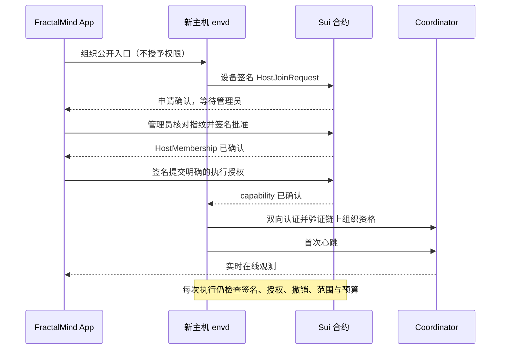

# FractalMind App 产品需求文档（PRD）

| 项目 | 内容 |
| --- | --- |
| 状态 | 待评审；单 HTML 原型已覆盖核心交互，生产集成按验收门槛交付 |
| 文档版本 | 0.7 · 链上组织与 Host 接入 |
| 产品 | FractalMind App |
| 定位 | FractalMind 开放智能网络的统一入口 |
| 首批用户 | 个人开发者：管理本地与云端执行主机，桌面/手机查看进度、继续对话和审批 |
| 目标平台 | macOS、Windows、Ubuntu、iOS、Android |
| 首版边界 | P2 五平台 MVP Beta；P1 为桌面 Alpha，P3 为团队协作与治理阶段 |
| 依据 | PR #18 产品基线、用户确认的 OKR 方向，okr-manager 技能约定，以及组织 / 链上持久状态的产品决策 |
| 配套文档 | [工程规划与资产盘点](../fractalmind-app-plan.md)；技术选型由 PoC/ADR 确认 |

本 PRD 是 App 产品范围和验收的依据。工程规划中的方案、工期和框架建议
服务于这些需求；需求变化应同步更新本文件。发布阶段不代表协议已上主网，
也不代表产品已达到 ASI。

## 1. 使命与产品定位

FractalMind 的使命是通过分形、自相似的 Agent 组织，向 ASI 发展；愿景是让
智能成为无需许可、去中心化、任何人都可以参与的公共基础设施。

**FractalMind App 让每个人建立自己的组织，组织人与 Agent 完成目标，
并自主参与更大的团队、组织和开放网络。**

用户的成长路径为：个人组织 → 人与 Agent 的团队 → 子组织与组织协作 → 组织联邦。
每一级复用 OKR、约束、任务、身份、权限、状态和成果证据，以便逐级组合能力。
用户通过 OKR 定义期望的结果和执行边界；Agent、团队或组织在授权范围内
自主规划、执行、验证与调整，成果及经验继续支持更大尺度的协作。
个人开发者是首批采用者，产品模型应支持完整成长路径。

| 使命要求 | 产品承诺 | 可观察的结果 |
| --- | --- | --- |
| 任何人可以参与 | 安装后可建立个人组织；可发现公开组织并按其规则参与 | 无 FractalMind 云账号；用自持身份创建链上组织，连接执行主机；加入其他组织遵循其规则 |
| 智能按组织结构组合 | 任务可由 Agent、团队或组织承接，逐层交接和验收 | 同一目标的子任务与汇总成果可追溯 |
| 用户自主控制 | 可选择模型、运行设备和服务节点，导出数据 | 用户能保留工作成果并通过兼容工具继续工作 |
| 开放治理 | 目标、成员责任、授权、决策和结果可以核查 | 权限来源、撤销状态与执行证据可对应 |
| 持续积累能力 | 完成任务后验收、复盘、沉淀记忆，选择分享技能与模板 | 后续工作能够引用已有成果和经验 |

这些承诺遵循现有[使命与愿景](../site/docs/guide/what-is-fractalmind.md)、
[分形模型](../site/docs/architecture/fractal-model.md)和
[三平面架构](../site/docs/architecture/overview.md)。组织规模与智能能力的关系
需要持续验证，不能用安装量、聊天量或 Agent 数量代替能力证据。

## 2. 用户问题与目标

当前服务、工具和界面分布在多个组件中。用户需要理解协调器、运行时、配置、
技能安装和设备连接，才能完成一个目标；任务、授权、成果和经验也缺少连续的
产品视图。统一 App 应承担安装、连接、编排和状态解释，使用户围绕目标工作。

| 用户 | 要完成的工作 | 当前阻碍 | 产品完成条件 |
| --- | --- | --- | --- |
| 首次使用的开发者 | 让 Agent 分析或修改一个项目 | 安装依赖、选择运行时、配置不连贯 | 在 App 内完成安装引导、配置、执行与成果验收 |
| 拥有多台执行主机的开发者 | 统一管理本地小主机与云端服务器，按目标选择执行位置 | 节点、Agent、终端、桌面与 OKR 相互分离 | 主机 → Agent 实例 → OKR/Run 可追踪，一台失联不影响其他主机 |
| 日常使用的开发者 | 持续推进目标，理解 Agent 做了什么 | 对话、终端、文件和权限状态分散 | 同一目标下看见任务、执行、证据、审批和结果 |
| 离开电脑的开发者 | 用手机继续任务并批准具体操作 | 外网连接、电脑离线、通知与恢复不可靠 | 手机得到可信的当前状态，决定被桌面确认后生效 |
| 后续团队负责人 | 组织多个 Agent 分工并对成果负责 | 缺少统一责任、交接和验收 | Lead、成员、任务与成果形成可追溯的协作过程 |
| 后续组织参与者 | 加入组织、参与目标和治理 | 身份、规则、授权和贡献入口分散 | 能了解参与条件、获得相应权限并核查贡献结果 |

首版首要结果：用户通过一个已确认的 OKR，让 Agent 在约束内自主推进，
完成至少一个经过验证、有证据可查看的关键结果，并能从手机查看与协作。用户不需要预先学习组件名称、编辑 YAML 或
手动执行安装命令。

## 3. 产品原则与交付边界

1. 每台设备安装一个 FractalMind App。核心组件统一管理，扩展依赖在 App 内
   按需安装；模型账号、外部服务账号、网络费用和系统权限仍需用户提供或授权。
2. 个人使用也建立链上 `Organization`，不引入独立 `Space`。所有持久产品状态
   以 Sui 为权威来源，不建设业务后端或业务数据库。App、Coordinator、envd
   只能保留可重建缓存和执行所需的临时状态；私钥和外部凭据留在设备安全存储。
   个人组织不自动保证私密或限制注册；敏感内容需加密，访问权需独立定义。
3. 本地电脑、小主机和自有云端服务器承担执行，桌面与手机通过统一 App 管理。
   手机单独安装后可浏览公开内容和引导演示；真实执行指向一台明确授权的主机。
   无桌面的云端主机使用受支持的执行服务，主机接入与授权由 App 引导。
4. 用户始终知道当前组织、执行设备、模型/运行时和可执行权限。切换组织后
   重新确定这些上下文，避免把一个组织的操作发送到另一个组织。
5. 用户确认 OKR、成功标准、执行约束与验证方式；Agent 自主拆解和调整任务。
   运行成功、任务验收、KR 验证与 OKR 达成分别记录。用户或预授权验证者
   检查证据后才构成验收；常规操作在既定边界内推进，越界或异常时升级。
6. 同一入口提供完整工作体验；CLI/API、独立组件、其他兼容客户端和自托管
   仍可使用。工作区和成果不依赖某个官方服务才能取回。
7. 一个功能达到配置、授权、操作、状态、失败恢复和数据边界的要求后，
   才计为整合完成。公开元数据、加密内容和访问授权保持明确的边界。

## 4. 范围与版本

本文中的“首版”特指 P2 五平台 MVP Beta。“必须”表示该阶段发布门槛；
后续能力提前具备模型与导航位置，但未实现时不得显示可用操作。

| 能力 | 首版 P2 必须交付 | 后续 P3 | 后续 P4 |
| --- | --- | --- | --- |
| 个人组织 | 创建/恢复链上组织、导入项目、OKR、约束、自主执行、审批、验证、记忆、导出 | 更多模板与协作入口 | 跨节点工作区协作 |
| Agent | 一个经过验证的默认兼容运行时，生命周期和能力说明 | 已有开发 Agent 接入、至少两个 Agent 的团队交付 | 多运行时组合与调度 |
| 手机协作 | 配对、授权、对话、任务发起、审批、产物查看、通知，以及多主机查看与授权控制 | 更完整的团队协作 | 更大规模的跨组织节点 |
| 主机与算力 | 本地/云端主机清单、多 Coordinator 连接、Agent 实例、日志与命令、已有能力支持的远程桌面、OKR 执行位置与明确改派 | 批量策略与资源感知调度 | 跨组织算力协作 |
| 工具与技能 | 内置文件/命令类能力、权限和依赖管理 | 可安装技能目录、至少一个消息渠道 | 开放连接器生态 |
| 组织与网络 | 组织创建/恢复、成员资格与权限读取、主机申请/批准/撤销、公开组织浏览；显示来源与确认状态 | 人员协作、角色委派与基本提案流程 | 跨组织任务、联邦与复杂治理 |
| 设备与发行 | 三桌面执行、两移动客户端、恢复、升级/卸载与诊断 | 完善公开发行渠道 | 扩展 CPU 架构与系统版本 |
| 专项能力 | 在产品模型中留出连接器入口 | 按验证结果开放 Explorer 深度视图 | Demail、Memory 服务、Android IME、资源共享 |

首版不承诺：手机本地运行完整开发 Agent、全平台远程桌面被控能力、无人
验收的自主组织、代管模型订阅、云计算托管、主网治理或资产交易。其后续
范围需要相应需求和验收；组织的链上记忆及其本地缓存属于首版。

## 5. 信息架构与核心概念

全局入口：**当前组织切换器 / 我的组织 / 开放网络**。

- 当前组织：所有 OKR、主机、Agent、授权与治理操作的上下文；个人开发者默认
  使用自己的 Organization，项目 `Workspace` 是组织内的项目目录与执行范围。
- 我的组织：展示可验证的组织关系；切换后重新加载该组织的工作台、OKR、主机
  与权限。名称、缓存和网络连接不能推导成员资格。切换本身不授予或撤销权限。
- 开放网络：浏览组织公开的使命、规则、网络、身份与更新时间。公开字段一旦
  上链不能承诺保密或物理删除；受保护内容的解密权与组织浏览是不同能力。
  未加入、未授权、查询失败、无结果和离线分别呈现。

组织内的工作界面：

| 页面 | 主要内容 | 首版关键动作 |
| --- | --- | --- |
| 工作台 | 运行导航地图、当前动作/位置、偏航与边界、执行主机、待介入事项 | 切换关注的 OKR、运行对话、暂停/恢复、纠偏换路、处理越界、查看对应 OKR |
| OKR | 默认只展示目标列表：生命周期、优先级、负责人、截止日期与结果达成度；点击进入成功标准、KR、趋势、边界、计划与证据详情 | 新建/筛选、确认/激活、调整约定、检查证据、复盘、在工作台查看运行 |
| 主机与算力 | 本地/云端主机、心跳、资源、Agent 实例、正在执行的 OKR | 接入主机、管理连接、远程命令/桌面、维护接单状态 |
| 团队与 Agents | Agent 角色、模型、设备、可用能力和健康状态 | 选择 Agent、配置运行时、启动/停止 |
| 记忆与成果 | 已验收成果、决策与经验，关联来源 | 查阅、编辑、删除记忆，引用已有成果 |
| 治理 | 当前权限、授权设备和决策记录 | 查看权限、操作审批和撤销；组织提案后续开放 |
| 组织设置 | 工作区、设备、工具、连接、凭据、存储和通知 | 配置、配对、恢复、导出和诊断 |

桌面使用组织切换与侧栏，任务详情并列展示对话、进度和成果；手机使用
工作台、OKR、主机、组织、设置五个入口，审批和待验收结果在工作台可达。
首版提供简体中文和英文，状态不只靠颜色表达，桌面关键流程支持键盘操作，
手机支持系统字体缩放和读屏标签。

关键对象关系：`Organization` 确定协作和授权范围；个人组织、团队组织与
子组织复用现有链上对象。`Workspace` 指向实际项目目录，不构成另一种组织。
`OKR` 包含 Objective、Success Criteria、Key Results 与 Execution Constraints；
`Task` 关联 KR，`Run` 表示一次执行，`Approval` 绑定具体操作，`Evidence/Artifact`
支持验证，`Memory` 保留经验。上述持久记录都归属明确的组织。

`HostJoinRequest` 表示设备签名的加入申请；`HostMembership` 表示管理员批准的
主机组织资格；执行 capability 表示可做的操作、范围、预算与有效期。
`CoordinatorBinding` 表示组织认可的连接端点。Host 申请/资格与连接绑定需协议
扩展；执行 capability 复用并验证现有 remote authority 的映射。新增对象名称
为产品设计名，不表示已有同名合约。Host 设备身份、Agent 身份、Agent 实例和
操作者身份分别校验；主机名称与 Coordinator 上报的 host_id 不能充当身份凭证。

## 6. 核心用户流程

### J1：安装到首个成果

1. 用户安装桌面 App，创建或恢复签名身份；选择创建个人 Organization 或读取
   已有链上组织。展示网络、公开字段、费用与签名动作；交易确认后才能进入已创建
   状态。费用不足、取消签名、RPC 不可用时保留草稿，不能仅写本地列表冒充创建。
2. 选择项目目录，查看并授权需要访问的范围；导入时先预览现有配置。
3. App 检查运行时和依赖，给出内置、安装或连接已有环境的路径。首次执行的本机
   同样通过 J7 获得 HostMembership 和执行授权；个人组织的管理员可在同一 App
   完成设备申请及管理员批准，但两个身份、签名和状态仍需区分。
4. 用户配置模型，验证可用性，了解计费来源和已知限制。
5. 输入 Objective；Agent 协助拟定 1–3 条量化成功标准、结果型 KR、依赖与
   验证方式。用户确认负责人、优先级、时间窗、工作范围、预算及升级条件。
6. 质量校验通过后提交链上 OKR 草案；用户确认且链上确认后激活。已有 3 个 ACTIVE 时，
   新目标保存在候选池。Agent 按依赖自主拆任务，选择工具、执行并验证。
7. 用户通过 KR 实测值、达成趋势、证据和异常了解进展；heartbeat 检查
   依赖、约束与阻塞，自主调整计划。越界、预算不足或验证失败且无法自行
   修复时升级请求，未经批准不执行超出约定的操作。
8. 预授权验证者按已确认方式验证 KR；全部 KR 完成后复核成功标准，
   通过才记为 ACHIEVED。用户可检查/质疑证据、要求补充，并将经验写入记忆。

依赖安装、模型鉴权或执行失败时保留配置与已完成步骤，提供重试和替换
运行时入口。新用户没有项目时可使用明确标记的示例工作区。

### J2：从手机接手桌面任务

1. 桌面生成短期配对码，手机扫码；两端核对设备并确认配对。
2. 配对建立设备连接，组织管理员另行签署绑定该手机身份、组织、动作及有效期的
   链上授权；确认后生效。手机配对码只用于配对，不能替代 J7 的 Host 入组织流程。
   App 明确区分“已连接”“授权待确认”“已授权”。
3. 手机查看 OKR 达成度、KR 证据与 Agent 计划，继续对话、确认 OKR 或调整
   执行约定；执行设备确认版本和权限后生效。任务保留为 KR 下的详情。
4. 收到通知后打开 App，获取当前待审批操作，查看影响范围并同意或拒绝。
5. 桌面验证权限和操作状态，确认结果回传；手机查看产物并参与成果验收。

手机使用蜂窝网络时仍须完成该流程。桌面睡眠、离线或授权服务不可用时，
明确显示原因及最后同步时间；用户可保存草稿，远程操作等待有效连接和授权。

### J3：失败、取消与恢复

任务断线时显示连接状态和最后确认进度；重新连接后同步已有事实。用户
发出取消后先显示“正在停止”，收到执行设备确认后才显示“已取消”。已发生
的文件修改和外部操作保留记录，不因取消而宣称回滚。

App/执行进程崩溃后重新检查运行状态和副作用证据。能够恢复的 Run 继续；
无法确认是否执行的操作标为“需要确认”，用户可检查结果后决定下一步。
重试创建新的 Run 并保留上次记录，不自动重复已完成的外部操作。

### J4：管理权限与设备

用户查看每台设备可以访问的组织和操作，修改范围或撤销权限。撤销确认后
禁止新的受保护操作；已开始的操作按执行状态尝试停止并显示结果。设备
遗失时通过仍受信任的设备恢复/撤销；没有可用凭据时进入恢复流程，不能
通过重新配对继承旧权限。

### J5：从个人组织走向更大协作

个人使用从同一个 Organization 模型开始。首版支持创建/恢复个人组织、读取
组织关系及管理 Host；不需要把“个人空间”转换为另一种链上对象。
用户可以浏览公开组织，查看使命、参与条件和网络，按组织规则申请相应资格。
人员加入和角色委派涉及的协议缺口在 P3 交付；UI 不把当前 Agent 自助注册当作
管理员批准的人员成员关系。跨组织访问需新授权，不自动共享个人组织内容。

团队协作阶段，Lead 拆分任务，成员提交子任务成果，验收者逐项验证后汇总。
子组织使用现有层级模型，权限继承需显式定义；联邦与跨组织能力在 P4 单独验收。

### J6：升级、导出与退出

用户在 App 内查看版本和更新，活跃任务期间可先下载并延迟应用。升级失败
保留可恢复数据和明确的修复入口。用户可导出标准工作区、成果和历史记录，
凭据备份单独处理。退出窗口可保留后台执行；“停止任务并退出”需要得到
明确执行结果。卸载停止后台组件，并允许用户选择保留项目数据。

导出包应包含版本化清单、标准工作区文件、可读的任务/验收记录和所选产物；
清单标明来源组织、导出时间和缺失内容。仅导出索引时说明哪些产物仍需从
原设备取回；不能把不完整包显示为完整备份。

### J7：新主机加入组织

1. App 选择已确认的 Organization，生成包含网络、包版本和组织 ID 的公开接入
   链接/二维码。它是定位信息，不是密码或持有即授权的邀请；若需短码，只能是
   可验证的编码/解析方式，不依赖 Coordinator 私有数据库保存秘密。
2. 有桌面的设备安装 FractalMind App 并打开入口；无桌面的服务器安装 envd
   并导入入口。envd 在本机生成或恢复设备密钥；主机拥有者确认组织、公钥指纹、
   项目目录和允许的本机能力。安装发行与 CLI 未完成前不展示虚假的可执行命令。
3. envd 用设备身份签署 `HostJoinRequest` 提交 Sui，绑定组织、设备公钥、nonce、
   申请范围与期限。App 区分签名待提交、交易待确认、申请已确认、失败/过期。
   此步骤不要求 Coordinator 在线；申请上链不代表加入成功。
4. 当前组织管理员在 App 核对新主机显示的指纹，批准或拒绝该请求。Sui 合约
   校验管理员权力、组织和设备绑定、期限、请求版本和防重放，确认后产生
   `HostMembership`。普通 AgentCertificate 不能替代这项管理员批准。
5. 管理员单独确认执行 capability：目标设备/Agent、delegate、允许动作、项目
   范围、预算、使用次数与有效期。桌面访问/控制单独授权。申请、成员资格和
   capability 可在设计允许时合并交易，但必须分别呈现是否确认及各自语义。
6. envd 与链上认可的 Coordinator 双向认证；Coordinator 验证组织资格，将认证
   公钥与 host_id 绑定。envd 验证实际命令签名、目标、链上授权/撤销、时效与
   本机限制。完成认证且收到新心跳后，才显示连接在线并部署/发现 Agent 实例。
7. App 展示“组织已批准、授权待确认”“已授权、连接未上线”“在线但执行授权
   已撤销”等组合状态。撤销确认禁止新的受保护操作；已有操作须单独确认停止。
   重启 Coordinator 后从链上恢复目录，在线状态等待重新认证/心跳。

失败恢复：交易结果未知时查询原交易，不盲目新建申请；重复确认不能重复入组或
授权。错组织、错指纹、非管理员、过期/已消费请求、已撤销资格均不可放行。
Coordinator 不可达不改变链上资格；Sui 不可达不能伪造交易确认或基于过期缓存
扩大权限。设备失钥走新身份申请及旧身份撤销，禁止通过主机重命名恢复旧授权。

## 7. 功能需求与验收

以下 FR-01 至 FR-20，以及 FR-25 至 FR-34，均为首版 P2 必须满足的要求。单个平台缺失对应核心能力
时，该平台只能标为预览，不能计入五平台 MVP 验收。

| ID | 功能要求 | 验收条件 |
| --- | --- | --- |
| FR-01 | 一体安装和首次启动 | 在三类干净桌面环境中，无预装 Go/Rust/Node/Python、无终端操作，完成默认运行时准备及 J1；系统包安装可由安装器处理 |
| FR-02 | 组织与工作区 | 创建/恢复链上 Organization，显示待确认/失败/已确认；个人使用也有组织 ID；切换后 OKR、主机、搜索和授权按组织隔离；导入项目取消不修改原文件 |
| FR-03 | 模型与运行时 | 至少一个默认兼容运行时在三桌面通过 J1/J2；鉴权可验证和撤销；如不支持特定审批/恢复能力，显示限制且不提供无效操作 |
| FR-04 | OKR 与自主执行约定 | 按第 8.1 节校验 Objective、成功标准、KR 及约束；用户确认后激活，最多 3 个 ACTIVE；候选可编辑/确认；Task 关联 KR、工作区、责任 Agent 和执行设备；重复提交不重复激活或创建任务 |
| FR-05 | OKR 可视化与执行观测 | 展示 KR 基线/实测/目标/权重、证据、依赖、总体达成度、趋势、预算、阻塞和下一步；计算遵循第 8.1 节；展开可看 Task/Run；heartbeat 仅在进展/阻塞时通知，重连补齐且不重复；Agent 声明与验证结果可区分 |
| FR-06 | 约束与越界升级 | 约定内自主执行仍经过执行端权限检查；越界、预算不足、到期或权限撤销时暂停受影响执行；升级请求展示原因、操作、范围、预算影响和替代方案；批准绑定版本与有效期；拒绝后不执行；旧批准不授权新范围 |
| FR-07 | 结果验证与成果验收 | Run 成功后进入验证；人工或预授权验证者检查 diff/产物/证据，记录验证者、规则版本及理由；指标达标但无有效证据时 KR 不 COMPLETE；所有 KR 通过后复核成功标准才能 ACHIEVED；失败/退回保留历史并可重新规划 |
| FR-08 | 组织记忆 | 已验收成果生成带来源的记忆，内容及版本按策略加密后上链；可编辑、归档和导出，引用可追溯；界面移除不承诺擦除链上历史 |
| FR-09 | 生命周期与恢复 | 关闭窗口可继续任务；显式停止得到确认；重启可找回任务；取消、崩溃和网络重试测试中不重复执行已确认副作用 |
| FR-10 | 内置工具与依赖 | 默认文件/命令工具显示执行位置和权限范围；需要的扩展依赖可在 App 内安装、重试、停用；移动操作指向明确的授权执行主机 |
| FR-11 | 配对与逐设备授权 | 两端确认配对；不同设备拥有独立身份和权限；过期配对码不可复用；配对完成但未授权时不能执行受保护操作 |
| FR-12 | 手机 OKR 协作 | iOS/Android 真机可在同网与蜂窝网络完成 J2，包括查看 OKR/KR/证据、确认 OKR 与约定、继续对话、越界审批及成果查看；操作需对应设备权限；不能仅通过局域网演示验收 |
| FR-13 | 通知与前后台恢复 | OKR/KR 有进展、完成、阻塞、越界或需要验证决定时可通知；点击后拉取当前状态；通知重复或迟到不重复操作；关闭通知后 App 内待办仍可见 |
| FR-14 | 离线与待确认状态 | 桌面离线和手机断线可辨识；保留最后确认状态并标明时间；离线可写草稿，审批/危险操作不自动排队执行；响应丢失先查询状态 |
| FR-15 | 撤销、凭据与恢复 | 撤销确认后新的受保护操作被拒绝；钥匙/凭据不进入普通日志或导出包；恢复不会默默扩大权限；已开始操作显示真实停止结果 |
| FR-16 | 组织与开放网络入口 | 可查看真实公开组织的名称、使命、身份、规则/参与说明和网络来源；可按名称查找；无数据/离线/查询失败有对应状态；不把演示数据当实时数据 |
| FR-17 | 导出与数据控制 | 导出标准工作区文件、记忆、任务/验收记录及产物或其清晰索引；缺失文件列入报告；脱离 App 后可阅读，凭据备份有独立流程 |
| FR-18 | 更新与卸载 | 一次支持版本间更新保留组织、权限和任务；更新中断可恢复；未确认停止任务前不强制替换执行组件；卸载停止后台组件并保留用户选择的数据 |
| FR-19 | 诊断与反馈 | 组件健康、版本、错误原因和恢复动作可见；导出诊断先脱敏；用户可预览并选择分享；包含跨组件请求标识以便定位问题 |
| FR-20 | 语言与可访问性 | 简中/英文完成 J1/J2；关键动作具有可读标签，状态不依赖颜色；桌面键盘与移动字体缩放/读屏通过核心流程检查 |
| FR-25 | 统一主机清单 | 同时管理至少一台本地和一台云端执行主机；按名称、位置、系统、本地/云端及状态筛选；保留各主机独立心跳、连接状态与最后观测 |
| FR-26 | 多连接与主机接入 | J7 的设备申请、管理员批准、执行授权、认证心跳均有独立状态；身份绑定网络/组织/设备公钥，不由 Coordinator 名称决定；覆盖错组织、非管理员、重复/过期申请、拒绝、交易失败和重试 |
| FR-27 | Agent Console 命令整合 | 节点状态、实例日志、Agent 重启/停止、Shell 进入主机详情；写操作带主机/实例/范围，关联命令与回执；超时先查询，不盲目重发 |
| FR-28 | 已支持主机的远程桌面 | 检测被控能力，支持的主机提供查看/控制、画质、缩放、统计、重连及移动输入；无图形会话明确提示；断线释放输入，重连不自动取得控制 |
| FR-29 | OKR 执行位置与改派 | OKR/Run 明示主机和 Agent 实例；目标在线、资源/接单状态可用、Agent 与工作区适配后才接收；暂停旧循环、保留检查点，明确继续；未确认源端停止时不得制造并行重复执行 |
| FR-30 | 主机维护与故障隔离 | 暂停接单只影响新分配；实例停止暂停对应 OKR，其他主机运行继续；断线显示未知与历史数据；手机只读授权不允许命令写操作或桌面输入 |
| FR-31 | 运行对话与干预 | 从工作台异常直接联系负责 Agent；消息关联 OKR/KR/Run、主机/实例、证据和约定快照；区分已送达、已回应、待确认方案和已应用动作；执行变更由运行端校验；旧方案不能覆盖新状态；只读或离线时保存草稿且不伪造送达 |
| FR-32 | 持久状态与重建 | 持久产品记录、正文/加密正文、授权及决定以 Sui 为准；清除 App/Coordinator 索引后可从链上重建已确认状态；仅有哈希或本机文件不能通过完整恢复验收 |
| FR-33 | 连接与权限分离 | 已授权但离线、在线但权限撤销可分别显示；撤销后即使连接仍在也拒绝新命令；链上不可达时明确状态时效并阻止不能安全验证的执行 |
| FR-34 | 组件职责与无业务后端 | 接入指导可解释组织入口由 App 生成、设备由 envd 签名、合约校验批准、Coordinator 认证转发；不依赖邀请码库/用户权限库；私钥不进入链上或普通导出 |

后续需求同样保持明确验收边界：

| ID | 阶段 | 功能与验收条件 |
| --- | --- | --- |
| FR-21 | P3 | 至少两个 Agent 在一个 Lead 的协调下完成拆分、交接、证据提交与汇总验收，失败子任务不会被隐藏为总体成功 |
| FR-22 | P3 | 人员成员/角色委派和至少一种已实现提案流程可用；状态以协议确认为依据；不延后首版的个人组织创建、Host 审批与执行授权 |
| FR-23 | P3 | 一个外部开发 Agent、一个消息渠道与可安装技能目录进入统一目标/任务模型；配置、授权、状态、撤销和安装失败可恢复 |
| FR-24 | P4 | 两个独立组织可按明确授权完成任务委托、提交、验收与撤销；各自私有数据不因加入联邦而自动共享 |

## 8. 状态与数据规则

Task 的交付主流程遵循既有分形模型：Created → Assigned → Submitted →
Verified → Completed。用户退回 Submitted 成果后回到待执行责任范围，保留
提交/退回记录；失败或取消有明确终态。具体协议字段映射在 P0 固化。

Run 至少区分：排队、运行、待审批、恢复中、需要确认、成功、失败、已取消。
“连接中断”属于连接状态，不能仅因断线把 Run 判定为失败。每次重试有新的
Run，历史执行和证据不可被覆盖为最新成功状态。

Approval 区分待处理、已同意、已拒绝、已过期和已失效。已同意表示操作获准，
不代表操作已执行；执行结果关联回该审批。仅有推送或聊天中的“同意”文本
不构成有效审批。

**存储原则：所有持久产品状态保存在 Sui，无独立业务后端。**
链上确认决定权威状态；App、Coordinator 和 envd 的缓存、索引与执行文件不能
成为另一套业务事实。RPC、P2P 中继和平台推送属于接入/传输设施，不保存用户
业务权威状态；不引入服务端邀请码库或权限数据库。

| 数据 | 权威来源 / 保存规则 | 恢复与可见性 |
| --- | --- | --- |
| 组织、成员、Host 申请/资格、连接绑定、权限与撤销 | Sui 对象与版本化记录 | 校验网络、包、组织和设备；链上重建；展示最后确认版本 |
| OKR/KR、任务/Run、审批、Agent 对话、方案、成果证据、记忆与产品配置 | Sui 持久记录，敏感正文加密 | 哈希/指针不足以代表正文持久化；可从链上恢复正文或密文及其关联，不依赖本机/业务服务器唯一副本 |
| 产品承诺保留的项目快照、产物与历史日志 | 内容/加密内容按有界分块方案上链 | 大小、写入频率、费用、完整性及保留策略需 PoC；未上链的数据明确标为临时或未保存，不宣称已持久化 |
| 正在编辑的草稿、执行工作目录、中间文件、未提交日志 | 临时本机工作副本，非权威记录 | 需要保留时显式提交并等待链上确认；用户已有外部代码仓库不是 App 的业务后端 |
| 心跳、CPU/内存、连接与 WebRTC 会话、进程句柄 | 实时观测 / 短期缓存 | 携带采样时间；失联显示未知；重启后重新观察，不能从旧链上目录推断在线 |
| 钱包/设备私钥、模型密钥、解密材料 | 用户设备安全存储的秘密材料 | 不以明文上链，不进普通日志、同步或导出；恢复/轮换单独设计，不交给 Coordinator |

“个人组织”只描述使用方式。Sui 上公开字段可被读取，成员限制不会自动加密
内容。敏感正文上链前加密，明确哪些元数据公开；密钥分发、多人解密、恢复与
撤销是 P0 必须验证的设计。撤销不能收回已下载的明文，界面删除不能保证擦除
不可变链上历史。暂不采用需业务服务保存正文的替代方案，也不将对象存储悄悄
解释成“已保存到 Sui”。若体积或成本不可行，需回到产品决策评审。

现有 Agent OS 文件契约仍作为适配格式：`OKR.md`、候选目标与记忆文件由链上
记录投影，编辑需版本校验与提交，不能与链上分别作为双主数据。每个组织最多
3 个 ACTIVE OKR。清缓存、删除本机工作副本、撤销授权和归档链上记录分别处理。

### 8.1 OKR 契约、自主执行与可视化

基于 [okr-manager 技能](../../skills/coordination/okr-manager-skill/SKILL.md)，
核心语义为 **Objective（为何）→ KR（可观察结果）→ Task / Milestone（如何）**。
“安装工具”“实现模块”“跑测试”等执行步骤进入任务计划。用户确定结果与
边界后，Agent 可调整实现路径；改变成功标准、指标口径或扩大授权需要重新确认。

| 对象 | 必填或约定字段 | 规则 |
| --- | --- | --- |
| Objective | 一句话结果目标、优先级 P0/P1/P2、负责人、期限或预期时间窗 | 动词 + 结果；负责人可以是 Agent，团队阶段可为 Lead |
| Success Criteria | 1–3 条可二元验证的成功标准，至少一个可量化指标 | 明确与 KR/验收证据的映射；自由文本不能直接推断验收通过 |
| KR | 可观察结果、PENDING / IN PROGRESS / COMPLETE、依赖、产出物、验证方式 | 验证完成才解除依赖；拒绝循环依赖；完成声明不能代替证据 |
| Metric | 基线、当前值、目标、单位、增减方向、权重、采样口径和更新时间 | 原始测量、来源、分母与样本窗保留；更换口径必须留版本 |
| Evidence | 产物或来源引用、关联 KR/Run、采样时间、验证者、规则版本、验证结果 | 敏感证据加密上链并遵守组织授权；演示、过期、缺失、未验证证据有明确标签 |
| Execution Constraints | 工作区/设备、可自主动作、升级条件、预算上限、时间窗、验证授权 | 预算包括已发生与在途预留；权限、预算、时间任一不满足即停止发起新动作 |
| Task / Milestone | KR 引用、执行责任、依赖、步骤、Run 与结果 | 由 Agent 自主拆解和调整；变更及理由保留，任务数量不影响达成度 |

用户可以保存草稿；只有质量校验通过、依赖有效且用户确认后的 OKR 可以
激活。ACTIVE 上限为 3，超出进入 `okrs/Candidate.md`。`OKR.md` 只保留 ACTIVE；
ACHIEVED 记录进入可导出的成果历史及记忆来源，不能因为移出活跃文件而丢失证据。
技能校验是质量门槛，执行约束由 App/运行时落实，两者共同组成产品需求。

自主循环：读取已确认 OKR → 审计依赖与约束 → 拆解/更新任务 → 执行 →
采集实测及证据 → 验证 → 更新 KR → 解锁下游 → 检查整体成功标准。
heartbeat 应主动推进未阻塞的工作，仅在进展、阻塞或需要用户决定时通知。
可自行解决的问题先在边界内重规划；无可行路径时给出原因、下一步与升级请求。
暂停、离线、崩溃或授权撤销后的恢复要重新核查事实，不能重复已发生的副作用。

**达成度计算**：单指标 KR 的进度为
`clamp((current - baseline) / (target - baseline), 0, 1)`；该公式同时适用于
提升与降低型指标，基线等于目标的输入需要修正。二元结果按明确验证的 0/1
表示。多个指标的 KR 必须声明聚合/全部通过规则；P1 优先采用单指标 KR。
总体为按正权重归一化的 KR 进度加权平均。超额完成显示原始值，图形封顶 100%。
缺失或过期数据标记为未知/待更新，不能伪装成最新的 0% 或已完成。

**完成状态**独立于进度数值。100% 表示所有指标达到阈值；只有满足各 KR
验证方式、有有效证据、前置依赖完成，并再次检查全部成功标准后才是 ACHIEVED。
验证失败导致相关结果重新验证；保留历史实测与失败原因。Agent 不可通过降低
目标、删除失败样本或拆分任务自行提高达成度。

可视化至少包含：组织 OKR 概览、KR 指标对比、整体加权达成度、带时间的趋势、
依赖与阻塞、证据入口、自主执行记录、资源消耗及上限。展示计算口径；趋势中的
实际、预测、目标线分开标注，首版可只展示实测。手机优先展示状态、需要决定的
事项和 KR；完整约定与证据可展开。个人/团队/组织使用相同结构，跨层聚合只有
在指标口径兼容且权重明确时才允许，避免按任务数量衡量组织智能。

验收场景需覆盖：提升/降低指标、权重归一化、无证据的 100%、依赖未解锁、
预算预留/耗尽、越界拒绝、截止/暂停、重连去重、确认版本失效及第 4 个 ACTIVE。
单 HTML 原型使用固定演示数据、模拟 heartbeat 和验证器，只用于交互评审；
实际调度、文件写入、权限执行、计量与自动验证须由后续工程交付。

### 8.2 Agent 运行导航

工作台承载“运行导航”，用于观察当前执行、判断方向与边界并处理异常。OKR
默认只展示目标列表，按生命周期筛选，点击目标后查看关键结果、成功标准、执行
约定与证据；列表不自动展开详情或运行地图。工作台与 OKR 详情共享同一结果、
约束和执行记录，通过“查看 OKR / 在工作台查看运行”双向跳转并保持目标一致；
返回列表保留筛选，切换关注目标不会改变自主执行状态。激活 OKR 后进入该目标
的工作台；主机中的运行任务及异常通知也定位到对应目标的工作台。

导航同时显示当前 KR / Task / Run、当前动作、最后已验证检查点、
测量新鲜度、距目标的差距、预算/期限/权限边界和下一步。点击节点可追溯原始
证据；采样结果与已验证位置分别标注，不因工具调用或自报完成移动已验证位置。

| 路况 | 判断依据 | 产品行为 |
| --- | --- | --- |
| 正常推进 | 新结果或新证据支持当前路线，约束检查通过 | 在授权内继续并更新位置、差距和足迹 |
| 临近/触及边界 | 下一动作的预算预留、期限或所需权限不满足约定 | 未获准动作不发起；给出约定内替代方案或具体升级请求 |
| 目标偏航 | 连续动作不能关联任何 KR，且缺少目标贡献证据；授权的有假设探索不只因短期指标不变判为偏航 | 标出偏离路线的位置，暂停无关动作，在约定内纠偏并验证 |
| 疑似空转 | 在任务观察窗内，同输入/错误/策略重复，缺少指标改善或新的有效信息 | 停止同策重试；在探索额度内重规划；阈值按任务类型配置 |
| 当前路径阻断 | 路线必要条件无法满足，或必要动作被硬约束排除 | 只判定当前路径不可行；验证替代路线；可行方案耗尽后升级 |
| 正常等待依赖 | 依赖有负责人/进程、有效心跳与预期返回窗口 | 显示等待对象和检查点；窗口内不直接判为空转，超时后再审计 |
| 状态未知 | 断线或观测过期 | 显示历史快照及更新时间，暂停状态推断；重连对账后再决定是否重试 |

换路记录包含原路线、阻塞依据、替代假设、关联 KR/Run、预算影响和验证方式；
更换实现路径不自动扩大权限、预算或改变成功标准。放弃外部操作时记录原请求
已被替代，不能将其标为已批准。候选路径显示“待验证”，不能承诺一定可达。

地图视图将 KR 映射为可点击的检查点、OKR 验收映射为终点，用方向箭头显示执行
位置。绿色实线表示已验证结果，蓝色轨迹表示当前执行进度，虚线表示计划路线；
偏航显示橙色岔路，空转显示绕圈，未授权操作显示路障和禁行区。方向状态与权限
状态分别展示，允许“目标偏航但仍在授权内”。提供全图与定位视野，手机上保留
位置、路况和下一步操作。地图是结果空间示意，不以几何距离推断剩余时间或
成功概率；指标达标后仍须验证检查点，全部验收通过后才显示抵达终点。

原型在工作台实现导航、场景注入、判断依据、换路、依赖返回和观测恢复，
并与既有 heartbeat、预算拦截及 KR 验证使用同一演示状态。生产判定应来自执行端
事件、约束检查与独立验证；原型中的固定事件和规则仅用于评审交互。

### 8.2.1 国际化与外观偏好

首版支持简体中文、English；顶部提供快捷切换，组织设置提供完整偏好入口，
桌面与手机使用相同选择。导航、地图状态、操作按钮、表单提示、可访问名称与
示例目标同步本地化；用户编写的目标、约定、备注和原始命令输出保留原文，
导出文件保留源记录。界面语言不参与执行权限、工作区匹配或验收规则判断。

提供浅色、深色、跟随系统三种外观。默认跟随设备的浅色/深色设置，并在设备
外观变化时即时更新；用户显式选择后以其选择为准。浅色采用暖白背景，深色采用
低亮度背景与柔和前景；覆盖工作台地图、主机管理、表单与弹窗。偏航、越界、
离线与已验证状态同时使用文字、形状和颜色区分。遵守减少动态效果的系统偏好。

语言与主题作为展示偏好独立保存；切换时保留页面、筛选、滚动位置、表单草稿和
执行记录，刷新后恢复选择。重置演示数据不重置展示偏好。原型内置语言目录，
不发送翻译请求；存储不可用时在当前会话内继续切换。生产版还需补齐各平台
原生界面与系统权限提示的本地化、真实设备可访问性和对比度验收。

### 8.2.2 运行对话与干预

工作台地图的“与 Agent 沟通”直接打开当前 OKR 负责 Agent 的对话，不要求用户
重新定位任务。会话按 OKR 保存，消息绑定当时的 KR/Run、主机与实例、当前路况、
最后已验证检查点、证据和执行约定。改派或后续推进不改写历史消息的来源。
抽屉标题标识关联快照，每次发送重新采集上下文；消息本身不能刷新观测时间。

| 沟通目的 | 对执行的影响 | 用户可见反馈 |
| --- | --- | --- |
| 询问原因 | 保持当前执行状态 | 原因、判断依据与下一步建议 |
| 补充信息 | 保存方向与线索，保持当前执行状态 | 已接收上下文；需要调整路径时可请求方案 |
| 请求新方案 | 暂停当前尝试；保留检查点 | 关联 KR、拟执行步骤、预计费用、约束影响及待确认状态 |
| 暂停等待 | 暂停当前 OKR 的自主循环 | 暂停回执及保留结果，可在补充信息后继续规划 |

用户主动请求的新方案经“采用方案并继续”后应用到运行地图。原有约定内自主
规划与执行仍然保留。消息送达、Agent 回应、方案采纳和结果验证是不同事件，
不能把对话中的承诺作为 KR 达成证据。执行端在应用方案时重新检查状态版本、
责任实例、工作范围、剩余预算、期限、依赖与观测；过期方案必须基于最新状态
重新生成。新的方向补充或暂停会替代尚未采用的方案。

聊天不能直接提高预算、扩大权限或重写成功标准；这些变更仍通过执行约定和
对应审批生效。选择本地替代路线时，原外部操作只标为已替代。主机不可达、
Agent 不可用或手机只读时禁用发送，保留草稿且不自动重发。生产消息需要唯一
标识、执行端回执和重连对账，防止重复干预或把未知状态显示为已送达。

当前单 HTML 原型提供上述交互、按 OKR 保存的会话/草稿、运行快照、方案失效
检查及地图联动。回复、送达标记和替代方案全部明确标为演示；自由文本仅保存
为上下文，不驱动固定模拟器，不宣称已经接入真实 Agent。中英文、深浅主题与
手机查看/操作权限沿用统一设置。

### 8.3 统一主机管理与 Agent Console 整合

“主机与算力”是一级入口。个人组织内可以管理随身电脑、局域网小主机、
办公室节点和自有云端服务器。用户围绕目标选择执行位置，观察哪台主机承担
哪些 Agent/OKR，并从同一 App 进入诊断、控制台和桌面。自托管连接不强制
经过官方云服务；手机是管理端，执行权限仍由对应主机校验。

| 已有资产 | 统一 App 中的位置 | 本次原型体现 |
| --- | --- | --- |
| `App.tsx` 的 Coordinator 连接、刷新与断开 | 主机页 → 管理连接 | 链上组织绑定的多连接目录、断开/恢复及故障隔离；现有生产客户端仍为单连接 |
| `coordinator.ts` 的 health/sentinels/agents | 主机清单与主机详情 | 独立连接状态、心跳、系统、CPU/内存、Agent 实例及 OKR 归属 |
| `SentinelList.tsx` 的 status/logs/restart/kill/shell | 主机详情 → 远程控制台 | 目标确认、命令回执、实例生命周期与对应 OKR 暂停 |
| `RemoteDesktop.tsx` 的 WebRTC 与移动输入 | 主机详情 → 远程桌面 | 示意画面、查看/控制、画质、缩放、统计、重连、触控方式和模拟键盘输入 |
| OKR 指标、证据与执行约定 | 导航 → 执行主机 | 可追溯主机与实例，适配检查、检查点保留及明确改派 |

主机、Agent 角色、运行实例和 Run 必须区分：同一 Builder 可部署在多台主机；
命令绑定具体实例，不能因名称相同发到其他节点。资源指标携带采样时间，断线
后的值作为历史快照；恢复连接不等于旧操作完成或可安全重试。改派保留源 Run、
目标 Run、检查点与归属记录；生产实现需要执行权撤销/隔离及请求幂等，禁止
源端未停止而目标端重复执行。暂停接单不应隐式停止现有运行。

### 8.4 组件职责与协议差距

| 组件 | 负责 | 不承担 |
| --- | --- | --- |
| App | 呈现组织与链上状态；构造交易并请求身份签名；展示接入、授权、运行和恢复 | 用本地列表批准入组；把聊天“同意”当签名授权 |
| Sui 合约 | 持久对象；校验组织权力、设备签名、期限、重复请求；确认成员与执行 capability、撤销和决定 | 判断设备当前在线；直接管理操作系统进程 |
| Coordinator | 可作为 envd 的可选角色运行；从链上恢复目录，双向认证、心跳聚合、路由和转发 | 业务权威数据库；生成具有批准权的接入秘密；代替管理员签名 |
| envd | 安全持有设备密钥，签名申请；执行前检查命令身份/目标/链上授权/撤销/重放/预算/本机权限，产生回执 | 根据连接成功自动扩大执行范围；把本地权限文件当生产最终权威 |

源码基线与新增需求明确区分：

- [`organization.move`](../../protocols/fractalmind-protocol/contracts/protocol/sources/organization.move) 已有 Organization / OrgAdminCap；`fractal.move` 已有子组织。
  本次保留此模型，不为 UI 的“空间”添加新合约概念。
- [`agent.move::register_agent`](../../protocols/fractalmind-protocol/contracts/protocol/sources/agent.move) 当前允许向有效组织自助注册；AgentCertificate
  不是管理员批准 Host 入组的凭证。需增加 HostJoinRequest/HostMembership
  或等价独立授权模型，避免用开放 Agent 注册绕过主机准入。
- [`peer.move::register_peer`](../../runtime/fractalmind-envd/contracts/envd/sources/peer.move) 提供组织内节点发现；网络 Peer 记录、Host 成员资格、
  执行 capability 是不同事实，需建立明确映射而非直接替代。
- [`remote_authority.move::create_capability`](../../protocols/fractalmind-protocol/contracts/protocol/sources/remote_authority.move) 当前校验 Organization.admin；App
  显示的“管理员/成员”需映射到真实合约权力。普通成员不能因 UI 角色获得签名权。
- Coordinator 的连接认证与上报 host_id 还需强绑定；`authority.json` / 当前
  FileAuthorityStore 及本地执行账本尚未完成链上权威解析和对账。旧 Console
  命令、桌面通道、撤销与缓存新鲜度都需逐路径验证，不能称已有完整生产闭环。
- 对话、OKR、证据、记忆正文的链上持久化、加密、查询分页和恢复仍需数据模型及
  成本验证。不得把本次 HTML 状态机视作已交付合约或已完成运行时迁移。

### 8.5 本次原型评审范围

单 HTML v0.7 将旧 v2 示例数据归入个人组织，不重置 OKR 指标、证据或对话。
支持在个人组织和空的 Labs 组织之间切换，分别显示 OKR、任务、记忆、主机和
权限；原型的自动推进计时器在切换时暂停并提示，生产的组织切换不改变后台运行。

个人组织保留 6 台主机、2 个 Coordinator、9 个 Agent；示例资格/权限明确标注
已确认的模拟状态。新增 Host 指导可以走通设备身份、请求交易、管理员核对
指纹、资格确认、独立执行授权、认证心跳，以及交易失败重试、链断连、普通
成员无审批权和撤销。所有批准/授权只有点击“模拟链上确认”才推进，连接状态
单独展示。治理页可继续未完成的接入，主机详情可查看申请并撤销。

原型使用 localStorage 保存模拟记录及偏好，方便评审；它不是产品存储架构。
不发送真实交易、不生成真实密钥、不安装软件、不连接 Coordinator、不执行
Shell、不采集桌面。尚未实现真实组织创建、合约、加密、链上恢复和多设备同步；
对应生产功能必须满足 FR-02、FR-26、FR-32–34 后才能标记完成。

## 9. 多平台与质量要求

| 平台 | 首版核心能力 | 最初验收目标 | 发行路径 |
| --- | --- | --- | --- |
| macOS | 本地 Agent、文件/任务/审批、后台继续、手机连接 | Apple Silicon；最低系统版本在 P0 锁定 | 签名、公证的安装包 |
| Windows | 原生本地执行与可靠取消/恢复，其他核心流程相同 | Windows 11 x64，默认体验不要求用户自行配置 WSL | 签名安装器 |
| Ubuntu | 本地执行与可靠后台生命周期，其他核心流程相同 | 22.04/24.04 x64，X11/Wayland 下核心流程可用 | 声明系统依赖的安装包 |
| iOS | 远程任务、配对、审批、产物与通知 | 真机；最低版本与设备基线在 P0 锁定 | 测试版经 TestFlight，公开发行经 App Store |
| Android | 远程任务、配对、审批、产物与通知 | 真机；最低版本与设备基线在 P0 锁定 | 签名测试包与商店发行包 |

macOS Intel、Windows ARM 和 Ubuntu ARM 在单独通过验收后加入支持列表。
“Ubuntu 核心流程可用”不包含本阶段未交付的 Wayland 远程桌面控制。

| ID | 质量要求 | 验证方式 |
| --- | --- | --- |
| NFR-01 | 一个平台安装失败不能被其他平台构建成功掩盖 | 五平台实际安装/启动记录，三桌面默认运行时记录 |
| NFR-02 | 控制面故障不导致重复授权执行 | 故障注入覆盖重复提交、丢响应、进程重启、旧审批与撤销；每次执行可对账 |
| NFR-03 | 已授权的远程操作由目标设备验证 | 复用 Sui capability/签名命令边界；伪造中继消息和单独 bearer token 不能获得新增节点权限 |
| NFR-04 | 核心任务具备可恢复数据 | 支持升级/备份恢复后检查任务和成果一致；清除客户端/Coordinator 缓存可从链上恢复确认状态，在线状态重新观测 |
| NFR-05 | 交互能及时表达状态 | 本地导航与点击反馈目标 p95 ≤ 300ms；前台网络恢复后状态同步目标 p95 ≤ 5s，参考数据量/设备/网络在 P0 固定 |
| NFR-06 | 本地工作不依赖官方中继持续在线 | 官方中继不可达时，在授权可安全验证且 Sui 可用的条件下本地执行仍可继续；RPC 不可用时显示未确认草稿/历史状态，不扩大权限；自托管端点遵守链上绑定 |
| NFR-07 | 诊断与使用统计由用户控制 | 默认本机记录，上传需选择；关键路径中不记录明文凭据和私有文件正文 |

这些是验收目标，不是当前性能声明。模型响应时间、系统推送投递延迟和
链上确认耗时应单独记录，不能包装为 App 自身固定响应时间。

## 10. 成功指标与试用验证

首要指标是**每个活跃个人组织每周经过验收、带有证据的成果数**，同时观察
这些成果所需的人类介入时间、失败率和资源消耗。跨组织阶段再观察协作成果
和技能/经验复用；不将成果条目拆分用于虚增完成量。

| 指标 | 定义与首批目标 | 数据来源 |
| --- | --- | --- |
| 首次成果转化 | 已配置有效模型且开始首个真实任务的试用用户中，完成一次成果验收的比例 ≥ 90%；始终保留失败样本 | 用户同意的试用记录、任务与验收事件 |
| 首次成果用时 | 从首次打开已安装 App 到首个示例任务验收，中位目标 ≤ 5 分钟；同时报告完整耗时和模型授权/依赖下载分项 | 三桌面相同示例项目与计时 |
| 配对用时 | 同网、两端已打开 App 且桌面具备远程授权前提时，扫码到已配对中位目标 ≤ 1 分钟；首次身份/授权时间另报 | 真机观察与配对事件 |
| 移动协作成功 | 两种手机都能在蜂窝网络完成任务提交、审批和结果查看；失败原因与恢复路径有记录 | J2 场景验收 |
| 结果可信度 | 测试中的重复请求不生成重复副作用；无有效授权的操作不启动；Run 成功不被自动记作人工验收 | 自动化故障用例与人工结果核对 |
| 后续协作质量 | 团队任务验收成功率、子任务交接失败、人工介入时间、已有成果被引用比例 | P3 起建立基线，不预设已产生智能增益 |

首次试用建议覆盖至少 10 名个人开发者，三种桌面系统和两种移动系统均有
使用者；记录分母、失败与环境，不把小样本结果宣传成普遍结论。商店审核
与公开发行可以晚于内部场景验收，不能以审核提交替代验收通过。

## 11. 交付阶段与发布门槛

| 阶段 | 产品交付 | 退出条件 |
| --- | --- | --- |
| P0 产品与工程验证 | 核心流程原型、领域/状态约定、默认运行时、五平台能力与依赖清单 | 本 PRD 的关键流程可走通原型；平台/授权 PoC、版本基线和下表决策有记录 |
| P1 桌面 Alpha | 三桌面 J1/J3/J6/J7，链上个人组织与默认 Agent，OKR、自主执行、升级、验证与记忆 | FR-01–10、FR-15、FR-17–20、FR-26、FR-32–34 的桌面部分通过；五平台 UI 结构已建立 |
| P2 五平台 MVP Beta | 手机协作、组织/公开网络浏览、远程授权与故障恢复 | FR-01–20、FR-25–34 和 NFR-01–07 全部通过；J1–J7 中首版范围有证据，测试网明确标识 |
| P3 团队与组织候选版 | 团队目标交付、成员委派与组织提案、技能和渠道扩展、公开发行准备 | FR-21–23 通过；回归首版流程，发布渠道、运营和支持准备完成 |
| P4 网络扩展 | 联邦、复杂治理和其他服务逐步整合 | FR-24 与各专项功能的独立验收通过后逐项开放 |

发布记录必须列出版本、平台、测试环境、通过/未通过需求和证据链接。公开
支持列表只包含已通过的组合；缺少任一五平台核心验收时，P2 保持预览状态。
协议部署、主网迁移和公开服务运营另按相应发布流程执行。

## 12. 服务整合顺序

| 现有资产 | 用户看到的能力 | 阶段 |
| --- | --- | --- |
| Agent Console、envd、agent-manager、Agent OS 文件契约 | 单一入口、设备、Agent 执行和恢复 | P1–P2 |
| oh-my-code、okr-manager、heartbeat/记忆相关工具 | OKR、约束、自主推进、结果可视化与经验积累 | 个人闭环 P1；团队协调 P3 |
| fractalmind-protocol | 组织身份、远程授权、撤销和治理 | P1 组织创建、Host 资格与链上状态；P2 移动权限与公开浏览；P3 成员委派/提案 |
| team-manager、team-chat、ROMs | Lead、成员、任务交接、Agent/团队模板 | P3 |
| skills、fractalbot | 工具技能目录、消息渠道与统一任务入口 | 内置工具 P1；可安装目录/首个渠道 P3 |
| Explorer | 公开组织发现、组织结构和可验证状态 | 基础浏览 P2；深度视图后续 |
| envd-desktop、TypeMind、OpenClaw wrapper | 远程桌面、移动输入扩展、系统连接 | P4，分别验收平台能力 |
| Demail、Memory 服务、其他私有外部服务 | 跨组织通信、扩展记忆及服务连接 | P4，先核实可用接口与数据权限 |
| claude-code-go 等实验运行时 | 标明支持范围的可选 Agent 连接器 | 达到适配契约后引入，不计为默认已可用能力 |

## 13. 开发前待验证决策

以下问题不改变已确认的产品定位。每项应在指定阶段给出结果，未满足前提
时保留明确阻塞状态，不通过降低验收标准把能力记为完成。

| 决策 | 当前方向 | 完成时点与责任角色 |
| --- | --- | --- |
| 默认兼容运行时与分发 | 选择支持三桌面、结构化任务状态和真实操作授权的运行时；如不能分发则提供 App 内安装 | P0，运行时负责人；需证明 J1/J2 所需能力 |
| 原生壳与支持版本 | 优先复用现有 React/Tauri/Capacitor，具体版本与插件由 PoC 决定 | P0，客户端负责人；输出五平台基线与兼容矩阵 |
| 远程注册/授权体验 | 保持目标端 Sui 授权，引导用户完成身份与权限设置；测试网和授权失败可见 | P0，协议/客户端负责人；确认赞助可用性、费用和恢复路径 |
| 公开组织数据与成员查询 | 使用可核实的协议数据；至少提供 P2 的查找/详情和来源标识 | P0，协议负责人；缺失查询接口时计入 P2 实施工作 |
| 连接中继与推送运营 | 传输设施可替换、自托管，不保存业务权威数据；推送只传唤醒信息，任务正文与私钥不交给中继 | P0 出方案、P2 上线前验证，基础设施负责人；明确成本和故障责任 |
| 链上持久数据与加密 | 设计正文/密文、分块、版本、索引和恢复；量测 OKR/聊天/证据/产物的写入成本和大小；密钥分发不依赖业务后端 | P0，协议/客户端负责人；未通过前阻塞持久状态生产集成 |
| Host 成员与执行能力 | 保留 Organization；补充 HostJoinRequest/HostMembership；绑定设备签名、管理员批准与现有 remote authority | P0，协议/运行时负责人；给出状态机、重放/撤销及升级迁移验证 |
| 无业务后端条件下的身份与费用 | 用户持有签名权，明确钱包/嵌入式身份、Gas 支付/可选赞助及失钥恢复；赞助不持有用户业务权限 | P0，客户端/协议负责人；证明取消/费用不足/恢复路径 |
| 既有用户迁移 | 导入 Agent Console 配置、工作区和已有 Agent，重新确认敏感权限 | P1 前，客户端负责人；核查已有 App ID、安装目录和数据格式 |
| 签名、商店与测试设备 | 按平台准备开发者账号、签名和真机 | P0 检查，发布负责人；P2 验证测试分发，P3 准备公开发行 |

## 14. 参考与关联

- [工程规划与资产盘点](../fractalmind-app-plan.md)：技术候选、运行时边界、跨平台差异和工程切片。
- [What is FractalMind?](../site/docs/guide/what-is-fractalmind.md)：使命、愿景和当前阶段。
- [Fractal Model](../site/docs/architecture/fractal-model.md)：Agent、团队、组织和联邦的共用原语。
- [Architecture Overview](../site/docs/architecture/overview.md)：权威、执行和应用的边界。
- [Design Decisions](../site/docs/architecture/design-decisions.md)：开放组件、模型无关和标准文件的既有选择。
- [Agent OS 文件契约](../../spec/agent-os-spec/contracts/files/core-files.md)：工作区文件与目标约束。
- [本地运行时适配边界](../../runtime/fractalmind-envd/docs/local-runtime-adapter.md)：操作、授权和持久化执行约定。

- [OKR Manager](../../skills/coordination/okr-manager-skill/SKILL.md)：OKR 质量门槛、生命周期、依赖与 heartbeat。
- [单 HTML 产品原型](../../apps/fractalmind-prototype/README.md)：交互评审入口，所有执行与数据为演示。
