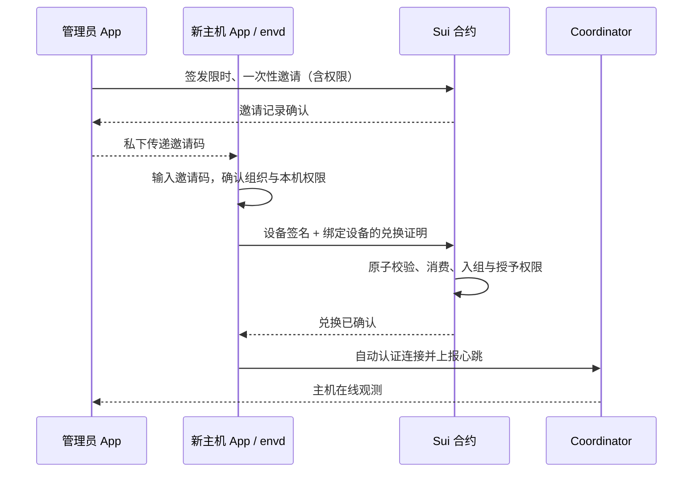
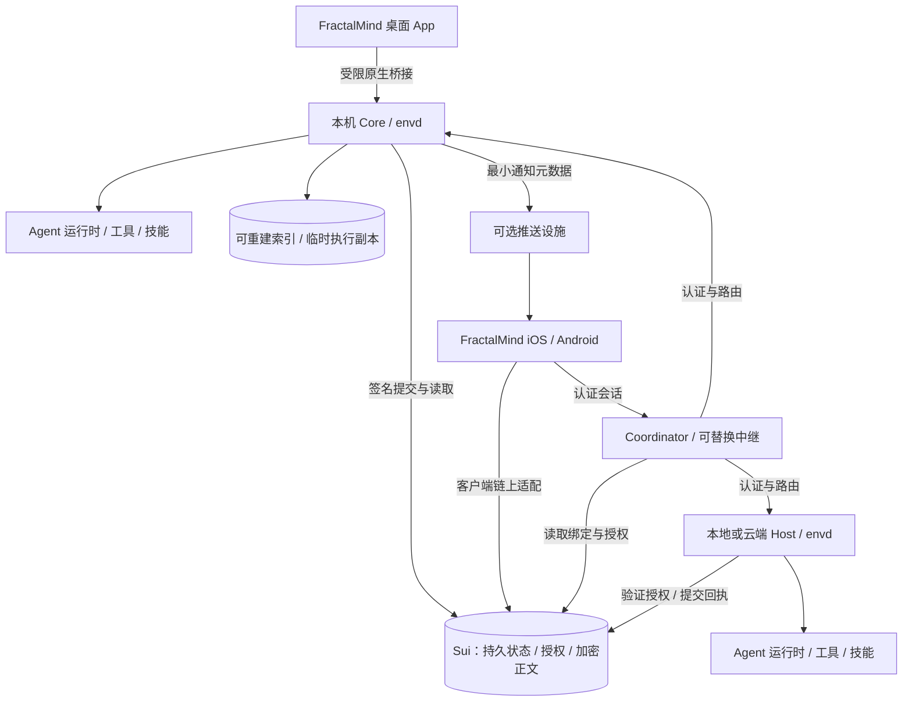

# FractalMind App 产品需求文档（PRD）

| 项目 | 内容 |
| --- | --- |
| 状态 | 待评审；单 HTML 原型已覆盖核心交互，生产集成按验收门槛交付 |
| 文档版本 | 0.13 · 单一 PRD：原型 15、原型 v2 与工程附录；新增 Agent 直接对话、常驻权限、渠道网关与 Agent 寻址规则；个人设置默认把本机设为执行主机（Host + Coordinator），并创建默认 Agent（工作区、模型连接、重启后身份不变） |
| 同步基线 | PR #21 合并后的 main `b5c0da9`；原型为交互证据，生产能力另行验收 |
| 产品 | FractalMind App |
| 定位 | FractalMind 开放智能网络的统一入口 |
| 首批用户 | 个人开发者：管理本地与云端执行主机，桌面/手机查看进度、继续对话和审批 |
| 目标平台 | macOS、Windows、Ubuntu、iOS、Android |
| 首版边界 | P2 五平台 MVP Beta；P1 为桌面 Alpha，P3 为团队协作与治理阶段 |
| 依据 | PR #18 产品基线、用户确认的 OKR 方向，okr-manager 技能约定，以及组织 / 链上持久状态的产品决策 |
| 文档维护 | 本文件统一维护需求、验收、阶段与工程候选；独立技术决策由 PoC/ADR 确认 |

本 PRD 是 App 产品范围、验收和阶段规划的单一依据。正文维护产品决策；附录保留
资产盘点、技术候选、发行约束和工程依赖，不另行维护 PLAN。候选方案仍需 P0/ADR
验证，不能视为已实现功能。发布阶段不代表协议已上主网，也不代表产品已达到 ASI。

## 1. 使命与产品定位

FractalMind 的使命是通过分形、自相似的 Agent 组织，向 ASI 发展；愿景是让
智能成为无需许可、去中心化、任何人都可以参与的公共基础设施。

**FractalMind App 让每个人建立自己的组织，组织人与 Agent 完成目标，
并自主参与更大的团队、组织和开放网络。**

用户的成长路径为：个人组织 → 人与 Agent 的团队 → 子组织与组织协作 → 组织联邦。
每一级复用 OKR、约束、任务、身份、权限、状态和成果证据，以便逐级组合能力。
用户通过 OKR 定义期望的结果和执行边界；Agent、团队或组织在授权范围内
自主规划、执行、验证与调整，成果及经验继续支持更大尺度的协作。
个人开发者是首批采用者，产品模型应支持完整成长路径。

| 使命要求 | 产品承诺 | 可观察的结果 |
| --- | --- | --- |
| 任何人可以参与 | 安装后可建立个人组织；可发现公开组织并按其规则参与 | 无 FractalMind 云账号；用自持身份创建链上组织，连接执行主机；加入其他组织遵循其规则 |
| 智能按组织结构组合 | 任务可由 Agent、团队或组织承接，逐层交接和验收 | 同一目标的子任务与汇总成果可追溯 |
| 用户自主控制 | 可选择模型、运行设备和服务节点，导出数据 | 用户能保留工作成果并通过兼容工具继续工作 |
| 开放治理 | 目标、成员责任、授权、决策和结果可以核查 | 权限来源、撤销状态与执行证据可对应 |
| 持续积累能力 | 完成任务后验收、复盘、沉淀记忆，选择分享技能与模板 | 后续工作能够引用已有成果和经验 |

这些承诺遵循现有[使命与愿景](../site/docs/guide/what-is-fractalmind.md)、
[分形模型](../site/docs/architecture/fractal-model.md)和
[三平面架构](../site/docs/architecture/overview.md)。组织规模与智能能力的关系
需要持续验证，不能用安装量、聊天量或 Agent 数量代替能力证据。

## 2. 用户问题与目标

当前服务、工具和界面分布在多个组件中。用户需要理解协调器、运行时、配置、
技能安装和设备连接，才能完成一个目标；任务、授权、成果和经验也缺少连续的
产品视图。统一 App 应承担安装、连接、编排和状态解释，使用户围绕目标工作。

| 用户 | 要完成的工作 | 当前阻碍 | 产品完成条件 |
| --- | --- | --- | --- |
| 首次使用的开发者 | 让 Agent 分析或修改一个项目 | 安装依赖、选择运行时、配置不连贯 | 在 App 内完成安装引导、配置、执行与成果验收 |
| 拥有多台执行主机的开发者 | 统一管理本地小主机与云端服务器，按目标选择执行位置 | 节点、Agent、终端、桌面与 OKR 相互分离 | 主机 → Agent 实例 → OKR/Run 可追踪，一台失联不影响其他主机 |
| 日常使用的开发者 | 持续推进目标，理解 Agent 做了什么 | 对话、终端、文件和权限状态分散 | 同一目标下看见任务、执行、证据、审批和结果 |
| 离开电脑的开发者 | 用手机继续任务并批准具体操作 | 外网连接、电脑离线、通知与恢复不可靠 | 手机得到可信的当前状态，决定被桌面确认后生效 |
| 后续团队负责人 | 组织多个 Agent 分工并对成果负责 | 缺少统一责任、交接和验收 | Lead、成员、任务与成果形成可追溯的协作过程 |
| 后续组织参与者 | 加入组织、参与目标和治理 | 身份、规则、授权和贡献入口分散 | 能了解参与条件、获得相应权限并核查贡献结果 |

首版首要结果：用户通过一个已确认的 OKR，让 Agent 在约束内自主推进，
完成至少一个经过验证、有证据可查看的关键结果，并能从手机查看与协作。用户不需要预先学习组件名称、编辑 YAML 或
手动执行安装命令。

## 3. 产品原则与交付边界

1. 每台设备安装一个 FractalMind App。核心组件统一管理，扩展依赖在 App 内
   按需安装；模型账号、外部服务账号、网络费用和系统权限仍需用户提供或授权。
2. 个人使用也建立链上 `Organization`，不引入独立 `Space`。所有持久产品状态
   以 Sui 为权威来源，不建设业务后端或业务数据库。App、Coordinator、envd
   只能保留可重建缓存和执行所需的临时状态；私钥和外部凭据留在设备安全存储。
   个人组织不自动保证私密或限制注册；敏感内容需加密，访问权需独立定义。
3. 本地电脑、小主机和自有云端服务器承担执行，桌面与手机通过统一 App 管理。
   手机单独安装后可浏览公开内容和引导演示；真实执行指向一台明确授权的主机。
   无桌面的云端主机使用受支持的执行服务，主机接入与授权由 App 引导。
4. 用户始终知道当前组织、执行设备、模型/运行时和可执行权限。切换组织后
   重新确定这些上下文，避免把一个组织的操作发送到另一个组织。
5. 用户确认 OKR、成功标准、执行约束与验证方式；Agent 自主拆解和调整任务。
   运行成功、任务验收、KR 验证与 OKR 达成分别记录。用户或预授权验证者
   检查证据后才构成验收；常规操作在既定边界内推进，越界或异常时升级。
6. 同一入口提供完整工作体验；CLI/API、独立组件、其他兼容客户端和自托管
   仍可使用。工作区和成果不依赖某个官方服务才能取回。
7. 一个功能达到配置、授权、操作、状态、失败恢复和数据边界的要求后，
   才计为整合完成。公开元数据、加密内容和访问授权保持明确的边界。

## 4. 范围与版本

本文中的“首版”特指 P2 五平台 MVP Beta。“必须”表示该阶段发布门槛；
后续能力提前具备模型与导航位置，但未实现时不得显示可用操作。

| 能力 | 首版 P2 必须交付 | 后续 P3 | 后续 P4 |
| --- | --- | --- | --- |
| 个人组织 | 创建/恢复链上组织、导入项目、OKR、约束、自主执行、审批、验证、记忆、导出 | 更多模板与协作入口 | 跨节点工作区协作 |
| Agent | 一个经过验证的默认兼容运行时，生命周期和能力说明；从已授权 Host 发现并仅观察导入既有实例，支持约束的适配器可明确纳入 OKR | 更多开发 Agent 适配、至少两个 Agent 的团队交付 | 多运行时组合与调度 |
| 手机协作 | 配对、授权、对话、任务发起、审批、产物查看、通知，以及多主机查看与授权控制 | 更完整的团队协作 | 更大规模的跨组织节点 |
| 主机与算力 | 本地/云端主机清单、多 Coordinator 连接、Agent 实例、日志与命令、已有能力支持的远程桌面、OKR 执行位置与明确改派 | 批量策略与资源感知调度 | 跨组织算力协作 |
| 工具与技能 | 内置文件/命令类能力、权限和依赖管理 | 可安装技能目录、至少一个消息渠道 | 开放连接器生态 |
| 组织与网络 | 组织创建/恢复、成员资格与权限读取、主机申请/批准/撤销、公开组织浏览；显示来源与确认状态 | 人员协作、角色委派与基本提案流程 | 跨组织任务、联邦与复杂治理 |
| 身份与运行费 | 稳定 Human 身份、逐设备授权、独立数据同步、单恢复码、首次自付或已有赞助方及后续链上费用提示 | 更多恢复策略与支付来源 | 组织费用治理 |
| 设备与发行 | 三桌面执行、两移动客户端、恢复、升级/卸载与诊断 | 完善公开发行渠道 | 扩展 CPU 架构与系统版本 |
| 专项能力 | 在产品模型中留出连接器入口 | 按验证结果开放 Explorer 深度视图 | Demail、Memory 服务、Android IME、资源共享 |

首版不承诺：手机本地运行完整开发 Agent、全平台远程桌面被控能力、无人
验收的自主组织、代管模型订阅、云计算托管、主网治理或资产交易。其后续
范围需要相应需求和验收；组织的链上记忆及其本地缓存属于首版。

## 5. 信息架构与核心概念

全局入口：**当前组织切换器 / 我的组织 / 开放网络**。

- 当前组织：所有 OKR、主机、Agent、授权与治理操作的上下文；个人开发者默认
  使用自己的 Organization，项目 `Workspace` 是组织内的项目目录与执行范围。
- 我的组织：展示可验证的组织关系；切换后重新加载该组织的工作台、OKR、主机
  与权限。名称、缓存和网络连接不能推导成员资格。切换本身不授予或撤销权限。
- 开放网络：浏览组织公开的使命、规则、网络、身份与更新时间。公开字段一旦
  上链不能承诺保密或物理删除；受保护内容的解密权与组织浏览是不同能力。
  未加入、未授权、查询失败、无结果和离线分别呈现。

组织内的工作界面：

| 页面 | 主要内容 | 首版关键动作 |
| --- | --- | --- |
| 工作台 | 运行导航地图、当前动作/位置、偏航与边界、执行主机、待介入事项 | 切换关注的 OKR、运行对话、暂停/恢复、纠偏换路、处理越界、查看对应 OKR |
| OKR | 默认只展示目标列表：生命周期、优先级、负责人、截止日期与结果达成度；点击进入成功标准、KR、趋势、边界、计划与证据详情 | 新建/筛选、确认/激活、调整约定、检查证据、复盘、在工作台查看运行 |
| 主机与算力 | 本地/云端主机、心跳、资源、Agent 实例、正在执行的 OKR | 接入主机、管理连接、远程命令/桌面、维护接单状态 |
| 团队与 Agents | Agent 角色、模型、设备、运行实例、可用能力、健康状态与常驻权限 | 选择/配置 Agent，直接对话，调整常驻权限，从 Host 发现并导入，明确授权纳入 OKR，启动/停止 |
| 记忆与成果 | 已验收成果、决策与经验，关联来源 | 查阅、编辑、删除记忆，引用已有成果 |
| 治理与审批 | 当前权限、授权设备和决策记录 | 查看权限、操作审批和撤销；组织提案后续开放 |
| 我的身份 | 稳定 Human ID、组织关系、管理设备与访问设备、恢复码 | 添加设备、核对授权、同步数据、锁定/解锁、撤销和恢复 |
| 组织设置 | 工作区、工具、连接、凭据、运行费、存储和通知 | 配置、费用查询、导出和诊断；身份与设备有独立入口 |

桌面使用组织切换与侧栏，任务详情并列展示对话、进度和成果；手机使用
工作台、OKR、主机、组织、设置五个入口；顶部“全部功能”访问 Agents、记忆、
审批、身份和费用。主机统一由“主机与算力”管理，不再增加重复的“我的主机”。
审批和待验收结果在工作台可达。未登录显示独立欢迎页，不展示组织私有内容。
首版提供简体中文和英文，状态不只靠颜色表达，桌面关键流程支持键盘操作，
手机支持系统字体缩放和读屏标签。

关键对象关系：`Organization` 确定协作和授权范围；个人组织、团队组织与
子组织复用现有链上对象。`Workspace` 指向实际项目目录，不构成另一种组织。
`OKR` 包含 Objective、Success Criteria、Key Results 与 Execution Constraints；
`Task` 关联 KR，`Run` 表示一次执行，`Approval` 绑定具体操作，`Evidence/Artifact`
支持验证，`Memory` 保留经验。上述持久记录都归属明确的组织。

`HostInvite` 表示管理员已签名的限时、一次性主机预授权；`HostMembership` 表示
主机组织资格；执行 capability 表示可做的操作、范围、预算与有效期。
`HostJoinRequest` 保留为无邀请码时的人工审核备选流程。
`CoordinatorBinding` 表示组织认可的连接端点。Host 申请/资格与连接绑定需协议
扩展；执行 capability 复用并验证现有 remote authority 的映射。新增对象名称
为产品设计名，不表示已有同名合约。Host 设备身份、Agent 身份、Agent 实例和
操作者身份分别校验；主机名称与 Coordinator 上报的 host_id 不能充当身份凭证。

`HumanIdentity` 是跨设备保持稳定的个人主体；设备独立密钥和 `DeviceGrant` 关联该
主体及组织/动作/期限。`RecoveryRecord` 提供恢复定位和授权验证，`EncryptedKeyBackup`
表达可恢复的密钥封装。这些是待设计的协议对象，不能视为现有合约能力。
Human ID、钱包地址、Host ID、AgentCertificate 与运行会话各有用途，不能互相代替。

`StandingPolicy`（常驻权限）是 Agent 在没有 OKR 时的执行边界：包含允许的动作、
每日预算、有效期与版本，由执行端强制，可由现有 `AgentPolicy` 改造而来。
`DirectConversation` 是直接发给某个 Agent 或实例的对话，归属组织与目标 Agent，
由它引发的 Run、费用与证据沿用同一模型记录。`ChannelBinding` 指定某个消息渠道
由哪台主机上的渠道网关承载；`ChannelGrant` 把渠道身份绑定到 Human，只授予读取、
询问、补充、暂停与 Agent 对话等低风险动作，从不包含审批和执行授权。

## 6. 核心用户流程

### J1：安装到首个成果

1. 未登录入口提供“创建我的身份 / 我已有身份 / 使用恢复码找回”。创建时填写称呼、
   个人组织名称、平台和解锁偏好，先按 J10 准备运行费并确认交易；确认后建立 Human、
   首个设备授权和个人组织，提示离线保存一份恢复码。新身份从空组织开始，不继承
   示例或其他身份的权限、OKR、主机与记忆。已有身份按 J8 添加设备或按 J9 恢复。
2. 桌面端在身份创建后默认把本机设为执行主机：App 随包携带的 envd 安装为当前用户的
   后台服务（登录后自动运行，关掉 App 后 Agent 继续执行，不需要管理员权限），同时承担
   Host 与 Coordinator 角色，Coordinator 入口默认仅本机（回环地址可用 HTTP）。用户确认
   一次：本设备签名在同一 PTB 内创建 Coordinator 绑定与一次性邀请，本机用自己的密钥兑换、
   由本设备代付 gas，无需给主机地址单独充值；本机同样经过 J7 的链上准入。可以选择稍后；
   之后可在“主机与算力”停止/启动服务、把入口开放到局域网或公网（须 HTTPS，绑定版本加一，
   旧邀请失效）、改用远程 Coordinator，撤销本机主机时同时卸载服务并清理密钥。
3. 接着创建默认 Agent（可稍后）：名称、角色、工作区文件夹（已有项目目录或新建文件夹，
   Agent 只读写这里）与模型。由 App 在本机 Host 上创建受约束的文件 Agent，没有旧进程
   需要交接，本设备签名一笔交易即可使用；实例身份由主机密钥派生，服务重启、注销登录后
   不变。常驻权限默认为空（没有 OKR 时只对话）。之后可在“团队与 Agents”新建更多 Agent
   （目前只能在本 App 管理的主机上创建，同一主机上工作区不能重复）。
4. 模型连接属于主机，同一主机上的 Agent 共用：Claude（Anthropic API，密钥只写入本机系统
   钥匙串，不写配置文件、不上链、不进日志）、本地 Ollama，或暂不连接（只写 OKR 中写明内容的
   文本文件）。界面显示每次运行的请求与 token 上限、计费来源（与 SUI Gas 分开）和数据去向；
   修改后后台服务重启生效，撤销本机主机时删除密钥。
5. 输入 Objective；Agent 协助拟定 1–3 条量化成功标准、结果型 KR、依赖与
   验证方式。用户确认负责人、优先级、时间窗、工作范围、预算及升级条件。
6. 质量校验通过后提交链上 OKR 草案；用户确认且链上确认后激活。已有 3 个 ACTIVE 时，
   新目标保存在候选池。Agent 按依赖自主拆任务，选择工具、执行并验证。
7. 用户通过 KR 实测值、达成趋势、证据和异常了解进展；heartbeat 检查
   依赖、约束与阻塞，自主调整计划。越界、预算不足或验证失败且无法自行
   修复时升级请求，未经批准不执行超出约定的操作。
8. 预授权验证者按已确认方式验证 KR；全部 KR 完成后复核成功标准，
   通过才记为 ACHIEVED。用户可检查/质疑证据、要求补充，并将经验写入记忆。

依赖安装、模型鉴权或执行失败时保留配置与已完成步骤，提供重试和替换
运行时入口。新用户没有项目时可使用明确标记的示例工作区。

### J2：从手机接手桌面任务

1. 新设备生成独立设备密钥和短期配对请求，已有管理设备扫码/核对请求并确认，详见 J8。
2. 有权签发者为同一个 Human 的新设备签署组织、动作及有效期的链上授权；确认后
   生效，再单独同步加密数据。默认当前组织、7 天只读；执行与审批须明确授权。
   手机配对码不能替代 J7 Host 准入。App 区分“已连接”“授权待确认”“已授权”与“数据待同步”。
3. 手机查看 OKR 达成度、KR 证据与 Agent 计划，继续对话、确认 OKR 或调整
   执行约定；执行设备确认版本和权限后生效。任务保留为 KR 下的详情。
4. 收到通知后打开 App，获取当前待审批操作，查看影响范围并同意或拒绝。
5. 桌面验证权限和操作状态，确认结果回传；手机查看产物并参与成果验收。

手机使用蜂窝网络时仍须完成该流程。桌面睡眠、离线或授权服务不可用时，
明确显示原因及最后同步时间；用户可保存草稿，远程操作等待有效连接和授权。

### J3：失败、取消与恢复

任务断线时显示连接状态和最后确认进度；重新连接后同步已有事实。用户
发出取消后先显示“正在停止”，收到执行设备确认后才显示“已取消”。已发生
的文件修改和外部操作保留记录，不因取消而宣称回滚。

App/执行进程崩溃后重新检查运行状态和副作用证据。能够恢复的 Run 继续；
无法确认是否执行的操作标为“需要确认”，用户可检查结果后决定下一步。
重试创建新的 Run 并保留上次记录，不自动重复已完成的外部操作。

### J4：管理权限与设备

用户查看每台设备可以访问的组织和操作，修改范围或撤销权限。撤销确认后
禁止新的受保护操作；已开始的操作按执行状态尝试停止并显示结果。设备
遗失时通过仍受信任的设备恢复/撤销；没有可用凭据时进入恢复流程，不能
通过重新配对继承旧权限。

### J5：从个人组织走向更大协作

个人使用从同一个 Organization 模型开始。首版支持创建/恢复个人组织、读取
组织关系及管理 Host；不需要把“个人空间”转换为另一种链上对象。
用户可以浏览公开组织，查看使命、参与条件和网络，按组织规则申请相应资格。
人员加入和角色委派涉及的协议缺口在 P3 交付；UI 不把当前 Agent 自助注册当作
管理员批准的人员成员关系。跨组织访问需新授权，不自动共享个人组织内容。

团队协作阶段，Lead 拆分任务，成员提交子任务成果，验收者逐项验证后汇总。
子组织使用现有层级模型，权限继承需显式定义；联邦与跨组织能力在 P4 单独验收。

### J6：升级、导出与退出

用户在 App 内查看版本和更新，活跃任务期间可先下载并延迟应用。升级失败
保留可恢复数据和明确的修复入口。用户可导出标准工作区、成果和历史记录，
凭据备份单独处理。退出窗口可保留后台执行；“停止任务并退出”需要得到
明确执行结果。卸载停止后台组件，并允许用户选择保留项目数据。

导出包应包含版本化清单、标准工作区文件、可读的任务/验收记录和所选产物；
清单标明来源组织、导出时间和缺失内容。仅导出索引时说明哪些产物仍需从
原设备取回；不能把不完整包显示为完整备份。

### J7：使用一次性邀请码接入主机（默认流程）

新组织没有连接入口时，先由有权设备提交 CoordinatorBinding，显示待确认/失败/已确认；
确认后再创建邀请。填写端点不构成信任或授权，链上绑定成功也不证明端点在线。

**管理员创建一次，新主机输入一次。** 管理员在签发邀请时完成入组与执行范围的
预授权，用户不再分别处理设备申请、管理员审批、执行授权和连接按钮。

1. **管理员创建邀请码**：在组织内选择“接入主机 → 创建邀请码”，确认有效期
   （默认 1 小时，可选 15 分钟 / 24 小时）、项目范围、连接入口、执行权限及
   权限有效期。每个邀请只允许 1 台主机；原型预设执行权限 7 天，桌面能力另选，
   不授予组织管理权限。管理员签名的创建交易确认后才能分享有效邀请码。
2. **新主机输入并确认**：有桌面的设备安装 App，选择“使用邀请码”；无桌面的
   服务器安装 envd 并通过交互输入接入凭证。App/envd 读取链上邀请，自动显示
   组织、预设范围、期限与连接配置。主机拥有者只需核对并同意本机权限，设备
   密钥在本机生成/恢复，无需再次等待管理员在线。
3. **自动兑换并连接**：envd 用邀请凭证生成绑定本机身份的兑换证明，并由设备
   身份提交交易。合约在同一原子交易中校验邀请、标记已消费、创建 HostMembership
   和对应的执行 capability。确认后 envd 自动双向认证连接 Coordinator 并上报
   心跳；界面显示“已加入并上线”，无需用户逐步点击“确认/授权/上线”。

邀请到期限制的是**最晚兑换时间**；执行授权有效期单独计算。邀请码一旦消费，
之后重新连接不再需要邀请码。链上入组已成功但 Coordinator 不可达时，显示
“已加入组织，等待连接”，保留资格并自动重连，不重复兑换或重新授予权限。
同一主机更换设备密钥需新邀请或人工审核，并撤销旧身份；重命名不恢复旧权限。

#### 邀请记录与秘密的边界

- **链上创建 HostInvite 记录**：组织/网络/包、签发权力、验证公钥、授权模板及
  版本、连接配置、到期时间、`max_uses = 1`、消费设备与撤销状态均可验证。
- **App 本机生成秘密邀请码**：采用高熵随机凭证；推荐以临时 Ed25519 邀请密钥
  编码为可复制的邀请码/私密链接。链上只保存验证公钥，不能公开保存可兑换的
  明文秘密，也不能把公开组织链接当作具有预授权能力的邀请码。
- **防复制证明抢领**：兑换证明绑定应用域、网络/包、邀请对象 ID、组织、设备
  地址/公钥、nonce、授权模板/期限。Sui 交易发送者必须与目标设备身份一致。
  原始秘密不出现在交易参数或事件中；旁观者复制证明无法改为自己的设备。
  不采用“公开提交秘密即可领取且不绑定接收者”的兑换接口。
- **有效期与一次性**：以 Sui Clock 检查到期时间；修改同一个邀请对象，原子完成
  消费、入组和授权。并发兑换只允许一笔成功；失败的交易不部分入组、不消耗次数。
  还需验证组织有效、签发权力/策略版本有效、未撤销以及请求权限未超出预授权。
- **交付与丢失**：持码者可认领一台主机，应私下传递；App 可提供复制和二维码，
  无后台短码解析服务。不要采用可离线穷举的短数字码。邀请码按凭据处理，不进入
  日志、普通状态导出、公开 URL 查询或分析事件；泄漏/丢失的未使用邀请可撤销重建。
- **费用与签名**：快速加入仍需要设备签名及 Gas；App/envd 处理交易构造，可使用
  明确配置的费用赞助。费用不足或赞助不可用时说明原因并可重试，不能绕过链上确认。

本方案复用 Sui 的[签名验证原语](https://docs.sui.io/references/framework/sui_sui/ed25519)、
[链上时钟](https://docs.sui.io/sui-stack/on-chain-primitives/access-time)和
[共享对象](https://docs.sui.io/develop/objects/object-ownership/shared)。以上是待实现的
应用协议设计；现有合约尚无 HostInvite 兑换接口，需 PoC、协议测试和审查。

失败恢复：错误、已使用、已过期、已撤销、待确认和网络不可用分别显示。交易
结果未知时先查询原交易，不能默认失败而重放。链上确认后连接失败只重试连接。
未使用邀请的撤销不等于撤销已入组主机；邀请已消费时，应进入对应主机撤销资格/
执行权限。在线但授权被撤销时拒绝新的受保护操作，已有操作另行确认停止。

**人工审核作为备选**：无邀请码时仍可由 envd 提交 HostJoinRequest，管理员
核对指纹后批准资格并授予执行权限。该入口折叠在高级流程中，不再占据默认接入
路径；普通 AgentCertificate 仍不能替代 Host 准入。旧接入记录和授权继续可查看。

### J8：在另一台设备使用同一个 Human

1. 新设备选择“我已有身份”，生成独立密钥与短期配对请求；展示平台、设备名称及核对信息。
2. 已有管理设备核对新设备和组织，选择范围、期限及数据分享；默认当前组织 7 天只读，
   执行/审批另选，不自动授予身份管理权。连接和扫码不能直接产生组织权限。
3. 授权交易确认后显示“已授权，数据待同步”；通过加密通道/密钥封装单独确认数据访问。
4. 两台设备显示同一个 Human ID，但保留独立可撤销授权。过期、拒绝、签名取消、失联和
   交易结果未知都保留明确状态；查询原交易，不重新授予更大权限。

App 解锁仅保护本机凭据，不能代替链上授权。组织角色、设备权限、数据解密权共同决定
操作可用性。Host 邀请只授予执行主机资格，不能用于 Human 登录或邀请人员入组。

### J9：只凭一份恢复码找回身份

1. 创建身份后或“我的身份”中生成高熵恢复码，离线保存并确认；备份文件可选，用户不必
   另存或输入 Human ID。生产恢复码必须包含可识别的格式版本、网络/定位信息和校验信息。
2. 所有设备丢失时，在未登录入口输入恢复码。App 在本机解析恢复材料并找到链上恢复记录，
   从记录读取稳定 Human ID；不是根据新设备地址新建 Human，也不要求官方后台查账号。
3. 展示找到的身份与关联组织，用户核对并明确确认撤销旧设备、授权当前新设备。
   查找成功只代表找到记录，不能登录或授予权限。确认时重新校验恢复记录版本与有效性。
4. 链上原子恢复确认后，旧设备授权失效，恢复码消费；Human ID、组织关系及原有工作保留。
   新设备数据访问独立恢复，界面区分“身份权限已恢复”和“加密数据已恢复”。
5. 提示生成并保存新恢复码。更换恢复码保持 Human ID 稳定，旧码恢复授权失效；取消确认、
   并发消费、旧确认页、错误网络/版本、格式错误、已消费/撤销、RPC 故障都不能绕过验证。

借鉴 1Password 式体验的重点是稳定身份、设备独立授权、本机解锁与离线恢复材料。
本产品没有可代为重置身份的业务服务器。没有有效恢复材料或仍获授权的管理设备时，不能
承诺找回。恢复码属于持有即可行使恢复权的秘密，不能发送到 Coordinator、写入明文链记录、
普通日志或普通导出。链上只存验证材料及加密备份。具体派生/签名/封装方案由 P0 ADR 验证，
不把原型的 SHA-256 摘要查表当作生产协议。

权限恢复必须映射到真实组织控制权。现有 Organization.admin 地址检查不会自动认识新的
Human/DeviceGrant，需合约升级或受验证的委托方案；仅在 UI 更新设备列表不算恢复成功。
旧设备已得到的密钥与明文无法收回；密钥轮换只保护后续数据。

### J10：首次运行费准备与后续充值

- 填写创建资料后、提交身份/组织创建前检查支付来源：自己的运行费账户，或实际可用的
  已有赞助方。有效代付可免用户先充值；不假设有 FractalMind 官方 Gas 后台。
- 自付先准备安全保管的初始签名凭据及临时资金恢复方式，再展示正确网络、收款地址、
  余额、估算和 Gas 预算；身份尚未创建时不能用尚不存在的 Human 恢复记录代替这份备份。
- 到账只更新余额，不自动签名或创建。用户核对公开字段、网络、费用和付款方后明确提交。
  待确认固定创建资料及支付来源，刷新/重连查询同一交易；确认失败后重试使用新交易。
- 签名取消、余额不足、RPC 不可用、赞助离线/额度不足分别显示；实际失败是否扣费及金额
  以交易结果为准，显示余额/代付额度和费用记录，不能把失败统一当成未扣费。
- 后续需要链上写入的 Host/设备授权、恢复、Agent 导入、OKR/证据/记忆等操作，均在提交前
  检查预算和支付来源；余额不足时提供补充资金或有效代付入口。普通读取/本机解锁不等同于
  链上写交易。恢复时新设备也必须能支付或获得代付，不能因丢失旧钱包而形成费用死锁。
- 运行费与模型、工具服务、云主机账单分开显示。原型数额只是测试值，生产使用实时估算与
  用户确认预算，不以固定 SUI 数额作为充值门槛或建议。

### J11：发现并导入 Host 上已有 Agent

1. 在“团队与 Agents”或主机详情选择一个已授权 Host，扫描已有会话；展示来源主机、
   运行实例、工作区、适配器能力和观测时间。离线、无实例、身份未核实分别显示。
2. 核对后默认“导入为仅观察”；链上确认后才建立组织内持久关联，保留原进程和任务，
   不重新启动或复制 Agent。同名不同主机不合并，同一实例重复导入被阻止。
3. 有权管理设备可将支持约束的实例纳入工作区匹配的 ACTIVE OKR。确认预算、期限、
   工具、升级条件及原任务安全检查点；证实旧执行停止，适配器接受约束后再提交授权。
   交接审阅从请求生成开始使用固定 5 分钟期限，界面显示原截止时间和倒计时；
   Host 接受后临时保留该实例，用户在期限内独立确认费用和授权。刷新、读取回应或
   重新打开界面不续期。当前权限或 OKR 剩余期限不足时，先调整约定再发起审阅；
   已到期或结果未知的请求先核对原记录，只有明确新发起的审阅使用新期限。
4. 确认后保留证据，等待用户明确继续。仅观察的 tmux 适配器不能伪装成可控运行时；
   边界/目标变化需重新授权，失联、观测过期或再次扫描丢失实例均显示未知并重新发现。

发现快照是观测；Agent 身份、导入关系、OKR 绑定与授权是链上状态。真实实例连续性及
身份证明需运行时实现，不能仅用名称/PID 判定。原型使用 5 分钟失效阈值，生产阈值须验证。

### J12：直接与 Agent 对话

1. 在“团队与 Agents”选择一个 Agent 或它的某个实例打开对话；聊天渠道中用 `/agent` 切换
   对象。按角色寻址时自动选择在线实例，同一对话线程固定在该实例上以保持上下文。
2. 提问、查看状态等只读请求直接回复。请求执行动作时，执行端按该 Agent 的常驻权限检查：
   权限内直接执行，记录 Run 与费用；超出权限时发起绑定具体动作的审批（出现在“需要你
   决定”），或建议转为任务、OKR 草稿。聊天中的承诺不能扩大权限或预算。
3. Agent 正在执行 OKR 时，直接对话照常回复，不暂停该 OKR；需要改动该 OKR 正在使用的工作区
   时先征得同意。话题涉及指挥某个 OKR 时，提示切换到 OKR 对话，保证方向变化有快照可查。
4. 对话可一键转为独立任务（不挂 KR）或 OKR 草稿，上下文随之带入。
5. 仅观察导入或不能接受约束的 Agent（如 tmux 观察会话、桌面应用）只能直接对话：界面标注
   “执行不受 FractalMind 约束”，只有管理设备可以发送。主机离线或实例停止时保存草稿，
   不伪造送达、不自动重发。

## 7. 功能需求与验收

以下 FR-01 至 FR-20，以及 FR-25 至 FR-41，均为首版 P2 必须满足的要求。单个平台缺失对应核心能力
时，该平台只能标为预览，不能计入五平台 MVP 验收。

| ID | 功能要求 | 验收条件 |
| --- | --- | --- |
| FR-01 | 一体安装和首次启动 | 在三类干净桌面环境中，无预装 Go/Rust/Node/Python、无终端操作，完成默认运行时准备及 J1；系统包安装可由安装器处理 |
| FR-02 | 组织与工作区 | 创建/恢复链上 Organization，显示待确认/失败/已确认；个人使用也有组织 ID；切换后 OKR、主机、搜索和授权按组织隔离；导入项目取消不修改原文件 |
| FR-03 | 模型与运行时 | 至少一个默认兼容运行时在三桌面通过 J1/J2；鉴权可验证和撤销；如不支持特定审批/恢复能力，显示限制且不提供无效操作 |
| FR-04 | OKR 与自主执行约定 | 按第 8.1 节校验 Objective、成功标准、KR 及约束；用户确认后激活，最多 3 个 ACTIVE；候选可编辑/确认；Task 关联 KR、工作区、责任 Agent 和执行设备；重复提交不重复激活或创建任务 |
| FR-05 | OKR 可视化与执行观测 | 展示 KR 基线/实测/目标/权重、证据、依赖、总体达成度、趋势、预算、阻塞和下一步；计算遵循第 8.1 节；展开可看 Task/Run；heartbeat 仅在进展/阻塞时通知，重连补齐且不重复；Agent 声明与验证结果可区分 |
| FR-06 | 约束与越界升级 | 约定内自主执行仍经过执行端权限检查；越界、预算不足、到期或权限撤销时暂停受影响执行；升级请求展示原因、操作、范围、预算影响和替代方案；批准绑定版本与有效期；拒绝后不执行；旧批准不授权新范围 |
| FR-07 | 结果验证与成果验收 | Run 成功后进入验证；人工或预授权验证者检查 diff/产物/证据，记录验证者、规则版本及理由；指标达标但无有效证据时 KR 不 COMPLETE；所有 KR 通过后复核成功标准才能 ACHIEVED；失败/退回保留历史并可重新规划 |
| FR-08 | 组织记忆 | 已验收成果生成带来源的记忆，内容及版本按策略加密后上链；可编辑、归档和导出，引用可追溯；界面移除不承诺擦除链上历史 |
| FR-09 | 生命周期与恢复 | 关闭窗口可继续任务；显式停止得到确认；重启可找回任务；取消、崩溃和网络重试测试中不重复执行已确认副作用 |
| FR-10 | 内置工具与依赖 | 默认文件/命令工具显示执行位置和权限范围；需要的扩展依赖可在 App 内安装、重试、停用；移动操作指向明确的授权执行主机 |
| FR-11 | 配对与逐设备授权 | 两端确认配对；同一 Human 的不同设备拥有独立密钥和权限；过期配对码不可复用；配对完成但未授权时不能执行受保护操作 |
| FR-12 | 手机 OKR 协作 | iOS/Android 真机可在同网与蜂窝网络完成 J2，包括查看 OKR/KR/证据、确认 OKR 与约定、继续对话、越界审批及成果查看；操作需对应设备权限；不能仅通过局域网演示验收 |
| FR-13 | 通知与前后台恢复 | OKR/KR 有进展、完成、阻塞、越界或需要验证决定时可通知；点击后拉取当前状态；通知重复或迟到不重复操作；关闭通知后 App 内待办仍可见 |
| FR-14 | 离线与待确认状态 | 桌面离线和手机断线可辨识；保留最后确认状态并标明时间；离线可写草稿，审批/危险操作不自动排队执行；响应丢失先查询状态 |
| FR-15 | 撤销、凭据与恢复 | 撤销确认后新的受保护操作被拒绝；钥匙/凭据不进入普通日志或导出包；恢复不会默默扩大权限；已开始操作显示真实停止结果 |
| FR-16 | 组织与开放网络入口 | 可查看真实公开组织的名称、使命、身份、规则/参与说明和网络来源；可按名称查找；无数据/离线/查询失败有对应状态；不把演示数据当实时数据 |
| FR-17 | 导出与数据控制 | 导出标准工作区文件、记忆、任务/验收记录及产物或其清晰索引；缺失文件列入报告；脱离 App 后可阅读，凭据备份有独立流程 |
| FR-18 | 更新与卸载 | 一次支持版本间更新保留组织、权限和任务；更新中断可恢复；未确认停止任务前不强制替换执行组件；卸载停止后台组件并保留用户选择的数据 |
| FR-19 | 诊断与反馈 | 组件健康、版本、错误原因和恢复动作可见；导出诊断先脱敏；用户可预览并选择分享；包含跨组件请求标识以便定位问题 |
| FR-20 | 语言与可访问性 | 简中/英文完成 J1/J2；关键动作具有可读标签，状态不依赖颜色；桌面键盘与移动字体缩放/读屏通过核心流程检查 |
| FR-25 | 统一主机清单 | 同时管理至少一台本地和一台云端执行主机；按名称、位置、系统、本地/云端及状态筛选；保留各主机独立心跳、连接状态与最后观测 |
| FR-26 | 邀请码快速接入 | 管理员一次签名预授权，新主机输入并确认即可原子兑换入组与执行权限，随后自动连接；覆盖过期/已使用/撤销、错设备证明、并发兑换、交易失败重试及连接失败；无邀请码可人工审核 |
| FR-27 | Agent Console 命令整合 | 节点状态、实例日志、Agent 重启/停止、Shell 进入主机详情；写操作带主机/实例/范围，关联命令与回执；超时先查询，不盲目重发 |
| FR-28 | 已支持主机的远程桌面 | 检测被控能力，支持的主机提供查看/控制、画质、缩放、统计、重连及移动输入；无图形会话明确提示；断线释放输入，重连不自动取得控制 |
| FR-29 | OKR 执行位置与改派 | OKR/Run 明示主机和 Agent 实例；目标在线、资源/接单状态可用、Agent 与工作区适配后才接收；暂停旧循环、保留检查点，明确继续；未确认源端停止时不得制造并行重复执行 |
| FR-30 | 主机维护与故障隔离 | 暂停接单只影响新分配；实例停止暂停对应 OKR，其他主机运行继续；断线显示未知与历史数据；手机只读授权不允许命令写操作或桌面输入 |
| FR-31 | 运行对话与干预 | 从工作台异常直接联系负责 Agent；消息关联 OKR/KR/Run、主机/实例、证据和约定快照；区分已送达、已回应、待确认方案和已应用动作；执行变更由运行端校验；旧方案不能覆盖新状态；只读或离线时保存草稿且不伪造送达 |
| FR-32 | 持久状态与重建 | 持久产品记录、正文/加密正文、授权及决定以 Sui 为准；清除 App/Coordinator 索引后可从链上重建已确认状态；仅有哈希或本机文件不能通过完整恢复验收 |
| FR-33 | 连接与权限分离 | 已授权但离线、在线但权限撤销可分别显示；撤销后即使连接仍在也拒绝新命令；链上不可达时明确状态时效并阻止不能安全验证的执行 |
| FR-34 | 组件职责与无业务后端 | 接入指导可解释秘密凭证由 App 生成、管理员签发链上邀请、envd 生成设备绑定证明、合约原子校验兑换、Coordinator 认证转发；不依赖邀请码库/用户权限库；私钥不进入链上或普通导出 |
| FR-35 | 稳定身份与未登录入口 | J1/J8：欢迎页有创建、已有身份和恢复三条路；新身份空数据隔离；多设备同一 Human ID、独立授权；只读不执行，Host 邀请不登录 Human |
| FR-36 | 授权与加密数据分离 | J8：批准前无权限，批准后未同步数据不能读取私有内容；锁定/撤销/到期检查覆盖内容、设置、导出和控制台；普通配对不自动授予身份管理权 |
| FR-37 | 单恢复码 | J9：无需输入 Human ID，从链上记录找到并核对身份；原子消费/撤销旧设备/授予新设备；同一身份和组织保持；跨全新客户端恢复密文与密钥；错误/取消/并发/失效/旧版本确认均测试 |
| FR-38 | 运行费与交易状态 | J10：首次创建及后续链上写入均检查真实支付来源/预算；有效代付可免充值；到账不自动签名；待确认固定资料并查询原交易；失败费用以链结果记录；恢复流程可支付 |
| FR-39 | 既有 Agent 发现与导入 | J11：核实 Host/实例/工作区，先仅观察导入；重复不建第二实例；明确交接并验证适配器约束能力后才纳入 OKR；观测过期、边界变化和失联阻止旧授权继续执行 |
| FR-40 | 运行准备与状态隔离 | 激活/分配前核对工作区、Agent 部署、主机、能力和授权；不满足可存候选；导出仅含所选组织/范围；并发旧版本写入被拒绝，切换身份/组织后的异步回调不污染新上下文 |
| FR-41 | Agent 直接对话与常驻权限 | J12：可按角色或实例直接对话，线程固定实例；只读请求直接回复；执行动作由执行端按常驻权限检查，超出时发起绑定具体动作的审批或转为任务/OKR 草稿；常驻权限含动作、每日预算与有效期，变更需确认并留版本；不受约束的 Agent 明确标注且仅管理设备可发送；离线保存草稿不重发；对话、Run 与费用可追溯 |

后续需求同样保持明确验收边界：

| ID | 阶段 | 功能与验收条件 |
| --- | --- | --- |
| FR-21 | P3 | 至少两个 Agent 在一个 Lead 的协调下完成拆分、交接、证据提交与汇总验收，失败子任务不会被隐藏为总体成功 |
| FR-22 | P3 | 人员成员/角色委派和至少一种已实现提案流程可用；状态以协议确认为依据；不延后首版的个人组织创建、Host 审批与执行授权 |
| FR-23 | P3 | 一个外部开发 Agent、一个消息渠道与可安装技能目录进入统一目标/任务模型；配置、授权、状态、撤销和安装失败可恢复 |
| FR-24 | P4 | 两个独立组织可按明确授权完成任务委托、提交、验收与撤销；各自私有数据不因加入联邦而自动共享 |
| FR-42 | P3 | 渠道网关：每个渠道凭据只在一台指定主机运行（`ChannelBinding`），由该主机 envd 以独立进程监督；凭据加密下发到该主机安全存储；聊天身份经一次性码绑定 Human（`ChannelGrant`）；消息经 Coordinator 以签名请求路由到任意主机上的 Agent，由目标 envd 校验；通知只含摘要与深链，聊天中的“同意”不构成审批；送达回执、去重与离线草稿可验证 |
| FR-43 | P3 | Agent 寻址与目录（§8.4.1）：目录由链上组织、Agent 角色、实例与 Host 成员资格推导，Coordinator 缓存清空后可重建；查询按调用方授权过滤，不暴露无权联系实例的存在；仅观察与不受约束实例、自报能力标签不参与寻址；按角色或按实例寻址，按实例时离线报告不可达且不改派；Agent 间请求由发起实例签名、目标 envd 校验；跨组织不做 Agent 级发现。是 FR-21 的前提 |

## 8. 状态与数据规则

Task 的交付主流程遵循既有分形模型：Created → Assigned → Submitted →
Verified → Completed。用户退回 Submitted 成果后回到待执行责任范围，保留
提交/退回记录；失败或取消有明确终态。具体协议字段映射在 P0 固化。

Run 至少区分：排队、运行、待审批、恢复中、需要确认、成功、失败、已取消。
“连接中断”属于连接状态，不能仅因断线把 Run 判定为失败。每次重试有新的
Run，历史执行和证据不可被覆盖为最新成功状态。

Approval 区分待处理、已同意、已拒绝、已过期和已失效。已同意表示操作获准，
不代表操作已执行；执行结果关联回该审批。仅有推送或聊天中的“同意”文本
不构成有效审批。

**存储原则：所有持久产品状态保存在 Sui，无独立业务后端。**
链上确认决定权威状态；App、Coordinator 和 envd 的缓存、索引与执行文件不能
成为另一套业务事实。RPC、P2P 中继和平台推送属于接入/传输设施，不保存用户
业务权威状态；不引入服务端邀请码库或权限数据库。

| 数据 | 权威来源 / 保存规则 | 恢复与可见性 |
| --- | --- | --- |
| Human、设备授权、恢复验证记录、组织、成员、Host 邀请/申请/资格、连接绑定、权限与撤销 | Sui 对象与版本化记录 | 校验网络、包、组织和设备；链上重建；展示最后确认版本 |
| OKR/KR、任务/Run、审批、Agent 对话、方案、成果证据、记忆与产品配置 | Sui 持久记录，敏感正文加密 | 哈希/指针不足以代表正文持久化；可从链上恢复正文或密文及其关联，不依赖本机/业务服务器唯一副本 |
| 产品承诺保留的项目快照、产物与历史日志 | 内容/加密内容按有界分块方案上链 | 大小、写入频率、费用、完整性及保留策略需 PoC；未上链的数据明确标为临时或未保存，不宣称已持久化 |
| 正在编辑的草稿、执行工作目录、中间文件、未提交日志 | 临时本机工作副本，非权威记录 | 需要保留时显式提交并等待链上确认；用户已有外部代码仓库不是 App 的业务后端 |
| 心跳、CPU/内存、连接与 WebRTC 会话、进程句柄 | 实时观测 / 短期缓存 | 携带采样时间；失联显示未知；重启后重新观察，不能从旧链上目录推断在线 |
| 加密密钥备份与恢复封装 | Sui 上的版本化密文和验证信息 | 只有有效恢复材料/获授权设备可解密；备份可取回不等于获得操作权 |
| 钱包/设备/邀请私钥、恢复码、模型密钥、解密材料 | 用户设备安全存储的秘密材料 | 不以明文上链，不进普通日志、同步或导出；恢复/轮换单独设计，不交给 Coordinator |

“个人组织”只描述使用方式。Sui 上公开字段可被读取，成员限制不会自动加密
内容。敏感正文上链前加密，明确哪些元数据公开；密钥分发、多人解密、恢复与
撤销是 P0 必须验证的设计。撤销不能收回已下载的明文，界面删除不能保证擦除
不可变链上历史。暂不采用需业务服务保存正文的替代方案，也不将对象存储悄悄
解释成“已保存到 Sui”。若体积或成本不可行，需回到产品决策评审。

现有 Agent OS 文件契约仍作为适配格式：`OKR.md`、候选目标与记忆文件由链上
记录投影，编辑需版本校验与提交，不能与链上分别作为双主数据。每个组织最多
3 个 ACTIVE OKR。清缓存、删除本机工作副本、撤销授权和归档链上记录分别处理。

### 8.1 OKR 契约、自主执行与可视化

基于 [okr-manager 技能](../../skills/coordination/okr-manager-skill/SKILL.md)，
核心语义为 **Objective（为何）→ KR（可观察结果）→ Task / Milestone（如何）**。
“安装工具”“实现模块”“跑测试”等执行步骤进入任务计划。用户确定结果与
边界后，Agent 可调整实现路径；改变成功标准、指标口径或扩大授权需要重新确认。

| 对象 | 必填或约定字段 | 规则 |
| --- | --- | --- |
| Objective | 一句话结果目标、优先级 P0/P1/P2、负责人、期限或预期时间窗 | 动词 + 结果；负责人可以是 Agent，团队阶段可为 Lead |
| Success Criteria | 1–3 条可二元验证的成功标准，至少一个可量化指标 | 明确与 KR/验收证据的映射；自由文本不能直接推断验收通过 |
| KR | 可观察结果、PENDING / IN PROGRESS / COMPLETE、依赖、产出物、验证方式 | 验证完成才解除依赖；拒绝循环依赖；完成声明不能代替证据 |
| Metric | 基线、当前值、目标、单位、增减方向、权重、采样口径和更新时间 | 原始测量、来源、分母与样本窗保留；更换口径必须留版本 |
| Evidence | 产物或来源引用、关联 KR/Run、采样时间、验证者、规则版本、验证结果 | 敏感证据加密上链并遵守组织授权；演示、过期、缺失、未验证证据有明确标签 |
| Execution Constraints | 工作区/设备、可自主动作、升级条件、预算上限、时间窗、验证授权 | 预算包括已发生与在途预留；权限、预算、时间任一不满足即停止发起新动作 |
| Task / Milestone | KR 引用、执行责任、依赖、步骤、Run 与结果 | 由 Agent 自主拆解和调整；变更及理由保留，任务数量不影响达成度 |

用户可以保存草稿；只有质量校验通过、依赖有效且用户确认后的 OKR 可以
激活。ACTIVE 上限为 3，超出进入 `okrs/Candidate.md`。`OKR.md` 只保留 ACTIVE；
ACHIEVED 记录进入可导出的成果历史及记忆来源，不能因为移出活跃文件而丢失证据。
技能校验是质量门槛，执行约束由 App/运行时落实，两者共同组成产品需求。

自主循环：读取已确认 OKR → 审计依赖与约束 → 拆解/更新任务 → 执行 →
采集实测及证据 → 验证 → 更新 KR → 解锁下游 → 检查整体成功标准。
heartbeat 应主动推进未阻塞的工作，仅在进展、阻塞或需要用户决定时通知。
可自行解决的问题先在边界内重规划；无可行路径时给出原因、下一步与升级请求。
暂停、离线、崩溃或授权撤销后的恢复要重新核查事实，不能重复已发生的副作用。

**达成度计算**：单指标 KR 的进度为
`clamp((current - baseline) / (target - baseline), 0, 1)`；该公式同时适用于
提升与降低型指标，基线等于目标的输入需要修正。二元结果按明确验证的 0/1
表示。多个指标的 KR 必须声明聚合/全部通过规则；P1 优先采用单指标 KR。
总体为按正权重归一化的 KR 进度加权平均。超额完成显示原始值，图形封顶 100%。
缺失或过期数据标记为未知/待更新，不能伪装成最新的 0% 或已完成。

**完成状态**独立于进度数值。100% 表示所有指标达到阈值；只有满足各 KR
验证方式、有有效证据、前置依赖完成，并再次检查全部成功标准后才是 ACHIEVED。
验证失败导致相关结果重新验证；保留历史实测与失败原因。Agent 不可通过降低
目标、删除失败样本或拆分任务自行提高达成度。

可视化至少包含：组织 OKR 概览、KR 指标对比、整体加权达成度、带时间的趋势、
依赖与阻塞、证据入口、自主执行记录、资源消耗及上限。展示计算口径；趋势中的
实际、预测、目标线分开标注，首版可只展示实测。手机优先展示状态、需要决定的
事项和 KR；完整约定与证据可展开。个人/团队/组织使用相同结构，跨层聚合只有
在指标口径兼容且权重明确时才允许，避免按任务数量衡量组织智能。

验收场景需覆盖：提升/降低指标、权重归一化、无证据的 100%、依赖未解锁、
预算预留/耗尽、越界拒绝、截止/暂停、重连去重、确认版本失效及第 4 个 ACTIVE。
单 HTML 原型使用固定演示数据、模拟 heartbeat 和验证器，只用于交互评审；
实际调度、文件写入、权限执行、计量与自动验证须由后续工程交付。

### 8.2 Agent 运行导航

工作台承载“运行导航”，用于观察当前执行、判断方向与边界并处理异常。OKR
默认只展示目标列表，按生命周期筛选，点击目标后查看关键结果、成功标准、执行
约定与证据；列表不自动展开详情或运行地图。工作台与 OKR 详情共享同一结果、
约束和执行记录，通过“查看 OKR / 在工作台查看运行”双向跳转并保持目标一致；
返回列表保留筛选，切换关注目标不会改变自主执行状态。激活 OKR 后进入该目标
的工作台；主机中的运行任务及异常通知也定位到对应目标的工作台。

导航同时显示当前 KR / Task / Run、当前动作、最后已验证检查点、
测量新鲜度、距目标的差距、预算/期限/权限边界和下一步。点击节点可追溯原始
证据；采样结果与已验证位置分别标注，不因工具调用或自报完成移动已验证位置。

| 路况 | 判断依据 | 产品行为 |
| --- | --- | --- |
| 正常推进 | 新结果或新证据支持当前路线，约束检查通过 | 在授权内继续并更新位置、差距和足迹 |
| 临近/触及边界 | 下一动作的预算预留、期限或所需权限不满足约定 | 未获准动作不发起；给出约定内替代方案或具体升级请求 |
| 目标偏航 | 连续动作不能关联任何 KR，且缺少目标贡献证据；授权的有假设探索不只因短期指标不变判为偏航 | 标出偏离路线的位置，暂停无关动作，在约定内纠偏并验证 |
| 疑似空转 | 在任务观察窗内，同输入/错误/策略重复，缺少指标改善或新的有效信息 | 停止同策重试；在探索额度内重规划；阈值按任务类型配置 |
| 当前路径阻断 | 路线必要条件无法满足，或必要动作被硬约束排除 | 只判定当前路径不可行；验证替代路线；可行方案耗尽后升级 |
| 正常等待依赖 | 依赖有负责人/进程、有效心跳与预期返回窗口 | 显示等待对象和检查点；窗口内不直接判为空转，超时后再审计 |
| 状态未知 | 断线或观测过期 | 显示历史快照及更新时间，暂停状态推断；重连对账后再决定是否重试 |

换路记录包含原路线、阻塞依据、替代假设、关联 KR/Run、预算影响和验证方式；
更换实现路径不自动扩大权限、预算或改变成功标准。放弃外部操作时记录原请求
已被替代，不能将其标为已批准。候选路径显示“待验证”，不能承诺一定可达。

地图视图将 KR 映射为可点击的检查点、OKR 验收映射为终点，用方向箭头显示执行
位置。绿色实线表示已验证结果，蓝色轨迹表示当前执行进度，虚线表示计划路线；
偏航显示橙色岔路，空转显示绕圈，未授权操作显示路障和禁行区。方向状态与权限
状态分别展示，允许“目标偏航但仍在授权内”。提供全图与定位视野，手机上保留
位置、路况和下一步操作。地图是结果空间示意，不以几何距离推断剩余时间或
成功概率；指标达标后仍须验证检查点，全部验收通过后才显示抵达终点。

原型在工作台实现导航、场景注入、判断依据、换路、依赖返回和观测恢复，
并与既有 heartbeat、预算拦截及 KR 验证使用同一演示状态。生产判定应来自执行端
事件、约束检查与独立验证；原型中的固定事件和规则仅用于评审交互。

### 8.2.1 国际化与外观偏好

首版支持简体中文、English；顶部提供快捷切换，组织设置提供完整偏好入口，
桌面与手机使用相同选择。导航、地图状态、操作按钮、表单提示、可访问名称与
示例目标同步本地化；用户编写的目标、约定、备注和原始命令输出保留原文，
导出文件保留源记录。界面语言不参与执行权限、工作区匹配或验收规则判断。

提供浅色、深色、跟随系统三种外观。默认跟随设备的浅色/深色设置，并在设备
外观变化时即时更新；用户显式选择后以其选择为准。浅色沿用原型 v2 的中性白背景与鸢尾紫强调色，深色采用
低亮度背景与柔和前景；覆盖工作台地图、主机管理、表单与弹窗。偏航、越界、
离线与已验证状态同时使用文字、形状和颜色区分。遵守减少动态效果的系统偏好。

语言与主题作为展示偏好独立保存；切换时保留页面、筛选、滚动位置、表单草稿和
执行记录，刷新后恢复选择。重置演示数据不重置展示偏好。原型内置语言目录，
不发送翻译请求；存储不可用时在当前会话内继续切换。生产版还需补齐各平台
原生界面与系统权限提示的本地化、真实设备可访问性和对比度验收。

### 8.2.2 运行对话与干预

对话分两类：OKR 对话（本节）绑定 OKR 的执行约定与运行快照；Agent 直接对话（§8.2.3）
面向某个 Agent 或实例，受该 Agent 的常驻权限约束。两者共用投递链路（App 或渠道网关 →
Coordinator → 目标 envd → Agent）、送达回执与离线草稿规则。

工作台地图的“与 Agent 沟通”直接打开当前 OKR 负责 Agent 的对话，不要求用户
重新定位任务。会话按 OKR 保存，消息绑定当时的 KR/Run、主机与实例、当前路况、
最后已验证检查点、证据和执行约定。改派或后续推进不改写历史消息的来源。
抽屉标题标识关联快照，每次发送重新采集上下文；消息本身不能刷新观测时间。

| 沟通目的 | 对执行的影响 | 用户可见反馈 |
| --- | --- | --- |
| 询问原因 | 保持当前执行状态 | 原因、判断依据与下一步建议 |
| 补充信息 | 保存方向与线索，保持当前执行状态 | 已接收上下文；需要调整路径时可请求方案 |
| 请求新方案 | 暂停当前尝试；保留检查点 | 关联 KR、拟执行步骤、预计费用、约束影响及待确认状态 |
| 暂停等待 | 暂停当前 OKR 的自主循环 | 暂停回执及保留结果，可在补充信息后继续规划 |

用户主动请求的新方案经“采用方案并继续”后应用到运行地图。原有约定内自主
规划与执行仍然保留。消息送达、Agent 回应、方案采纳和结果验证是不同事件，
不能把对话中的承诺作为 KR 达成证据。执行端在应用方案时重新检查状态版本、
责任实例、工作范围、剩余预算、期限、依赖与观测；过期方案必须基于最新状态
重新生成。新的方向补充或暂停会替代尚未采用的方案。

聊天不能直接提高预算、扩大权限或重写成功标准；这些变更仍通过执行约定和
对应审批生效。选择本地替代路线时，原外部操作只标为已替代。主机不可达、
Agent 不可用或手机只读时禁用发送，保留草稿且不自动重发。生产消息需要唯一
标识、执行端回执和重连对账，防止重复干预或把未知状态显示为已送达。

当前单 HTML 原型提供上述交互、按 OKR 保存的会话/草稿、运行快照、方案失效
检查及地图联动。回复、送达标记和替代方案全部明确标为演示；自由文本仅保存
为上下文，不驱动固定模拟器，不宣称已经接入真实 Agent。中英文、深浅主题与
手机查看/操作权限沿用统一设置。

### 8.2.3 Agent 直接对话与常驻权限

Agent 不只为 OKR 工作：用户可以直接提问、查看状态或请它完成临时工作。没有 OKR 时，
执行边界来自该 Agent 的常驻权限，由执行端与 OKR 执行约定同样强制。

| 级别 | 默认 | 包含 | 超出时 |
| --- | --- | --- | --- |
| 对话与只读 | 开启 | 回答问题、读取工作区、查看状态与日志 | — |
| 权限内动作 | 关闭，需显式授予 | 例如运行测试、在指定分支或沙箱目录修改文件；带每日预算 | 预算用尽后停止发起新动作 |
| 超出范围 | — | 付费外部服务、上传代码、修改凭据等 | 发起绑定具体动作的审批，或转为任务、OKR 草稿 |

- 常驻权限的变更需要有权设备确认并生成新版本；绑定旧版本的待处理审批失效。
- 直接对话引发的执行记为独立 Run，费用计入该 Agent 的每日预算，不占用任何 OKR 的预算。
- Agent 正在执行 OKR 时，直接对话不暂停它；涉及同一工作区的写入先征得同意。
- 渠道消息与 App 消息进入同一对话，并标明来源；渠道身份只能询问、补充、暂停和对话。
- 仅观察导入或不能接受约束的 Agent 只能对话，执行不受 FractalMind 约束，需明确标注。

### 8.3 统一主机管理与 Agent Console 整合

“主机与算力”是一级入口。个人组织内可以管理随身电脑、局域网小主机、
办公室节点和自有云端服务器。用户围绕目标选择执行位置，观察哪台主机承担
哪些 Agent/OKR，并从同一 App 进入诊断、控制台和桌面。自托管连接不强制
经过官方云服务；手机是管理端，执行权限仍由对应主机校验。

| 已有资产 | 统一 App 中的位置 | 本次原型体现 |
| --- | --- | --- |
| `App.tsx` 的 Coordinator 连接、刷新与断开 | 主机页 → 管理连接 | 链上组织绑定的多连接目录、断开/恢复及故障隔离；现有生产客户端仍为单连接 |
| `coordinator.ts` 的 health/sentinels/agents | 主机清单与主机详情 | 独立连接状态、心跳、系统、CPU/内存、Agent 实例及 OKR 归属 |
| `SentinelList.tsx` 的 status/logs/restart/kill/shell | 主机详情 → 远程控制台 | 目标确认、命令回执、实例生命周期与对应 OKR 暂停 |
| `RemoteDesktop.tsx` 的 WebRTC 与移动输入 | 主机详情 → 远程桌面 | 示意画面、查看/控制、画质、缩放、统计、重连、触控方式和模拟键盘输入 |
| OKR 指标、证据与执行约定 | 导航 → 执行主机 | 可追溯主机与实例，适配检查、检查点保留及明确改派 |

主机、Agent 角色、运行实例和 Run 必须区分：同一 Builder 可部署在多台主机；
命令绑定具体实例，不能因名称相同发到其他节点。资源指标携带采样时间，断线
后的值作为历史快照；恢复连接不等于旧操作完成或可安全重试。改派保留源 Run、
目标 Run、检查点与归属记录；生产实现需要执行权撤销/隔离及请求幂等，禁止
源端未停止而目标端重复执行。暂停接单不应隐式停止现有运行。

### 8.4 组件职责与协议差距

| 组件 | 负责 | 不承担 |
| --- | --- | --- |
| App | 管理设备安全凭据和解锁；生成邀请/恢复秘密，构造交易；核对身份、费用、授权和数据同步状态 | 用本地列表批准入组；把聊天“同意”当签名授权 |
| Sui 合约 | 持久对象与加密备份；校验 Human/设备/恢复权力、证明和期限；原子消费邀请或恢复记录并更新授权；保存撤销和决定 | 判断设备当前在线；直接管理操作系统进程 |
| Coordinator | 可作为 envd 的可选角色运行；从链上恢复目录，双向认证、心跳聚合、路由和转发 | 业务权威数据库；生成具有批准权的接入秘密；代替管理员签名 |
| envd | 安全持有设备密钥，生成兑换证明并签名交易，自动连接；执行前检查命令身份/目标/链上授权/撤销/重放/预算/本机权限，产生回执；P3 起提供按授权过滤的 Agent 目录查询 | 根据连接成功自动扩大执行范围；把本地权限文件当生产最终权威；把本机扫描结果放进协作目录 |
| 渠道网关（fractalbot） | 作为 envd 的可选角色，每个渠道凭据只在一台指定主机以独立进程运行；收发渠道消息，经 Coordinator 以签名请求投递到目标主机上的 Agent，订阅事件发送通知 | 直接调用 Agent 或执行命令；持有其他主机的执行权；把聊天“同意”当作审批；明文保存渠道凭据 |

源码基线与新增需求明确区分：

- [`organization.move`](../../protocols/fractalmind-protocol/contracts/protocol/sources/organization.move) 已有 Organization / OrgAdminCap；`fractal.move` 已有子组织。
  本次保留此模型，不为 UI 的“空间”添加新合约概念。
- [`agent.move::register_agent`](../../protocols/fractalmind-protocol/contracts/protocol/sources/agent.move) 当前允许向有效组织自助注册；AgentCertificate
  不是管理员批准 Host 入组的凭证。需增加 HostInvite/HostMembership 及
  备选 HostJoinRequest 模型，避免用开放 Agent 注册绕过主机准入。其 `capability_tags`
  为自报，不能作为寻址或发现依据（见 §8.4.1）。
- [`peer.move::register_peer`](../../runtime/fractalmind-envd/contracts/envd/sources/peer.move) 提供组织内节点发现；网络 Peer 记录、Host 成员资格、
  执行 capability 是不同事实，需建立明确映射而非直接替代；节点端点可达不等于
  其上的 Agent 可被联系。
- [`remote_authority.move::create_capability`](../../protocols/fractalmind-protocol/contracts/protocol/sources/remote_authority.move) 当前校验 Organization.admin；App
  显示的“管理员/成员”需映射到真实合约权力。邀请码兑换要使用受验证预授权的
  内部授权路径，不能直接调用要求管理员作为 tx.sender 的现有入口或取消其校验。
- Coordinator 的连接认证与上报 host_id 还需强绑定；`authority.json` / 当前
  FileAuthorityStore 及本地执行账本尚未完成链上权威解析和对账。旧 Console
  命令、桌面通道、撤销与缓存新鲜度都需逐路径验证，不能称已有完整生产闭环。
- Human、DeviceGrant、恢复定位记录、密钥封装和 Gas 引导尚未生产集成；需解决现有
  Organization.admin/OrgAdminCap 与多设备签名及恢复的兼容，不能声称更换设备即更换管理员。
- 既有 Agent 扫描到可信身份/会话连续性、导入幂等和安全交接需适配器及协议工作。
- `agent_policy.move` 的 `AgentPolicy` 改造为 Agent 常驻权限（动作、每日预算、有效期、版本），与 OKR
  执行约定、`RemoteCapability` 分工；fractalbot 的聊天管理命令与直接路由在受管模式下关闭。
- 对话、OKR、证据、记忆正文的链上持久化、加密、查询分页和恢复仍需数据模型及
  成本验证。不得把本次 HTML 状态机视作已交付合约或已完成运行时迁移。

### 8.4.1 Agent 寻址与发现

“发现”有两种，不能混用同一套数据和权限：

| | Host 内发现（J11） | 跨 Host 寻址 |
| --- | --- | --- |
| 目的 | 纳管：找出主机上已在运行、尚未登记的会话 | 协作：在已登记的 Agent 中找到有权联系的实例 |
| 发起方 | 人，经管理设备 | Agent 或编排器 |
| 数据来源 | 目标主机 envd 扫描本机进程与会话 | 链上组织目录：组织 → Agent 角色 → 实例 → Host 成员资格；在线状态来自 Coordinator 缓存 |
| 结果性质 | 观测快照，会过期，身份需核实 | 链上事实；可达性是可重建的缓存 |
| 之后 | 先仅观察导入，交接检查后才能纳入 OKR | 还需授权才能发送请求 |
| 范围 | 单台主机 | 当前组织内所有主机 |

- 扫描结果不进入协作目录。仅观察导入的实例与不能接受约束的 Agent 只能与人对话，
  不出现在协作目录中，也不接受其他 Agent 的请求。
- 目录查询按调用方授权过滤：只返回执行约定、团队分派或常驻权限允许联系的实例；
  无权联系的实例不应暴露存在性。自报的能力标签不能作为寻址依据，只有经管理设备确认的角色与能力可用。
- Agent 之间的请求与直接对话同一路径：发起实例签名，经 Coordinator 转发，
  目标主机 envd 校验签名、链上授权与预算，不信任转发方。
- 可以按角色或按实例寻址。按角色时由编排器选择在线实例并记录选择；按实例时固定目标，
  目标离线即报告不可达，不静默改派到同角色的其他实例。
- 不做跨组织的 Agent 级发现：先经开放网络发现组织（FR-16），再按对方组织规则协作（FR-24）。
- 阶段：P2 不开放 Agent 自主发现，预授权验证者等协作对象由执行约定指定并由编排器路由；
  P3 团队交付（FR-21）提供按授权过滤的目录查询（FR-43）。

### 8.5 原型 15 评审范围与生产差距

基线为已合并 PR #19（`c590689`）中的
[单 HTML 原型](fractalmind-app-prototype/README.md)与
[QA 记录](fractalmind-app-prototype/QA-REPORT.md)。原型交互已完成不代表生产功能已交付。

| 已有原型交互 | 生产实施/验收差距 |
| --- | --- |
| 工作台地图、OKR 列表、运行对话、偏航/死胡同/边界/失联、用户确认新方案 | 真实运行事件、证据、预算和授权校验；旧方案与重复命令对账 |
| 组织隔离、多主机/Coordinator、Host 一次性邀请与人工审核备选 | HostInvite/HostMembership/CoordinatorBinding、链上原子性、Clock、设备绑定与 live authority |
| 邀请有效期 15 分钟/1 小时/24 小时，默认执行 7 天，桌面权限另选；失败、并发与重连场景 | 默认期限需产品配置；原型 Ed25519/JSON/本地时钟仅演示，不是生产 Sui 协议 |
| 未登录欢迎、空组织创建、同 Human 设备配对、授权/数据同步分步、锁定与撤销 | Human/设备合约、系统安全存储、原生扫码/解锁、真实加密通道与密钥分发 |
| 单恢复码查找身份→确认组织→撤销旧设备→数据恢复→保存新码 | 原型用摘要查本浏览器模拟目录，无真实派生/签名/解密；需无业务后端的链上定位、原子恢复及全新设备备份恢复 |
| 首次创建自付/已有赞助方、余额不足、待确认、失败扣费与重试 | 无真实钱包/到账/代付；0.003 估算、0.010 预算、0.0006 失败费均为示例；后续 Host/Agent/OKR 费用尚未接入 |
| Host Agent 发现→仅观察导入→约束交接→明确继续 | 固定观测与演示适配器；真实 envd 的 tmux 发现不等于可靠身份、原生 Windows 或执行约束能力 |
| 运行准备校验、导出隔离、旧窗口写保护、中英文/主题/手机全部功能 | 本地写保护不是链上并发协议；原生五平台、读屏、真机恢复与系统权限仍需验收 |

正式客户端 `apps/fractalmind-app` 必须以原型 v2 为唯一界面实现基准；v1 仅保留历史评审。
真实链上、原生身份与运行时能力接入 v2 对应交互，未完成流程明确表达接线状态，不导入原型模拟数据。

[原型 v2](fractalmind-app-prototype-v2/README.md) 在同一产品模型上补充决定优先的工作台、可信阶梯、
Agent 直接对话、常驻权限与渠道来源等交互，同样只模拟状态机，不代表生产能力。

localStorage 模拟链记录与偏好，私密邀请/恢复码只在页面内存，普通导出不含秘密。
清除浏览器档案后无法只用演示码恢复；不同浏览器不能读取这条模拟链。没有真实 Sui
交易、生产凭据、Shell、主机连接或加密数据恢复。模拟“返回原设备”、样例载入和
故障注入只供评审，不能带入生产登录流程。已有档案/工作在原型更新中保留。

七组领域回归已接入 CI，见 QA 记录；它们验证 HTML 状态机。浏览器走查验证交互，
均不能代替生产合约安全、Gas 成本、全新客户端重建或五平台原生验收。

## 9. 多平台与质量要求

| 平台 | 首版核心能力 | 最初验收目标 | 发行路径 |
| --- | --- | --- | --- |
| macOS | 本地 Agent、文件/任务/审批、后台继续、手机连接 | Apple Silicon；最低系统版本在 P0 锁定 | 签名、公证的安装包 |
| Windows | 原生本地执行与可靠取消/恢复，其他核心流程相同 | Windows 11 x64，默认体验不要求用户自行配置 WSL | 签名安装器 |
| Ubuntu | 本地执行与可靠后台生命周期，其他核心流程相同 | 22.04/24.04 x64，X11/Wayland 下核心流程可用 | 声明系统依赖的安装包 |
| iOS | 远程任务、配对、审批、产物与通知 | 真机；最低版本与设备基线在 P0 锁定 | 测试版经 TestFlight，公开发行经 App Store |
| Android | 远程任务、配对、审批、产物与通知 | 真机；最低版本与设备基线在 P0 锁定 | 签名测试包与商店发行包 |

macOS Intel、Windows ARM 和 Ubuntu ARM 在单独通过验收后加入支持列表。
“Ubuntu 核心流程可用”不包含本阶段未交付的 Wayland 远程桌面控制。

| ID | 质量要求 | 验证方式 |
| --- | --- | --- |
| NFR-01 | 一个平台安装失败不能被其他平台构建成功掩盖 | 五平台实际安装/启动记录，三桌面默认运行时记录 |
| NFR-02 | 控制面故障不导致重复授权执行 | 故障注入覆盖重复提交、丢响应、进程重启、旧审批与撤销；每次执行可对账 |
| NFR-03 | 已授权的远程操作由目标设备验证 | 复用 Sui capability/签名命令边界；伪造中继消息和单独 bearer token 不能获得新增节点权限 |
| NFR-04 | 核心任务具备可恢复数据 | 支持升级/备份恢复后检查任务和成果一致；清除客户端/Coordinator 缓存可从链上恢复确认状态，在线状态重新观测 |
| NFR-05 | 交互能及时表达状态 | 本地导航与点击反馈目标 p95 ≤ 300ms；前台网络恢复后状态同步目标 p95 ≤ 5s，参考数据量/设备/网络在 P0 固定 |
| NFR-06 | 本地工作不依赖官方中继持续在线 | 官方中继不可达时，在授权可安全验证且 Sui 可用的条件下本地执行仍可继续；RPC 不可用时显示未确认草稿/历史状态，不扩大权限；自托管端点遵守链上绑定 |
| NFR-07 | 诊断与使用统计由用户控制 | 默认本机记录，上传需选择；关键路径中不记录明文凭据和私有文件正文 |

这些是验收目标，不是当前性能声明。模型响应时间、系统推送投递延迟和
链上确认耗时应单独记录，不能包装为 App 自身固定响应时间。

## 10. 成功指标与试用验证

首要指标是**每个活跃个人组织每周经过验收、带有证据的成果数**，同时观察
这些成果所需的人类介入时间、失败率和资源消耗。跨组织阶段再观察协作成果
和技能/经验复用；不将成果条目拆分用于虚增完成量。

| 指标 | 定义与首批目标 | 数据来源 |
| --- | --- | --- |
| 首次成果转化 | 已配置有效模型且开始首个真实任务的试用用户中，完成一次成果验收的比例 ≥ 90%；始终保留失败样本 | 用户同意的试用记录、任务与验收事件 |
| 首次成果用时 | 从首次打开已安装 App 到首个示例任务验收，中位目标 ≤ 5 分钟；同时报告完整耗时和模型授权/依赖下载分项 | 三桌面相同示例项目与计时 |
| 配对用时 | 同网、两端已打开 App 且已有管理设备具备签发权限时，从展示请求到核对配对中位目标 ≤ 1 分钟；首次身份、链上授权及数据同步时间另报 | 真机观察与配对事件 |
| 移动协作成功 | 两种手机都能在蜂窝网络完成任务提交、审批和结果查看；失败原因与恢复路径有记录 | J2 场景验收 |
| 结果可信度 | 测试中的重复请求不生成重复副作用；无有效授权的操作不启动；Run 成功不被自动记作人工验收 | 自动化故障用例与人工结果核对 |
| 后续协作质量 | 团队任务验收成功率、子任务交接失败、人工介入时间、已有成果被引用比例 | P3 起建立基线，不预设已产生智能增益 |

首次试用建议覆盖至少 10 名个人开发者，三种桌面系统和两种移动系统均有
使用者；记录分母、失败与环境，不把小样本结果宣传成普遍结论。商店审核
与公开发行可以晚于内部场景验收，不能以审核提交替代验收通过。

## 11. 交付阶段与发布门槛

| 阶段 | 产品交付 | 退出条件 |
| --- | --- | --- |
| P0 产品与工程验证 | 核心流程原型、领域/状态约定、默认运行时、五平台能力与依赖清单 | 关键流程可走通原型；平台/权限映射、无缓存身份与数据恢复、链上存储/费用 PoC 有证据，§13 决策有记录 |
| P1 桌面 Alpha | 三桌面 J1/J3/J6–J12，链上身份/个人组织与默认 Agent，OKR、自主执行、升级、验证与记忆 | FR-01–10、FR-15、FR-17–20、FR-25–41 的桌面部分（FR-28 仅已支持的被控主机能力）通过；五平台 UI 结构已建立 |
| P2 五平台 MVP Beta | 手机协作、组织/公开网络浏览、远程授权与故障恢复 | FR-01–20、FR-25–41 和 NFR-01–07 全部通过；J1–J12 中首版范围有证据，测试网明确标识 |
| P3 团队与组织候选版 | 团队目标交付、成员委派与组织提案、技能和渠道扩展、公开发行准备 | FR-21–23、FR-42–43 通过；回归首版流程，发布渠道、运营和支持准备完成 |
| P4 网络扩展 | 联邦、复杂治理和其他服务逐步整合 | FR-24 与各专项功能的独立验收通过后逐项开放 |

发布记录必须列出版本、平台、测试环境、通过/未通过需求和证据链接。公开
支持列表只包含已通过的组合；缺少任一五平台核心验收时，P2 保持预览状态。
协议部署、主网迁移和公开服务运营另按相应发布流程执行。工程依赖见附录 D。
原先按 2–3 名工程师估算的工期未覆盖新增合约、恢复和链上存储工作，已撤回；
完成 P0 的协议、成本及五平台验证后重新估算，商店审核与协议安全评审另计。

## 12. 服务整合顺序

| 现有资产 | 用户看到的能力 | 阶段 |
| --- | --- | --- |
| Agent Console、envd、agent-manager、Agent OS 文件契约 | 单一入口、设备、Agent 执行和恢复 | P1–P2 |
| oh-my-code、okr-manager、heartbeat/记忆相关工具 | OKR、约束、自主推进、结果可视化与经验积累 | 个人闭环 P1；团队协调 P3 |
| fractalmind-protocol | 组织身份、远程授权、撤销和治理 | P1 组织创建、Host 资格与链上状态；P2 移动权限与公开浏览；P3 成员委派/提案 |
| team-manager、team-chat、ROMs | Lead、成员、任务交接、Agent/团队模板 | P3 |
| skills、fractalbot | 工具技能目录；fractalbot 作为渠道网关角色提供消息渠道、通知与 Agent 对话入口 | 内置工具 P1；App 内 Agent 直接对话 P2；可安装目录/首个渠道 P3 |
| Explorer | 公开组织发现、组织结构和可验证状态 | 基础浏览 P2；深度视图后续 |
| envd-desktop | 已支持主机的远程桌面与后续平台扩展 | P1–P2 按 FR-28 验收已有能力；P4 扩展被控平台 |
| TypeMind、OpenClaw wrapper | 移动输入扩展、系统连接 | P4，分别验收平台能力 |
| Demail、Memory 服务、其他私有外部服务 | 跨组织通信、扩展记忆及服务连接 | P4，先核实可用接口与数据权限 |
| claude-code-go 等实验运行时 | 标明支持范围的可选 Agent 连接器 | 达到适配契约后引入，不计为默认已可用能力 |

## 13. 开发前待验证决策

以下问题不改变已确认的产品定位。每项应在指定阶段给出结果，未满足前提
时保留明确阻塞状态，不通过降低验收标准把能力记为完成。

| 决策 | 当前方向 | 完成时点与责任角色 |
| --- | --- | --- |
| 默认兼容运行时与分发 | 选择支持三桌面、结构化任务状态和真实操作授权的运行时；如不能分发则提供 App 内安装 | P0，运行时负责人；需证明 J1/J2 所需能力 |
| 原生壳与支持版本 | 优先复用现有 React/Tauri/Capacitor，具体版本与插件由 PoC 决定 | P0，客户端负责人；输出五平台基线与兼容矩阵 |
| 远程注册/授权体验 | 保持目标端 Sui 授权，引导用户完成身份与权限设置；测试网和授权失败可见 | P0，协议/客户端负责人；确认赞助可用性、费用和恢复路径 |
| 公开组织数据与成员查询 | 使用可核实的协议数据；至少提供 P2 的查找/详情和来源标识 | P0，协议负责人；缺失查询接口时计入 P2 实施工作 |
| 连接中继与推送运营 | 传输设施可替换、自托管，不保存业务权威数据；推送只传唤醒信息，任务正文与私钥不交给中继 | P0 出方案、P2 上线前验证，基础设施负责人；明确成本和故障责任 |
| 链上持久数据与加密 | 设计正文/密文、分块、版本、索引和恢复；量测 OKR/聊天/证据/产物的写入成本和大小；密钥分发不依赖业务后端 | P0，协议/客户端负责人；未通过前阻塞持久状态生产集成 |
| Host 成员与执行能力 | 保留 Organization；补充 HostInvite/HostMembership 及人工审核备选；验证一次性、时效、设备绑定证明及 remote authority 预授权兑换 | P0，协议/运行时负责人；给出状态机、重放/撤销及升级迁移验证 |
| Human 与多设备权力映射 | 稳定 Human、独立设备密钥、DeviceGrant 和组织管理权；区分解锁、操作权和解密权 | P0，协议/客户端负责人；证明兼容现有 admin/OrgAdminCap 的授权与撤销 |
| 单恢复码与密钥备份 | 确定版本化编码、恢复定位、签名域、密钥封装、轮换和原子消费；不要求用户另存 Human ID | P0，协议/安全/客户端负责人；全新设备无旧缓存恢复同一身份/组织/数据，覆盖竞争恢复、失效码和旧设备 |
| 运行费与恢复支付 | 实时估算、预算、首次资金备份、自付/已有赞助方、失败费用与幂等查询；无默认官方代付承诺 | P0，客户端/协议负责人；证明无旧钱包仍能支付恢复，完成 J10；P1 接入后续写交易 |
| 已有 Agent 发现与交接 | Host 认证、实例连续性、幂等导入、仅观察/可控能力、检查点与旧执行停止 | P0/P1，运行时负责人；完成 J11，tmux 不自动获得控制能力 |
| Agent 常驻权限 | `AgentPolicy` 改造为常驻权限；默认只读，动作与每日预算需显式授予 | P0，协议/运行时负责人；证明执行端强制、预算计量与审批绑定 |
| Agent 寻址与发现 | 与 Host 内发现分离；目录来自链上并按授权过滤；P2 不开放 Agent 自主发现，P3 提供目录查询；收紧 `register_agent` 的自助注册与自报能力 | P0 定 `register_agent` 收紧方案（协议负责人）；P3 前完成目录接口与跨组织隔离验证（运行时负责人） |
| 渠道网关部署与通知时机 | 作为 envd 角色单主机部署、经 Coordinator 路由；是否把“通知 + 只读对话”提前到 P2 待定 | P1 前，产品/运行时负责人；确认单凭据单实例、凭据下发与故障改派 |
| 既有用户迁移 | 导入 Agent Console 配置、工作区和已有 Agent，重新确认敏感权限 | P1 前，客户端负责人；核查已有 App ID、安装目录和数据格式 |
| 签名、商店与测试设备 | 按平台准备开发者账号、签名和真机 | P0 检查，发布负责人；P2 验证测试分发，P3 准备公开发行 |

## 14. 参考与关联

- [What is FractalMind?](../site/docs/guide/what-is-fractalmind.md)：使命、愿景和当前阶段。
- [Fractal Model](../site/docs/architecture/fractal-model.md)：Agent、团队、组织和联邦的共用原语。
- [Architecture Overview](../site/docs/architecture/overview.md)：权威、执行和应用的边界。
- [Design Decisions](../site/docs/architecture/design-decisions.md)：开放组件、模型无关和标准文件的既有选择。
- [Agent OS 文件契约](../../spec/agent-os-spec/contracts/files/core-files.md)：工作区文件与目标约束。
- [本地运行时适配边界](../../runtime/fractalmind-envd/docs/local-runtime-adapter.md)：操作、授权和持久化执行约定。

- [OKR Manager](../../skills/coordination/okr-manager-skill/SKILL.md)：OKR 质量门槛、生命周期、依赖与 heartbeat。
- [单 HTML 产品原型](fractalmind-app-prototype/README.md)：交互评审入口，所有执行与数据为演示。
- [交互原型 v2](fractalmind-app-prototype-v2/README.md)：决定优先的工作台、可信阶梯、Agent 直接对话与常驻权限等交互演示。

## 附录 A：可复用资产与实施差距

以下保留 PR #17 的资产盘点，并补充原型 15 所需差距；未重新验收全部组件。
工作流存在不等于五平台发行已验证；产品整合阶段统一见 §12。

| 资产 | 当前可复用部分 | 统一 App 的整合方式 | 需要补齐 |
| --- | --- | --- | --- |
| `apps/agent-console` | React/TS、协调器客户端、节点列表、控制命令、WebRTC 查看器；Tauri/Capacitor 配置 | 作为 FractalMind App 起点 | 导航、任务/会话模型、本地服务管理、配对、发布签名、iOS 工程 |
| `runtime/fractalmind-envd` | 节点发现、协调器、心跳、重连、进程监督、运行时适配、Sui 授权 | 多主机控制面和节点服务 | 链上权威解析/对账、Host 准入、真实 Agent 实例发现/交接、事件同步、安装生命周期、完整 Windows 支持 |
| `skills/coordination/agent-manager-skill/agent-manager` | 已有 Agent 操作和协议适配 | 兼容运行时适配器 | 当前 tmux/Python 依赖的托管安装；原生跨平台执行适配 |
| `runtime/fractalbot` | Telegram、飞书、Slack、Discord、iMessage 等渠道和运行时路由 | “连接”中的可选服务 | App 配置界面、健康状态、密钥引用、统一任务映射 |
| `runtime/fractalmind-envd/desktop` | WebRTC、屏幕采集、输入控制、健康检查 | 设备页中的远程桌面模块 | Windows 采集/输入、Ubuntu Wayland、系统权限和组件打包 |
| `skills/` 与 `roms/` | 技能、注册表、Agent 发行模板 | 工具/技能目录与创建 Agent 模板 | 版本锁、运行依赖、权限说明、卸载与升级 |
| `protocols/fractalmind-protocol` | Sui SDK、Organization/Agent 及命令授权 | 组织和远程授权基础 | Human/DeviceGrant、恢复目录/密钥备份、HostInvite/HostMembership、admin 权力映射及 Gas 引导；原型不代表已有合约 |
| `protocols/fractal-demail` | 邮件客户端、桥接和 gas station 适配 | 高级消息连接器 | App 数据模型、发送/收件 UX；fractalbot 的通用 Demail Agent 入站路由仍待实现 |
| `apps/explorer` | React、组织/链上可视化 | 后续“组织/网络”模块，按需加载 | React 18/19 等依赖统一、抽离组件和数据访问；避免同时引入两套应用状态 |
| `apps/typemind-android` | Android IME 与输入 API | 可选 Android 原生扩展，后续验证同一安装包内集成 | Kotlin/Manifest 合并与系统启用引导；当前 shell/root 广播不是普通 App 的无配置接口 |
| `apps/openclaw-gateway-app` | macOS 包装和权限说明 | 可选 OpenClaw 连接器的权限引导 | 统一签名和进程归属验证；当前仍要求外部 OpenClaw/Node 安装 |
| `runtime/claude-code-go` | 实验中的 CLI、server 和会话兼容面 | 实验连接器，逐功能标明支持范围 | 稳定性与兼容性验证，不作为默认执行引擎依赖 |
| 私有 memory/gateway 仓库 | 此次未检查其内部实现 | 按版本化服务协议预留连接器 | 分别核实可用 API、部署、认证、许可和数据边界 |
| `workspace/oh-my-code`、`governance/`、team/OKR/heartbeat 技能 | 文件工作区、运行闭环、团队协调、候选 OKR | 目标、团队、记忆、提案和验收的统一产品体验 | 文件适配、冲突处理、治理 UI；继续遵守 Agent OS 文件契约 |

盘点发现的发行前缺口：Agent Console 连接 token 存入 localStorage，
Tauri CSP 为 `null`，macOS 使用临时签名且 hardened runtime 关闭；这些都需在
正式发行前处理。现有节点命令 UI 也尚不是产品需要的任务与审批界面。

## 附录 B：技术候选与适配契约

### B.1 客户端框架候选

统一 UI、领域模型、API 客户端和设计系统；原生能力经 `PlatformAdapter` 访问。
桌面和移动分别构建原生安装包，对外使用相同产品名称。

| 方案 | 适合本项目的理由 | 代价与决策 |
| --- | --- | --- |
| React + Tauri + Capacitor | 直接复用现有 UI、TS SDK 和已有打包路径 | 保留两套原生壳；首版推荐，维护边界集中在平台适配层 |
| React + 全平台 Tauri 2 | 可统一原生壳；官方支持桌面与移动 | 需实机验证推送、安全存储、扫码、WebRTC 和后台恢复；PoC 全通过后可选，尚不承诺迁移 |
| Flutter | 官方覆盖五个目标平台，统一 UI 工具链 | 现有 React 页面和 TS 客户端需重写或重新桥接；本阶段投入收益较低 |

框架覆盖平台并不代表运行时能力相同。Tauri 的移动 Shell 插件不提供桌面式
子进程执行；本方案把完整 Agent 执行留在桌面/远程节点。移动本地能力使用
Swift/Kotlin 插件，例如扫码、系统安全存储、推送和文件选择。

### B.2 Core 与传输拓扑候选

组件权力边界以 §8.4 为准，持久状态以 §8 为准；以下仅说明部署和调用关系。

FractalMind Core 是逻辑层，优先扩展 envd 的入口和包。默认运行一个本机核心
进程，按需监督独立服务；Go 核心、Rust 原生桥接和 TS UI 分别承担清晰职责。
不把所有第三方服务编进同一二进制。是否需要额外可执行入口由 PoC 的依赖
和跨平台构建结果决定。

桌面通过受限原生桥接访问 Core；本机 IPC 使用有访问限制的 socket/管道。
采用 loopback HTTP 时仍需随机凭据、Origin 校验与明确操作范围，UI 不获得任意 Shell 权限。
链上接入复用仓库 gRPC/GraphQL/SDK 适配，移动 WebView 的可用传输在 P0 验证。
支持 LAN 直连与自托管中继；APNs/FCM 仅携带最小唤醒信息，不依赖手机永久后台连接。

### B.3 API、运行时与文件适配

- 节点接口候选 `/api/v1`，保留旧 envd 端点；定义 OpenAPI 与事件 schema，包含
  `event_id`、`device_id`、`run_id`、序号、时间与来源版本；断线按游标补拉。
- 能力协商返回 OS、运行时版本和可用操作。适配器提供 capabilities、start、assign、
  events、cancel、resume、health；结构化事件优先，终端输出不能冒充任务/审批协议。
- Unix PTY 与 Windows ConPTY 分别验证启动、取消及清理。tmux/Python 作为兼容接入，
  不能据此承诺原生 Windows 或任意既有 Agent 的约束控制能力。
- 文件适配保留 `SYSTEM.md`、`SOUL.md`、`AGENTS.md`、`USER.md`、`HEARTBEAT.md`、
  `OKR.md`、`okrs/Candidate.md`、`memory/`；变更检测、来源版本与冲突处理进入契约。
  SQLite 仅作可重建索引和临时暂存，不成为另一套产品事实库。
- 技能安装复用 `npx skills add` 与注册表语义，由目标桌面/Host Core 执行，展示预览、
  版本锁、依赖和结果。内置技能直接分发；手机只发起对指定执行主机的授权请求。

## 附录 C：安装与发行工程约束

产品能力和平台范围以 §9 为准；下表保留安装与系统集成的验证事项。

| 平台 | 工程验证与发行要求 |
| --- | --- |
| macOS | 签名/公证 DMG、Developer ID、hardened runtime、稳定 helper 身份；GUI 服务使用用户 LaunchAgent；桌面采集/输入另获系统权限 |
| Windows | 签名 EXE/MSI、Authenticode、ConPTY 和 Job Object 清理；Core 与 GUI 会话权限分离；被控采集/输入按独立能力验收 |
| Ubuntu | DEB 优先、用户 systemd 服务、声明系统 WebView 依赖；分别验证 X11/Wayland，xdotool/X11 不能证明 Wayland 支持 |
| iOS | TestFlight/App Store、APNs、安全存储与扫码；前后台切换恢复、WebRTC 查看按真机验收，不能依赖桌面式守护进程 |
| Android | 签名 APK/AAB、FCM、安全存储与扫码；前台服务/后台恢复按平台验证，IME 为后续专项 |

- 一个产品版本记录 Core、API schema、UI、平台壳及可选组件版本。桌面基础包包含 UI、
  Core、默认工具及可分发运行时；不可内置时提供 App 内安装，不要求用户预装开发环境。
- 大组件/可选依赖按需安装，锁版本并校验签名/摘要；Git 等外部工具先检测、再引导。
  模型和外部渠道凭据由用户授权；不静默运行任意注册表安装脚本。
- OS 权限在启用对应能力时申请，不将远程桌面、全盘访问、WireGuard 设为首次运行前提。
- 更新在安全检查点应用，链上 schema/客户端兼容和缓存重建分开验证；回滚不能恢复旧授权。
  卸载停止后台组件，用户决定保留哪些本地工作副本；不能宣称擦除链上历史。
- 工程目录候选先在 `apps/agent-console` 迭代；品牌/App ID 迁移核查已有安装包后决定。
  后续移至 `apps/fractalmind` 或抽出 `packages/app-ui` / `packages/app-client` 需独立实施，
  同步工作流和迁移；不与深层运行时重构混在同一 PR。
- 受影响的 PR 验证客户端/API 契约、核心构建、任务恢复与对应原生壳；发布前完成真实安装、
  权限、更新迁移与五平台流程。浏览器走查不能替代 WKWebView/Android WebView/系统权限验证。

## 附录 D：工程切片与依赖

使命、流程、信息架构和 P0–P4 门槛仅在正文维护。下表将实施工作关联到 FR/J，
原型覆盖与生产差距见 §8.5，不再复制另一份阶段计划。

| 顺序 | 工程切片 | 依赖与交付证据 | PRD |
| --- | --- | --- | --- |
| 1 | 链上状态、身份与恢复 ADR/PoC | Human 与 admin 权力映射、恢复定位/消费、密钥封装、资金恢复；全新客户端恢复同一身份和数据 | FR-32–38，J8–J10 |
| 2 | Host 准入与实时权限 | 邀请原子兑换、连接绑定、目标验签、撤销/重放；明确 Coordinator/envd 边界 | FR-25–30、33–34，J7 |
| 3 | 五平台壳与三桌面执行 PoC | 安全存储/配对/推送、签名、Unix/Windows 生命周期；受支持能力矩阵 | FR-01、03、09、11–15，NFR-01 |
| 4 | Desktop Bootstrap 与运行费 | 依赖 1–3；首次创建、备份、空组织、Core 打包和后台生命周期 | FR-01–03、35–38，J1/J10 |
| 5 | OKR/Run/Approval、导航对话与 Agent 直接对话 | 链上持久化和并发控制、证据、预算、偏航/阻塞干预、恢复对账 | FR-04–09、31–32、40–41，J12 |
| 6 | Host Agent 发现/导入/交接 | 依赖 2/3/5；可靠实例标识、先观察、安全停止与重新授权 | FR-29、39–40，J11 |
| 7 | Mobile Identity/Sync | 依赖 1/2/5；逐设备授权、数据同步、恢复与费用、外网/推送 | FR-11–15、35–38，J2/J8/J9 |
| 8 | Connector/Skill/团队治理 | 核心闭环完成后扩展运行时、渠道、技能、Agent 寻址与人员提案 | FR-21–24、42–43 |

1–3 可并行验证，后续切片按表中依赖交付；完成 P0 后重新估算排期。项目发布门槛
逐项引用 §11，HTML 已有入口不能抵消缺少的合约、费用、真实适配器或五平台验证。

## 附录 E：技术参考

以下为既有技术候选的参考链接；本次仅同步仓库内产品决策，未重新确认外部版本/平台政策。
实施时按 P0/发行验证更新兼容矩阵。

- [Tauri 平台与架构](https://v2.tauri.app/start/)：支持桌面/移动，采用 Web UI 与原生桥接。
- [Tauri sidecar](https://v2.tauri.app/develop/sidecar/)：可分发外部二进制，需针对平台/架构产物。
- [Tauri Shell 平台能力](https://v2.tauri.app/plugin/shell/)：移动端不具备桌面式子进程能力。
- [Capacitor 文档](https://capacitorjs.com/docs)：Web 应用到 iOS/Android 的原生运行时及插件路径。
- [Flutter 平台矩阵](https://docs.flutter.dev/reference/supported-platforms)：框架覆盖候选平台，不等于本项目功能已验证。
- [Apple App Review Guidelines §2.5](https://developer.apple.com/app-store/review/guidelines/#software-requirements)：移动代码执行和后台服务的约束，需在设计与发行时核查。
- [Android 后台任务](https://developer.android.com/develop/background-work/background-tasks)：前台服务与后台运行限制，推送和恢复机制需独立设计。
