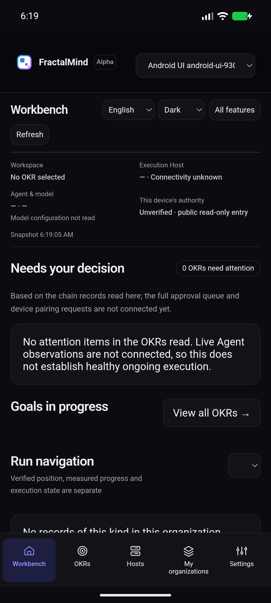
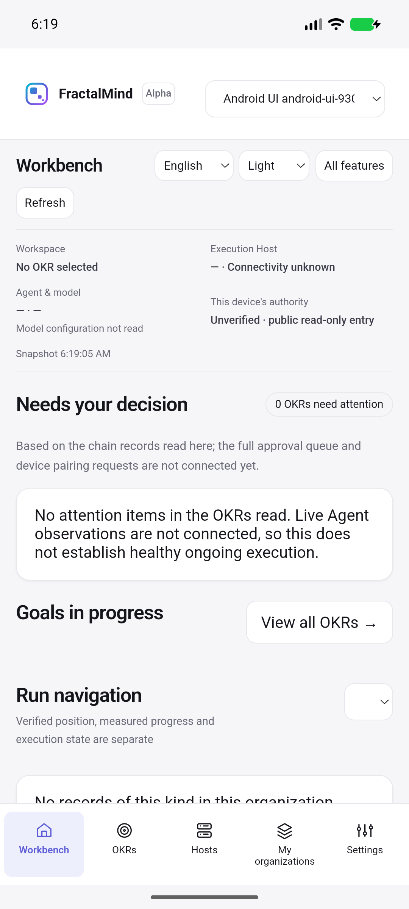

# v0.2.0 Android 安装版：系统栏、身份创建与原组织重建

基线 `fff6366`，继续 [Android 原生凭据验收](v020-app-android-native.md)。完整版本仍按 [#40](https://github.com/fractalmind-labs/fractalmind-os/issues/40) 验收。

## 修复

- 系统栏跟随 App 选择的明暗外观；内容避开状态栏、导航栏和屏幕切口。Android 平台模板纳入源码，npm 的初始化后及构建／开发前钩子复制到生成工程；遇到未知 Activity 内容拒绝覆盖。依据 [Android edge-to-edge 与 insets](https://developer.android.com/develop/ui/views/layout/edge-to-edge)。
- 独立 `app-appearance` 权限及有来源保护的原生命令只接受 `light`／`dark`，使用 Tauri 固定版本的公开 JNI handle 在 UI 线程更新，等待有时限。原生 SharedPreferences 仅镜像公开外观，没有凭据或业务正文。签名和设备权限保持各自边界。
- 身份创建先核验公开 ProtocolRegistry 的 ID、共享所有权和精确类型来源，再生成密钥。升级部署遗漏 `originalPackageId` 时明确提示；配置示例补齐核心与扩展原始包字段。

## 实际结果

[完整报告、前序失败与源码指纹](evidence/v020-app-android-installed.json)：

| 验收项           | 结果与范围                                                                                                                                                                                   |
| ---------------- | -------------------------------------------------------------------------------------------------------------------------------------------------------------------------------------------- |
| APK              | 两次完整构建退出 0；最终 ARM64 debug APK v2 签名、升级安装成功                                                                                                                               |
| 原生凭据与外观   | R2 **19 项检查、0 笔广播**；实际 UI 明暗操作改变系统栏 flags，冷启动后原钥、内容密钥环与外观保持                                                                                             |
| 实际创建 UI      | 准备恢复码、明确保存后从 DOM 隐藏；零余额拒绝报价；仅给两个测试地址领取 localnet Gas；分别确认 Human 与组织两笔交易                                                                          |
| 原组织恢复       | 同一个 profile 补齐部署资料后，**3 项检查、0 笔新广播**；显示原 Human、原组织确认摘要并进入实际工作台                                                                                        |
| 新部署保护       | 最终 APK 的错误部署操作被拒；原生查询确认该新测试 profile 没有生成 onboarding 密钥                                                                                                           |
| 实际清缓存冷启动 | 清空 App localStorage、实际 IndexedDB 交易日志和 CacheStorage；PID **4409 → 4602**；重新输入同一本机配置名和公开部署资料，**3 项检查、0 笔新广播**，原 Human／组织重建，旧交易缓存回执不存在 |
| 独立链上核对     | 原组织类型来源正确；Human 和组织的 `previousTransaction` 仍是原组织创建摘要，没有因恢复而新增交易                                                                                            |
| 回归             | App **234/234**，共享 Rust 壳来源保护 **1/1**，最终夹具严格 TypeScript、格式和 diff 检查通过；SDK／Move／Go／凭据核心单元套件未计作全量重跑                                                  |
| 暂停测试环境     | 任务模拟器退出 0，独立 ADB 与 Gradle 停止；原测试 App/profile 保留在任务 AVD，供原对象复查与后续联测                                                                                         |

最终 APK SHA-256：`741f181d1095ef2ccababeeac0acca89b54e255002953bf35691256b52d77cf9`。

## 前序记录与限制

- 首次安装前检查错误地把不存在包的 `pm path` 退出 1 当作异常，尚未安装；确认空查询结果后继续。原生 R1 通过 19 项，但夹具把外观命令误纳入设备命令类型，严格类型失败；拆分夹具传输类型后最终 R2 通过。生产设备命令类型没有扩大。
- UI R1 错误断言可见英文提示应包含内部错误码，停止于零余额，未充值／提交；后续对同一个 profile 明确继续，未再次创建密钥。两笔交易分别原生签名并确认，组织后续读取因测试部署遗漏 `originalPackageId` 返回 `invalid_provenance`。保留失败、原确认回执及来源比较，配置修正后只读取原结果。
- 独立 `GetTransaction` 对旧 Human 摘要返回 `NOT_FOUND`；任务 localnet 会裁剪交易历史。本次以安装版原确认回执和未改变的当前对象／`previousTransaction` 核对，不能声称已从 RPC 重新读到裁剪的旧交易。没有调整链历史或生成新 genesis。
- UI 由一次性 CDP 夹具操作真实 DOM；使用安装版生产 IPC、Android Keystore、正式控制器及 Sui，没有替换 native／链上返回。公开步骤、原记录和夹具指纹保留；界面操作不计作人工手机评审。
- 原生 19 项针对首次外观修复 APK；最终 APK 追加前端部署保护，原生命令源码未再修改，最终保护、原组织恢复、实际缓存清空和工作台截图在最终 APK 验证。
- 此次仅重建 Human／组织；本机配置名及公开部署资料显式重新输入。未证明完整恢复码 UI、OS 卸载后恢复、Host／OKR／消息／审批／证据重建，也未证明实体手机、蜂窝网络、硬件安全模块或生产签名发布。
- 当前工作台仍要求独立核验设备权限；进入组织不自动授权执行。真实云 Host、手机沟通审批、安装版桌面全旅程、运行中 Host 续跑／Coordinator 重连、公共升级及历史未结 Run 均未完成。新增 Android GitHub CI 尚未运行，本增量不关闭 #40。

## 复现入口

按照[原生 Android 验收说明](v020-app-android-native.md)准备独立任务模拟器，使用 `npm run android:init`／`npm run android:build`，确保平台模板钩子运行。

实际创建 UI 需输入匹配的公开部署资料，升级核心保留 `originalPackageId`，扩展升级保留对应原始包 ID。依次保存恢复码、充值两个指定地址、检查余额、分别估算和确认两笔费用。结果异常时读取原交易和现有组织，修正公开配置后选择「继续已有创建流程」。

缓存验收只操作独立模拟器；删除该 App 的浏览器缓存及交易日志，保留原生凭据后冷启动，重新输入同一本机配置名和公开部署资料。不得把这一局部场景计为完整 #40 恢复旅程。
