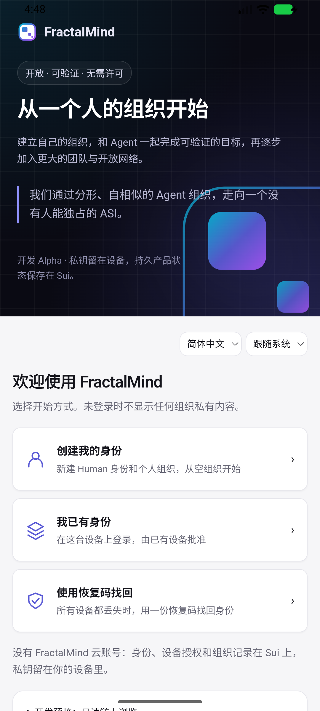
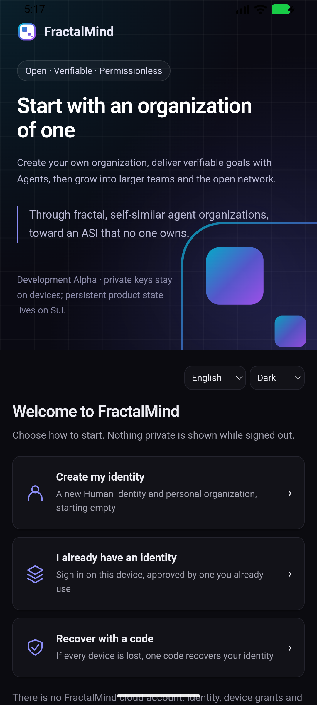

# v0.2.0 Android 完整构建与原生凭据验收

本增量完成 ARM64 debug APK 构建，在独立 Android 16／ARM64 模拟器中验证安装后的 IPC、凭据与冷启动。完整 v0.2.0 仍以 [#40](https://github.com/fractalmind-labs/fractalmind-os/issues/40) 的真实产品旅程验收。

## 修复与交付

- 首次完整打包失败于 `:app:rustBuildArm64Debug`：生成的 Gradle 工程再次调用 `npm run tauri`，package.json 缺少该脚本。补齐标准 CLI 入口后构建退出 0；密钥库交叉编译检查无法覆盖此缺口。
- 新增 Android APK CI job：JDK 21、ARM64 Rust target、命令行工具 build 16111833、SDK 37.0、Build Tools 36.0.0、NDK 30.0.16248370。生成平台工程、完整构建、上传 debug APK，总 CI gate 包含此 job。此次仅本地验证，GitHub job 尚未实际运行。
- [原生夹具](../../apps/fractalmind-app/scripts/android-native-acceptance.ts)只接受明确命名的任务模拟器，使用安装版 debug WebView、生产 Rust 命令及 Android Keystore 提供者；没有替换返回值，没有广播链上交易。

## 实际结果

[完整证据、源码指纹与前序记录](evidence/v020-app-android-native.json)：

| 项目                  | 实际结果                                                                 |
| --------------------- | ------------------------------------------------------------------------ |
| Rust 壳与 Gradle 打包 | ARM64 debug APK，退出 **0**，169,291,395 bytes                           |
| 签名与安装            | APK v2 签名验证通过；Android Debug 证书；独立模拟器安装成功              |
| 安装后原生验收 R5     | **15 项检查、0 笔广播，退出 0**                                          |
| 凭据与边界            | 缺失钥拒绝、初始化幂等、无效 profile／交易 sender／任意命令字节拒绝      |
| 实际签名              | 生产客户端验证设备持钥证明、设备与恢复凭据的离线交易签名                 |
| 恢复材料              | 原生单恢复码；以原恢复凭据解密比较重新加载的原内容密钥环，秘密不写入报告 |
| 冷进程启动            | PID **7770 → 7962**，原设备／恢复公钥、内容密钥环保持，新挑战签名通过    |
| 实际 UI               | 无身份首页、手机宽度、中英／明暗切换；后台 6 秒后冷启动恢复英文／黑夜    |
| 最终源码              | 严格 TypeScript、Prettier、CI YAML 与聚合 gate 检查通过                  |
| 清理                  | 测试 App 卸载，包查询为空；模拟器退出 0，独立 ADB／临时 Gradle 停止      |

APK SHA-256：`2553e748b1fb4e6e8074d3f8bcd8e544376e25914840f093545482acd4b8392f`。





## 前序失败与证明边界

- 首次初始化因 NDK 缺失失败，补齐后成功。首次模拟器因磁盘空间退出；清理任务生成的可下载模型缓存与旧编译缓存后，同一 AVD 启动成功。原验证报告保留。
- 夹具 R1 错误假定恢复码分隔符；R2 错误比较随机重新加密的密文。后续使用生产恢复码解析、原恢复密钥解密及恒定时间比较核对内容，未改动凭据格式或提供者以满足夹具。
- R3 修改偏好后立即停止进程，冷启动出现默认偏好，原钥读取通过；即时停止后最新偏好的持久性仍未证明。R4 初次冷启动钥读取返回通用不可用；对同一原 profile 后续只读查询成功，英文／黑夜也正确。R5 等待实际欢迎页加载后调用原生桥，明确记录后台 6 秒。只有发现／页面就绪查询可以重复，原生创建和签名没有自动重发。
- R5 后夹具仅经过 Prettier 格式化，严格类型检查针对最终文件；本增量未修改 APK 的 Rust／前端生产源。App／SDK／Move／Go／Rust 单元套件未计作全量重跑。
- JNI／Keystore 与跨进程读取已验证。模拟器不证明实体手机、硬件安全模块、每次使用生物认证、设备锁定或 OS 备份恢复。
- 离线交易使用夹具对象引用，持钥挑战使用离线链／Human／Grant 标签；有效签名不代表链上授权。Android 费用／链上提交、配对、消息、审批、人工验收、清缓存重建、蜂窝网络均未验收。
- 截图暴露 Android 状态栏在欢迎页深色背景上的对比问题，需要继续修复；首页渲染不是完整手机 UI 验收。云 Host、安装版桌面旅程、运行中 Host 续跑／重连、公共升级、历史未结 Run 等剩余门禁保持。

## 复现

按 [Tauri 前置要求](https://v2.tauri.app/start/prerequisites/)准备 Java、SDK／NDK、Rust target，先构建本地 SDK，再进入 `apps/fractalmind-app`：

```sh
npm ci
npm run android:init -- --skip-targets-install
npm run android:build -- --debug --apk --target aarch64 --ci
```

APK 位于 `src-tauri/gen/android/app/build/outputs/apk/universal/debug/`；平台工程与 APK 不提交代码库。安装到明确命名的独立 ARM64 模拟器并启动 App 后：

```sh
./node_modules/.bin/tsx scripts/android-native-acceptance.ts \
  --adb /absolute/android-sdk/platform-tools/adb \
  --adb-port 15037 --serial emulator-5580 \
  --avd fm-v020-android-r1 --devtools-port 19135 \
  --report /tmp/android-native-acceptance.json
```

`--avd` 与实际任务模拟器一致；已有报告／进度文件拒绝覆盖。夹具保留凭据供原请求复查，完成后卸载任务模拟器中的测试 App。采用 [debug WebView 官方调试机制](https://developer.chrome.com/docs/devtools/remote-debugging/webviews/)，未给 release App 添加调试权限或凭据导出接口。
