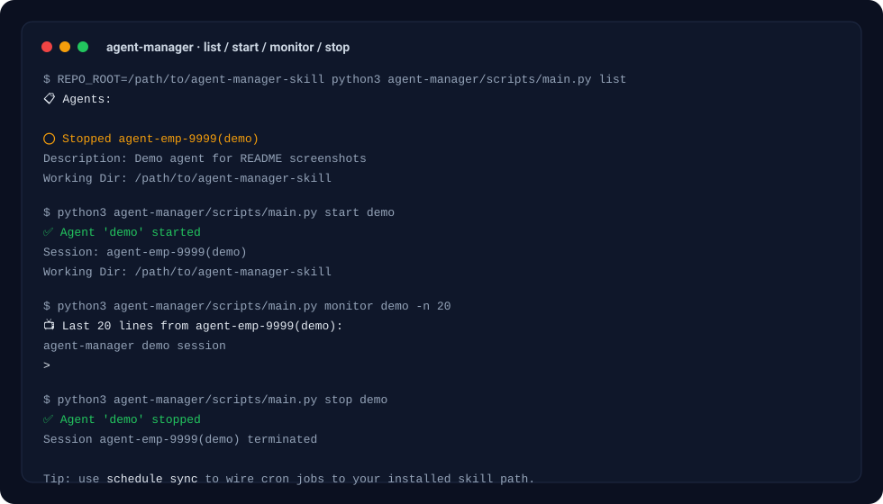

# Agent Manager (agent-manager)

Simple, installation-agnostic agent lifecycle management using **tmux + Python**.

Manage multiple AI agents without running a server, wiring HTTP APIs, or pulling in heavy dependencies.



## Why agent-manager?

Managing multiple AI agents is deceptively complex:

- Each agent needs its own long-running process
- You need a reliable way to start/stop/monitor them
- Scheduling (cron) should keep working even if you move the skill around

**agent-manager** solves this with a tiny architecture: **tmux sessions + a single Python CLI**.

**Advantages:**

- **Zero dependencies** beyond `tmux` + `python3`
- **Cross-platform** (where tmux runs)
- **Cron-friendly**: `schedule sync` writes crontab entries calling the installed `main.py` by absolute path

## Highlights

- 🚀 Simple agent lifecycle management
- 📅 Scheduled task execution via cron
- 🔧 Installation-agnostic design
- 🎯 Zero dependencies beyond tmux + Python

## Installation

### via openskills (recommended)

```bash
# Project installation
openskills install fractalmind-ai/agent-manager-skill

# Global installation
openskills install fractalmind-ai/agent-manager-skill --global
```

### Manual installation

```bash
git clone https://github.com/fractalmind-ai/agent-manager-skill.git
cp -r agent-manager-skill ~/.claude/skills/agent-manager
```

## Usage

After installation, read the skill documentation:

```bash
openskills read agent-manager
```

Or view directly:

```bash
cat ~/.claude/skills/agent-manager/SKILL.md
```

## Quick Start

```bash
# If installed with `--universal` (repo-local):
python3 .agent/skills/agent-manager/scripts/main.py list

# If installed with `--global`:
python3 ~/.claude/skills/agent-manager/scripts/main.py list

# Or from this repo (cloned):
python3 agent-manager/scripts/main.py list

# Start / monitor / stop
python3 .agent/skills/agent-manager/scripts/main.py start dev
python3 .agent/skills/agent-manager/scripts/main.py monitor dev --follow
python3 .agent/skills/agent-manager/scripts/main.py stop dev


## Demo

The screenshot above shows a real run of:

- `list` (see configured agents + status)
- `start` (launches an agent into `tmux`)
- `monitor` (captures output from the tmux pane)
- `stop` (kills the agent's tmux session)

Want an animated GIF instead? You can record it with tools like `termttogif` (or any terminal recorder) and replace `assets/demo.svg`.
# Start/monitor examples (adjust the path based on your install location)
python3 .agent/skills/agent-manager/scripts/main.py start dev
python3 .agent/skills/agent-manager/scripts/main.py monitor dev --follow
```

## Path & Repo Root Resolution

- Repo root is resolved in this priority order: `$REPO_ROOT` → git superproject (submodule-safe) → git toplevel → parent-walk fallback.
- `schedule sync` writes crontab entries that call the *installed* `main.py` absolute path (so cron keeps working regardless of where the skill is installed).

## Skills Resolution

When injecting agent skills into the system prompt, `agent-manager` searches for `SKILL.md` in the following locations (first match wins):

1) `<repo>/.agent/skills/<skill>/SKILL.md`
2) `~/.agent/skills/<skill>/SKILL.md`
3) `<repo>/.claude/skills/<skill>/SKILL.md`
4) `~/.claude/skills/<skill>/SKILL.md`

## Documentation

See [agent-manager/SKILL.md](agent-manager/SKILL.md) for complete documentation.

## Requirements

- Python 3.x
- tmux
- Agents defined in `agents/EMP_*.md` files

## Features

- 🚀 Simple agent lifecycle management (start/stop/monitor)
- 📅 Scheduled task execution via cron (`schedule list`, `schedule sync`, `schedule run`)
- 🔧 Installation-agnostic (works from any location)
- 🎯 Zero dependencies beyond tmux + Python
- 💡 Dynamic path resolution (submodule-safe repo root detection)

## License

MIT
